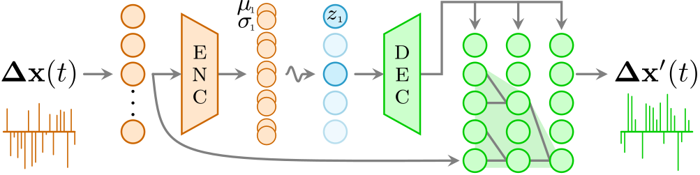
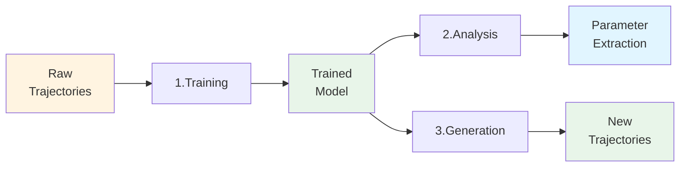
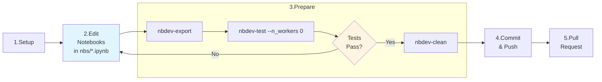

# SPIVAE


<!-- WARNING: THIS FILE WAS AUTOGENERATED! DO NOT EDIT! -->



[](https://zenodo.org/doi/10.5281/zenodo.11572993)
[](https://deepwiki.com/GabrielFernandezFernandez/SPIVAE)
[](https://github.com/GabrielFernandezFernandez/SPIVAE/actions/workflows/test.yaml)

SPIVAE (Stochastic Processes Insights from Variational Autoencoders) is
an interpretable machine learning method for analyzing and generating
stochastic processes. The method employs variational autoencoders (VAEs)
to learn the underlying probability distribution of input trajectories.
By encoding trajectories into a low-dimensional representation (a few
neurons), SPIVAE learns process parameters (e.g., anomalous diffusion
exponent, diffusion coefficient) without explicit supervision, making it
applicable to processes where analytical solutions are intractable.
Furthermore, SPIVAE permits us to generate new trajectories with
controllable features, enabling quantitative comparison and controlled
generation of complex time series.

The approach was initially devised for the paper entitled [Learning
minimal representations of stochastic processes with variational
autoencoders](https://doi.org/10.48550/arXiv.2307.11608) where,
motivativated by the analysis of molecular diffusion trajectories, we
rediscover various diffusion parameters from fractional Brownian motion,
scaled Brownian motion, and confined Brownian motion.

To foster the application of this method to more stochastic processes as
well as to facilitate the reproduction of our research findings, here we
provide a [thoroughly documented Python library](./source/data.html) and
detailed [tutorials](./tutorials/training_fbm.html).

What can you do with SPIVAE?

- Analyze stochastic processes: Extract interpretable parameters from
  experimental or simulated time series.
- Generate synthetic data: Create new trajectories with controlled
  statistical properties.

# Getting started

To use this library, you will need a system with `python>=3.10` and
proceed with the installation.

You can install the latest version of SPIVAE by first cloning this
repository in your file system and installing it with pip:

``` bash
git clone https://github.com/GabrielFernandezFernandez/SPIVAE.git
cd SPIVAE
pip install .
```

This will install the library and all necessary dependencies.

## Quick start

The fastest way to understand SPIVAE is to run a complete workflow. We
recommend starting with the fractional Brownian motion (FBM) tutorial,
which walks you through:

1.  Training a VAE model on FBM trajectories.
2.  Analyzing the learned representation.
3.  Generating new trajectories.


``` mermaid
flowchart LR
    A[Raw<br>Trajectories] --> B[1.Training] --> C[Trained<br>Model]
    C --> D[2.Analysis]    --> E[Parameter<br>Extraction]
    C --> F[3.Generation]  --> G[New<br>Trajectories]

    style A fill:#fff4e1
    style C fill:#e8f5e9
    style E fill:#e1f5ff
    style G fill:#e8f5e9
```

[→ Start with the FBM tutorial](./tutorials/training_fbm.html)

# Repository organization

SPIVAE is mainly organized into the library, the source notebooks that
generate it, and the tutorials:

    SPIVAE/
    ├─ SPIVAE/            # Python library
    │  ├─ data.py
    │  ├─ imports.py        # Convenient imports
    │  ├─ models.py
    │  └─ utils.py
    │
    ├─ nbs/               # Notebooks that
    │  ├─ source/           # generate .py files above, documentation, and tests
    │  │  ├─ 00_data.ipynb    # Trajectory generation and data processing with `andi_datasets`
    │  │  ├─ 01_models.ipynb  # VAE architectures (VAEConv1d, VAEWaveNet), init
    │  │  └─ 02_utils.ipynb   # Loss, metrics, callbacks, save/load, plus helper functions
    │  │
    │  ├─ tutorials/        # show step-by-step examples
    │  │  ├─ 00_training_FBM.ipynb
    │  │  ├─ 00_training_SBM.ipynb
    │  │  ├─ 01_analysis_FBM.ipynb
    │  │  ├─ 01_analysis_SBM.ipynb
    │  │  ├─ 02_generation_FBM.ipynb
    │  │  └─ 02_generation_SBM.ipynb
    │  │
    │  └─ index.ipynb     # generates README.md
    └─ README.md

# Development guide

SPIVAE follows a notebook-driven development workflow powered by
[nbdev](https://nbdev.fast.ai/), a literate programming framework where
Jupyter notebooks serve as the single source of truth for code, tests,
and documentation.

This means:

- All Python modules in `SPIVAE/*.py` are auto-generated from notebooks
  `nbs/*.ipynb`
- Tests are written directly in notebook cells
- Documentation is extracted from the same notebooks and rendered with
  Quarto
- Testing and deployment of the library and documentation is automated
  via GitHub Actions

**Contributing to SPIVAE**

1.  Setup: Fork the repository on GitHub, then clone your fork, and
    install in editable mode with development dependencies:

    ``` bash
    git clone https://github.com/YOUR_USERNAME/SPIVAE.git
    cd SPIVAE
    pip install -e ".[dev]"
    ```

    Replace YOUR_USERNAME with your GitHub username.

2.  Develop: Edit the relevant notebook, e.g.,
    `nbs/source/00_data.ipynb`.

3.  Prepare: run this in SPIVAE’s root folder:

    ``` bash
    nbdev-export              # Generate .py files from notebooks
    nbdev-test --n_workers 0  # Run all tests sequentially
    nbdev-clean               # Remove notebook metadata
    ```

4.  Committ and push

5.  Create a pull request on GitHub


``` mermaid
flowchart LR
    Z[1.Setup] --> A[2.Edit<br>Notebooks<br>in nbs/*.ipynb] --> B
    subgraph P[3.Prepare]
    B[nbdev-export] --> C[nbdev-test --n_workers 0] --> D{"Tests<br>Pass?"}
    D -->|Yes| F[nbdev-clean]
    end
    F --> G[4.Commit<br>& Push]
    G --> H[5.Pull<br>Request]
    D -->|No| A

    style A fill:#e1f5ff
    style D fill:#fff4e1
```

If you want to see the documentation locally you can use
`nbdev-preview`. For more details, see the [nbdev
documentation](https://nbdev.fast.ai/).

# Cite us

If you use this repository, please give us credit. You can use the
following to cite the paper this repository was developed for:

``` latex
Gabriel Fernández-Fernández, Carlo Manzo, Maciej Lewenstein,
Alexandre Dauphin, and Gorka Muñoz-Gil
Learning Minimal Representations of Stochastic Processes with Variational Autoencoders
Physical Review E, 110, L012102 (2024).
https://doi.org/10.1103/PhysRevE.110.L012102
```

**BibLaTeX**

``` bibtex
@article{fernandez2024learning,
  ids = {fernandez2023learning},
  title = {Learning Minimal Representations of Stochastic Processes with Variational Autoencoders},
  author = {Fern\'andez-Fern\'andez, Gabriel and Manzo, Carlo and Lewenstein, Maciej and Dauphin, Alexandre and Mu\~noz-Gil, Gorka},
  date = {2024-07-18},
  journaltitle = {Physical Review E},
  shortjournal = {Phys. Rev. E},
  volume = {110},
  number = {1},
  eprint = {2307.11608},
  eprinttype = {arXiv},
  pages = {L012102},
  publisher = {American Physical Society},
  doi = {10.1103/PhysRevE.110.L012102},
  url = {http://arxiv.org/abs/2307.11608}
}
```

**BibTeX**

``` bibtex
@article{fernandez2024learning,
  ids = {fernandez2023learning},
  title = {Learning Minimal Representations of Stochastic Processes with Variational Autoencoders},
  author = {{Fern{\'a}ndez-Fern{\'a}ndez}, Gabriel and Manzo, Carlo and Lewenstein, Maciej and Dauphin, Alexandre and {Mu{\~n}oz-Gil}, Gorka},
  year = 2024,
  month = jul,
  journal = {Physical Review E},
  volume = {110},
  number = {1},
  eprint = {2307.11608},
  pages = {L012102},
  publisher = {American Physical Society},
  doi = {10.1103/PhysRevE.110.L012102},
  url = {http://arxiv.org/abs/2307.11608}
}
```
