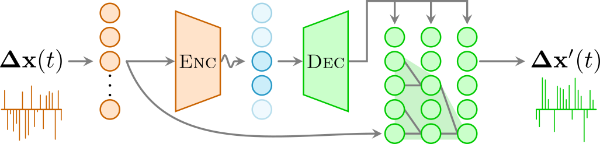

# SPIVAE

<!-- WARNING: THIS FILE WAS AUTOGENERATED! DO NOT EDIT! -->

SPIVAE is a machine learning method to study stochastic processes. It
tries to learn the probability distribution of input trajectories and
permits us to interpret its functioning and generate new trajectories
with controllable features.

The approach was initially devised for the paper entitled [Learning
minimal representations of stochastic processes with variational
autoencoders](https://doi.org/10.48550/arXiv.2307.11608). We provide a
[documented library](./source/data.html) and detailed
[tutorials](./tutorials/training_fbm.html) to facilitate the
reproduction of our research findings.

# Getting started

To use this code as a library, you will need a system with
`python>=3.10` and proceed with the installation. You can install SPIVAE
by first cloning this repository in your file system:

    git clone https://github.com/GabrielFernandezFernandez/SPIVAE.git
    cd SPIVAE
    pip install .

This will install all the necessary dependencies to make full use of the
library. Make sure your file system has enough space to store the data
files of some GBs.

# Cite us

If you use this library, please give us credit.

    @misc{fernandez2023learning,
      title = {Learning Minimal Representations of Stochastic Processes with Variational Autoencoders},
      author = {{Fern{\'a}ndez-Fern{\'a}ndez}, Gabriel and Manzo, Carlo and Lewenstein, Maciej and Dauphin, Alexandre and {Mu{\~n}oz-Gil}, Gorka},
      year = {2023},
      month = jul,
      number = {arXiv:2307.11608},
      eprint = {2307.11608},
      publisher = {{arXiv}},
      doi = {10.48550/arXiv.2307.11608},
      url = {http://arxiv.org/abs/2307.11608},
      keywords  = {Soft Condensed Matter (cond-mat.soft),
                   Machine Learning (cs.LG),
                   Biological Physics (physics.bio-ph),
                   {Data Analysis, Statistics and Probability (physics.data-an)},
                   Quantitative Methods (q-bio.QM)}
    }

    @misc{fernandez2023spivae,
      title = {{{SPIVAE}}},
      author = {{Fern{\'a}ndez-Fern{\'a}ndez}, Gabriel},
      year = {2023},
      month = jul,
      url = {https://github.com/GabrielFernandezFernandez/SPIVAE},
      urldate = {2023-07-21},
      copyright = {Apache-2.0}
    }
