# Data


<!-- WARNING: THIS FILE WAS AUTOGENERATED! DO NOT EDIT! -->

The data module provides:

- Trajectory generators for stochastic processes from the
  [`andi_datasets`](https://github.com/AnDiChallenge/andi_datasets)
  library.
- The
  [`load_data`](https://GabrielFernandezFernandez.github.io/SPIVAE/source/data.html#load_data)
  function that bundles preprocessing, splitting, and batching into a
  single call, ready for training.

Both parts are exemplified for the fractional Brownian motion and scaled
Brownian motion datasets.

<div>

<figure class=''>

<div>

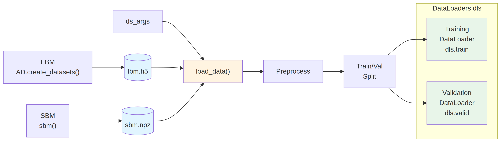

</div>

</figure>

</div>

# Data generation

To study stochastic processes, we take trajectories from three
paradigmatic diffusion models: Brownian motion, fractional Brownian
motion, and scaled Brownian motion.

We generate the trajectories with the
[andi_datasets](https://doi.org/10.5281/zenodo.4775311) package.

## Fractional Brownian motion

For fractional Brownian motion (FBM), we take *α* ∈ \[0.04, 1.96\]. For
the dataset of Brownian motion (BM), we can take directly the FBM
trajectories with *α* = 1.

``` python
alphas_train = np.linspace(0.2,1.8,21)
alphas_test  = np.linspace(0.04,1.96,49)
print(f'{alphas_train=}')
print(f'{alphas_test=}')
```

    alphas_train=array([0.2 , 0.28, 0.36, 0.44, 0.52, 0.6 , 0.68, 0.76, 0.84, 0.92, 1.  ,
           1.08, 1.16, 1.24, 1.32, 1.4 , 1.48, 1.56, 1.64, 1.72, 1.8 ])
    alphas_test=array([0.04, 0.08, 0.12, 0.16, 0.2 , 0.24, 0.28, 0.32, 0.36, 0.4 , 0.44,
           0.48, 0.52, 0.56, 0.6 , 0.64, 0.68, 0.72, 0.76, 0.8 , 0.84, 0.88,
           0.92, 0.96, 1.  , 1.04, 1.08, 1.12, 1.16, 1.2 , 1.24, 1.28, 1.32,
           1.36, 1.4 , 1.44, 1.48, 1.52, 1.56, 1.6 , 1.64, 1.68, 1.72, 1.76,
           1.8 , 1.84, 1.88, 1.92, 1.96])

As advised in the
[andi_datasets](https://doi.org/10.5281/zenodo.4775311) library, we can
save at the beginning a big dataset of long (`T_save`  ∼ 10<sup>3</sup>)
and numerous (`N_save`  ∼ 10<sup>4</sup>) trajectories which then allows
us to load any other combination of `T` and `N_models`.

``` python
AD.avail_models_name
```

    ['attm', 'ctrw', 'fbm', 'lw', 'sbm']

``` python
N=6_000 # number of trajectories per parameter combination
```

``` python
T=400
dataset = AD.create_dataset(T=T, N_models=N,
                            exponents=alphas_test,
                            models=[2],   # fbm
                            dimension=1,
                            N_save=N,
                            T_save=T,
                            save_trajectories=True,
                            load_trajectories=False, # False allows saving
                            path="../../data/raw/")
```

The [andi_datasets](https://doi.org/10.5281/zenodo.4775311) gives us the
trajectories with shape \[*N* \* |exponents|,2 + *T*\] where the first
two data points of each vector are the model label and the anomalous
exponent *α*.

``` python
dataset.shape, dataset[0,:2], dataset[-1,:2]
```

    ((294000, 402), array([2.  , 0.04]), array([2.  , 1.96]))

The following *T* points compose the trajectory that always has zero
origin.

<details class="code-fold">
<summary>Code</summary>

``` python
plt.plot(dataset[0,2:], label=f'{alphas_test[0]:.3g}');
plt.plot(dataset[49//2*N,2:], label=f'{alphas_test[49//2]:.3g}');
plt.plot(dataset[-1,2:], label=f'{alphas_test[-1]:.3g}');
plt.xlabel(r'$t$');plt.ylabel(r'$x$', rotation=0);
plt.legend(title=r'$\alpha$');
```

</details>

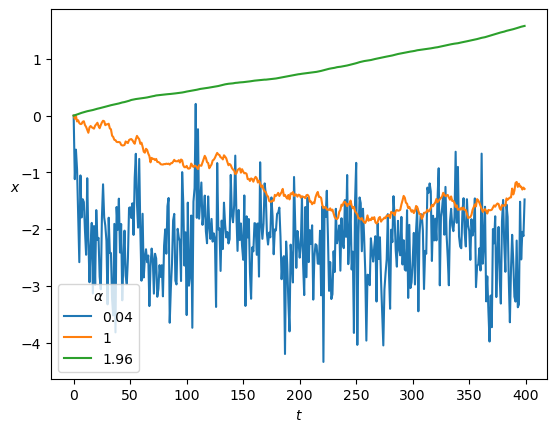

The distribution of the positions *x*(*t*) depends on *α* and time, as
we expect from the mean squared displacement relation
⟨*x*<sup>2</sup>⟩ = 2*D**t*<sup>*α*</sup>.

<details class="code-fold">
<summary>Code</summary>

``` python
fig, axs = plt.subplots(3,1, sharex=True, gridspec_kw=dict(hspace=0))
for ax, a_i in zip(axs,[0,49//2,48]):
    ax.hist2d(np.tile(np.arange(T),N),dataset[a_i*N:(a_i+1)*N,2:].reshape(-1), T, cmin=2, norm=matplotlib.colors.LogNorm());
    ax.text(0.02,0.9, r'$\alpha=' f'{dataset[a_i*N,1]:.3g}' r'$', transform=ax.transAxes);
    ax.set_ylabel(r'$x$', rotation=0);
    ax.set_ylim([-4,4])
    ax.locator_params(nbins=3);
axs[-1].set_xlabel(r'$t$');
```

</details>

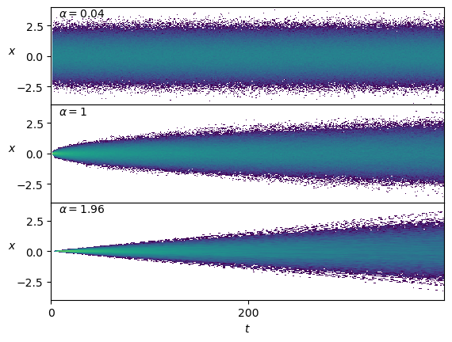

Conveniently, the displacements *Δ**x* are stationary.

<details class="code-fold">
<summary>Code</summary>

``` python
fig, axs = plt.subplots(3,1, sharex=True, gridspec_kw=dict(hspace=0))
for ax, a_i in zip(axs,[0,49//2,48]):
    ax.hist2d(np.tile(np.arange(T-1),N),np.subtract(dataset[a_i*N:(a_i+1)*N,3:],dataset[a_i*N:(a_i+1)*N,2:-1]).reshape(-1), T-1, cmin=2, norm=matplotlib.colors.LogNorm());
    ax.text(0.02,0.9, r'$\alpha=' f'{dataset[a_i*N,1]:.3g}' r'$', transform=ax.transAxes);
axs[-1].set_xlabel(r'$t$');
for ax in axs : ax.set_ylabel(r'$\Delta x$', rotation=0);
```

</details>

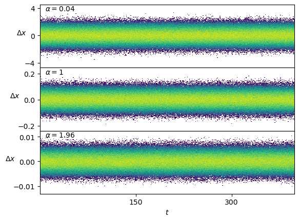

## Scaled Brownian motion

For the generation of scaled Brownian motion (SBM) trajectories, we take
the generating function from
[andi_datasets](https://github.com/AnDiChallenge/andi_datasets/blob/develop/source_nbs/lib_nbs/models_theory.ipynb)
to control sigma as *D*<sub>0</sub> and generate displacements directly.

------------------------------------------------------------------------

<a
href="https://github.com/GabrielFernandezFernandez/SPIVAE/blob/main/SPIVAE/data.py#L19"
target="_blank" style="float:right; font-size:smaller">source</a>

### sbm

``` python

def sbm(
    T:int, # trajectory time steps
    alpha:float, sigma:float=1.0
)->array:

```

*Creates `T` scaled Brownian motion displacements.*

We select the range of values to coincide with the previous dataset.

``` python
N=1_000
```

``` python
T=400
Ds = np.geomspace(1e-5,1e-2, 10)
alphas_train = np.linspace(0.2,1.8,21)
```

``` python
disp = {f'{a:.3g}'+f',{D:.3g}':[] for D in Ds for a in alphas_train}
fname = '../../data/raw/sbm.npz'
if not os.path.exists(fname):  # create
    for i,a in enumerate(alphas_train):
        for j,D in enumerate(Ds):
            k = f'{a:.3g}'+f',{D:.3g}'
            disp[k]=np.array([np.concatenate(([a,D],sbm(T, a, sigma = D2sig(D)))) for n in range(N)]) # N, T+2
    np.savez_compressed(fname,**disp)
    print('Saved at:', fname)
else:  # load
    with np.load(fname) as f:
        for i,a in enumerate(alphas_train):
            for j,D in enumerate(Ds):
                k = f'{a:.3g}'+f',{D:.3g}'
                disp[k] = f[k][:N,:2+T]
    print('Loaded from:', fname)
```

    Loaded from: ../../data/raw/sbm.npz

The displacements follow the temporal scaling
*D*<sub>*α*</sub>(*t*) = *α**D*<sub>0</sub>*t*<sup>*α* − 1</sup>.

<details class="code-fold">
<summary>Code</summary>

``` python
fig, axs = plt.subplots(3,1, sharex=True, gridspec_kw=dict(hspace=0))
for ax, a in zip(axs,[0.2,1,1.8]):
    k = f'{a:.3g}'+f',0.01'
    ax.hist2d(np.tile(np.arange(T),N),disp[k][:,2:].reshape(-1), T, cmin=2, norm=matplotlib.colors.LogNorm());
    ax.text(0.02,0.9, r'$\alpha=' f'{a:.3g}' r'$', transform=ax.transAxes);
    ax.set_ylabel(r'$\Delta x$', rotation=0);
axs[-1].set_xlabel(r'$t$');
```

</details>

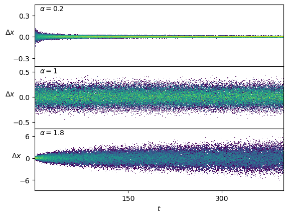

We can do the same to create a test set.

``` python
Ds = np.geomspace(1e-6,1e-1,16)[2:-2] # np.geomspace(1e-6,1e-1,61)[6:-6]
alphas = np.linspace(0.04,1.96,49)
disp_test = {f'{a:.3g}'+f',{D:.3g}':[] for D in Ds for a in alphas_train}
fname = '../../data/test/sbm.npz'
if not os.path.exists(fname):  # create
    os.makedirs('../../data/test/', exist_ok=True)
    for i,a in enumerate(alphas_train):
        for j,D in enumerate(Ds):
            k = f'{a:.3g}'+f',{D:.3g}'
            disp_test[k]=np.array([np.concatenate(([a,D],sbm(T, a, sigma = D2sig(D)))) for n in range(N)]) # N, T+2
    np.savez_compressed(fname,**disp_test)
    print('Saved at:', fname)
```

# Data Loader

To load trajectories, we use the convenience funtion
[`load_data()`](https://GabrielFernandezFernandez.github.io/SPIVAE/source/data.html#load_data).
This function accepts a configuration dictionary and returns the
[fastai](https://docs.fast.ai/data.core.html#DataLoaders) `DataLoaders`
object. This object takes care of the splitting and preprocessing of the
data, as well as shuffling batches in training and some other utilities.

To select the dataset, the function expects a `ds_args` dictionary with
the following structure:

``` python
ds_args = {
    'path': str,              # Data directory path
    'model': 'fbm' or 'sbm',  # Process type
    'alpha': list[float],     # Exponent values
    'D': list[float],         # Diffusion coefficients
    'T': int,                 # Trajectory length
    'N': int,                 # Number of trajectories per parameter
    'N_save': int,            # Total saved trajectories
    'T_save': int,            # Saved trajectory length
    'valid_pct': float,       # Validation split percentage
    'seed': int,              # Random seed
    'bs': int,                # Batch size
}
```

------------------------------------------------------------------------

<a
href="https://github.com/GabrielFernandezFernandez/SPIVAE/blob/main/SPIVAE/data.py#L81"
target="_blank" style="float:right; font-size:smaller">source</a>

### ConditionalsTransform

``` python

def ConditionalsTransform(
    n_labels:int=1
):

```

*Extracts the positional information from the input array,* inserts a
channel dimension for convolutions, and discards the labels.

------------------------------------------------------------------------

<a
href="https://github.com/GabrielFernandezFernandez/SPIVAE/blob/main/SPIVAE/data.py#L33"
target="_blank" style="float:right; font-size:smaller">source</a>

### load_data

``` python

def load_data(
    ds_args:dict
)->DataLoaders:

```

*Loads a dataset from the given args and returns train and validation
`DataLoaders`.* Trajectories are preprocessed on load and on-the-fly via
[`ConditionalsTransform`](https://GabrielFernandezFernandez.github.io/SPIVAE/source/data.html#conditionalstransform).

## Visualization helpers

The following functions provide standardized plots for inspecting
generated trajectories and their statistical properties. They are used
throughout the tutorials to verify that generated data behaves as
expected.

------------------------------------------------------------------------

<a
href="https://github.com/GabrielFernandezFernandez/SPIVAE/blob/main/SPIVAE/data.py#L129"
target="_blank" style="float:right; font-size:smaller">source</a>

### set_plot_xf

``` python

def set_plot_xf(
    x_label:str='', y_label:str='', title:str='', x_scale:str='linear', y_scale:str='linear', legend_title:str='',
    save:bool=False, ncol:int=1, show_legend:bool=True
):

```

*Configure axis labels and formatting for trajectory plots.*

------------------------------------------------------------------------

<a
href="https://github.com/GabrielFernandezFernandez/SPIVAE/blob/main/SPIVAE/data.py#L110"
target="_blank" style="float:right; font-size:smaller">source</a>

### plot_xf_D

``` python

def plot_xf_D(
    x, f, ds_args:dict, intersect_idx, f_a:NoneType=None, f_D:NoneType=None, f_aD:NoneType=None, each_D:bool=True,
    each_g:bool=True, kwargs:VAR_KEYWORD
):

```

*Plots `f(x)` using the provided indices and auxiliary functions*

------------------------------------------------------------------------

<a
href="https://github.com/GabrielFernandezFernandez/SPIVAE/blob/main/SPIVAE/data.py#L105"
target="_blank" style="float:right; font-size:smaller">source</a>

### f_a_text

``` python

def f_a_text(
    a, y
):

```

*Format an anomalous exponent `a` value as a text annotation in (0.95,y)
of axes coordinates*

------------------------------------------------------------------------

<a
href="https://github.com/GabrielFernandezFernandez/SPIVAE/blob/main/SPIVAE/data.py#L94"
target="_blank" style="float:right; font-size:smaller">source</a>

### plot_xf

``` python

def plot_xf(
    x, f, ds_args:dict, intersect_idx, x_label:str='', y_label:str='', title:str='', x_scale:str='linear',
    y_scale:str='linear'
):

```

*Plot a set of input arrays `x` transformed by `f`* and colored by a
parameter combination.

## FBM

To load the dataset of FBM, we simply specify the dataset parameters in
a dict and call
[`load_data`](https://GabrielFernandezFernandez.github.io/SPIVAE/source/data.html#load_data)
with it.

``` python
N=6_000; bs=2**8
```

``` python
Ds     = [1e-4, 1e-3, 1e-2]
alphas = [0.6, 1.0, 1.4]
n_alphas, n_Ds = len(alphas), len(Ds)
ds_args = dict(path="../../data/raw/", model='fbm', # 'sbm'
               D=Ds, alpha=alphas,
               N=int(N/n_alphas/n_Ds), T=400,
               N_save=N, T_save=400,
               seed=0, valid_pct=0.2, bs=bs,
              )
dls = load_data(ds_args)
```

Once loaded, we can inspect the data that bring the `DataLoaders`.

``` python
print(dls.bs, dls.device, len(dls.one_batch()))
print(L(map(lambda x: x.shape, dls.one_batch())))
#print(dls.one_batch())
```

    256 cpu 2
    [torch.Size([256, 1, 399]), torch.Size([256, 399, 1])]

``` python
alphas_items = dls.valid.items[:,0]
Ds_items     = dls.valid.items[:,1]
ds_in_labels = dls.valid.items[:,:2]
u_a=np.unique(alphas_items,)
u_D=np.unique(Ds_items,)
alphas_idx = [np.flatnonzero(alphas_items==a) for a in u_a]
Ds_idx = [np.flatnonzero(Ds_items==D) for D in u_D]
intersect_idx = np.array([[reduce(partial(np.intersect1d,assume_unique=True),
                                       (alphas_idx[i],Ds_idx[j]))
                                for j,D in enumerate(u_D)] for i,a in enumerate(u_a)], dtype=object)
```

We fetch the preprocessed dataset as the model will see in the following
loop.

``` python
ds_in = []
with torch.no_grad():
    for b in tqdm(dls.valid):
        x,y=b
        ds_in.append(to_detach(x).numpy())
ds_in = np.concatenate(ds_in)
print(ds_in.shape)
```

      0%|          | 0/5 [00:00<?, ?it/s]

    (1198, 1, 399)

The samples are the displacements *Δ**x* of a trajectory.

<details class="code-fold">
<summary>Code</summary>

``` python
plt.plot(ds_in.squeeze()[:2].T); plt.xlabel(r'$t$'); plt.ylabel(r'$\Delta x$', rotation=0);
```

</details>

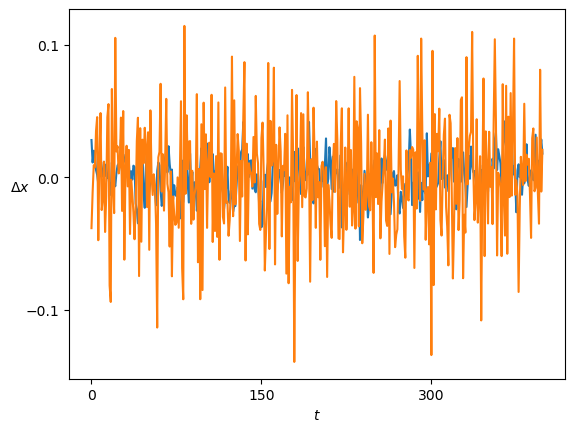

FBM displacements follow a Gaussian distribution 𝒩(*μ*, *σ*<sup>2</sup>)
which is centered at *μ* = 0 and whose variance is related to the
diffusion coefficient as *σ*<sup>2</sup> = 2*D*.

<details class="code-fold">
<summary>Code</summary>

``` python
for i,D in enumerate(u_D): plt.hist(ds_in[Ds_idx[i]].reshape(-1),500, histtype='step', label=f'{D:.2g}');
plt.ylabel('Counts'); plt.xlabel(r'$\Delta x$'); plt.legend(title=r'$D$');
```

</details>

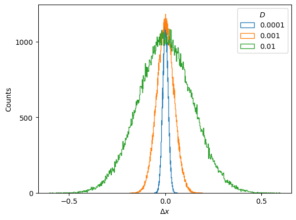

Therefore, the mean and variance of the displacements constitute two
straightforward sanity checks that the generated displacements must
satisfy.

<details class="code-fold">
<summary>Code</summary>

``` python
plot_xf(ds_in, lambda x: x.squeeze().mean(0),ds_args, intersect_idx, x_label=r'$t$', y_label=r'$\mu_{in}$',)
```

</details>

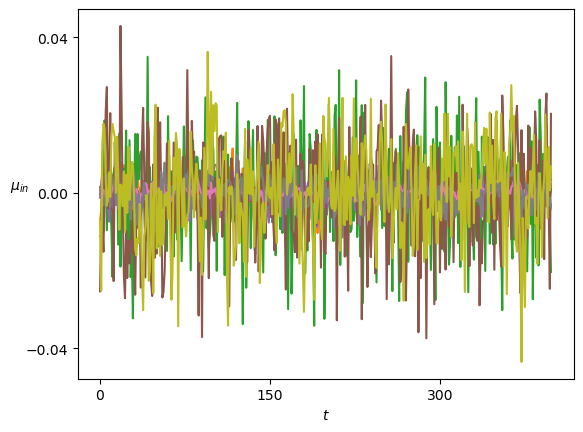

<details class="code-fold">
<summary>Code</summary>

``` python
plot_xf_D(ds_in, lambda x: sig2D(x.squeeze().std(0)),ds_args, intersect_idx,
          f_a=f_a_text,
          f_D=lambda D: plt.axhline(D, c='k', lw=1, ls='--', alpha=0.7),
          each_D=False,each_g=False, x_label=r'$t$', y_label=r'$D_{in}$',
          y_scale='log', show_legend=False,
         )
```

</details>

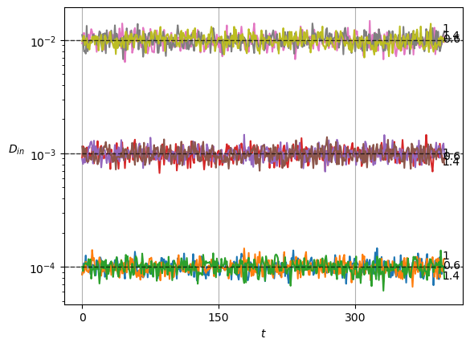

## SBM

Similarly, to load the dataset of SBM, we simply specify the dataset
parameters in a dict and call
[`load_data`](https://GabrielFernandezFernandez.github.io/SPIVAE/source/data.html#load_data)
with it.

``` python
N=1_000
```

``` python
Ds = [1e-5,1e-4,1e-3, 1e-2]  # np.geomspace(1e-5,1e-2, 10)
alphas = np.linspace(0.2,1.8,21)
n_alphas, n_Ds = len(alphas), len(Ds)
ds_args = dict(path="../../data/raw/", model='sbm',
               N=int(N/n_alphas/n_Ds), T=400,
               D=Ds, alpha=alphas,
               N_save=N, T_save=400,
               seed=0, valid_pct=0.8, bs=2**8,)
```

``` python
dls = load_data(ds_args)
```

As we did before, we can inspect the data that brings the `DataLoaders`.

``` python
alphas_items = dls.valid.items[:,0]
Ds_items     = dls.valid.items[:,1]
ds_in_labels = dls.valid.items[:,:2]
u_a=np.unique(alphas_items,)
u_D=np.unique(Ds_items,)
alphas_idx = [np.flatnonzero(alphas_items==a) for a in u_a]
Ds_idx = [np.flatnonzero(Ds_items==D) for D in u_D]
intersect_idx = np.array([[reduce(partial(np.intersect1d,assume_unique=True),
                                       (alphas_idx[i],Ds_idx[j]))
                                for j,D in enumerate(u_D)] for i,a in enumerate(u_a)], dtype=object)
```

``` python
ds_in = []
with torch.no_grad():
    for b in tqdm(dls.valid):
        x,y=b
        ds_in.append(to_detach(x).numpy())
ds_in = np.concatenate(ds_in)
print(ds_in.shape)
```

      0%|          | 0/40 [00:00<?, ?it/s]

    (9996, 1, 399)

SBM displacements have a zero mean but follow the scaling of the aging
diffusion coefficient
*D*<sub>*α*</sub>(*t*) = *α**D*<sub>0</sub>*t*<sup>*α* − 1</sup>.

<details class="code-fold">
<summary>Code</summary>

``` python
plt.plot(ds_in.squeeze()[:2].T); plt.xlabel(r'$t$'); plt.ylabel(r'$\Delta x$', rotation=0);
```

</details>

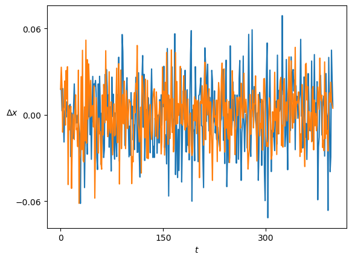

For *α* \< 1, the displacements become smaller as time passes. On the
contrary, *α* \> 1 leads to a growth of the displacements.

<details class="code-fold">
<summary>Code</summary>

``` python
fig, axs = plt.subplots(3,1, sharex=True, gridspec_kw=dict(hspace=0))
for ax, a_i in zip(axs,[0,n_alphas//2,n_alphas-1]):
    x = ds_in.squeeze()[alphas_idx[a_i]]
    ax.hist2d(np.tile(np.arange(x.shape[-1]),x.shape[0]),x.reshape(-1),x.shape[-1],
              cmin=2, norm=matplotlib.colors.LogNorm());
    ax.text(0.02,0.9, r'$\alpha=' f'{u_a[a_i]:.3g}' r'$', transform=ax.transAxes);
    ax.set_ylabel(r'$\Delta x$', rotation=0);
axs[-1].set_xlabel(r'$t$');
```

</details>

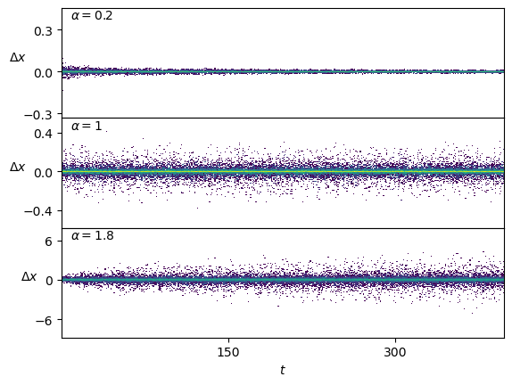

We plot the means of the displacements.

<details class="code-fold">
<summary>Code</summary>

``` python
plot_xf(ds_in, lambda x: x.squeeze().mean(0),ds_args, intersect_idx, x_label=r'$t$', y_label=r'$\mu_{in}$',)
```

</details>

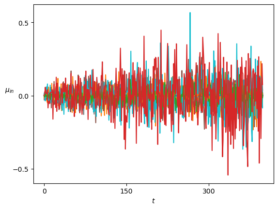

In SBM, each *α* is shown in the variance at each time step. Thus, this
simple sanity check is now a direct observation of the displacements
properties.

<details class="code-fold">
<summary>Code</summary>

``` python
x = ds_in.squeeze()
plot_xf_D(x, lambda x: sig2D(x.squeeze().std(0)),ds_args, intersect_idx,
          f_a=lambda a,y: plt.text(0.95,y[-1],f'{a:.3g}', transform=matplotlib.transforms.blended_transform_factory(plt.gca().transAxes, plt.gca().transData)),
          f_D=lambda D: plt.axhline(D, c='k', lw=1, ls='--', alpha=0.7),
          f_aD=lambda a,D: plt.plot(a*D*np.arange(1,x.shape[-1])**(a-1.)),
          each_D=True,each_g=False, x_label=r'$t$', y_label=r'$D_{in}$',
          y_scale='log', show_legend=False,
         )
```

</details>

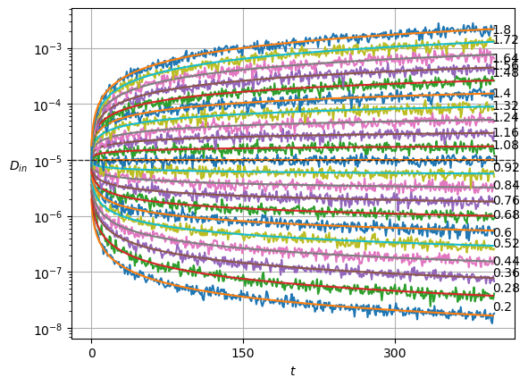

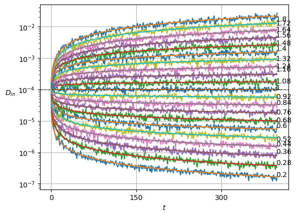

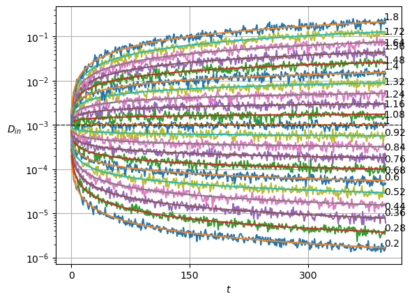

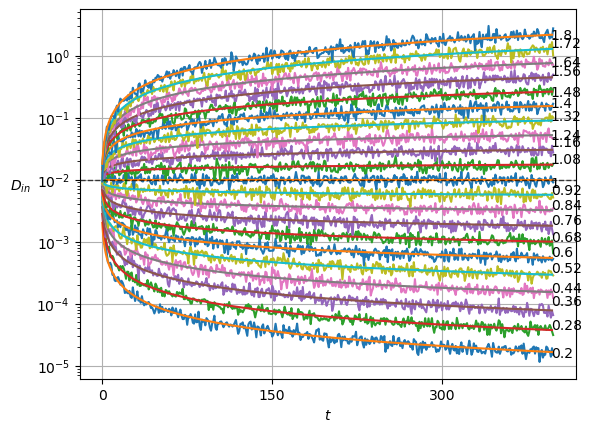
