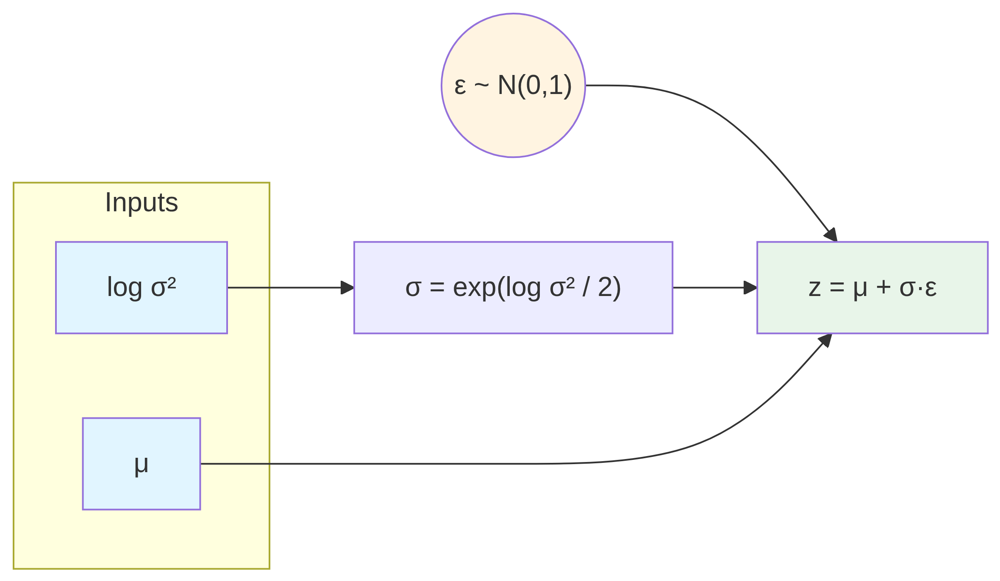
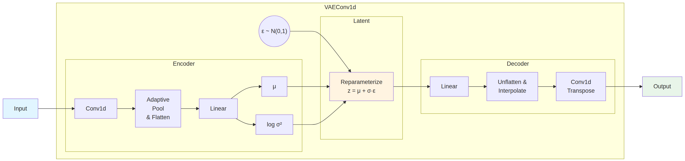
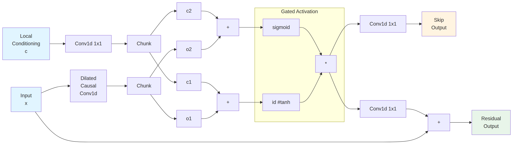
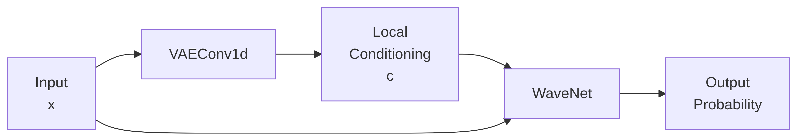
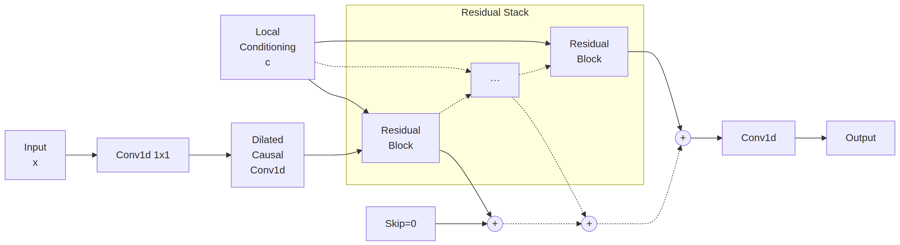

# Model


<!-- WARNING: THIS FILE WAS AUTOGENERATED! DO NOT EDIT! -->

The architecture of the interpretable autoregressive *β*-VAE works in
the following manner: Given the displacements **Δ****x**(*t*) of a
diffusion trajectory, the encoder (orange) compresses them into an
interpretable latent space (blue), in which few neurons (dark blue)
represent physical features of the input data while others are noised
out (light blue). An autoregressive decoder (green) generates from this
latent representation the displacements **Δ****x**<sup>′</sup>(*t*) of a
new trajectory recursively, considering a certain receptive field RF
(light green cone).

<figure>

<figcaption aria-hidden="true">Architecture</figcaption>
</figure>

The models module provides:

- An autoregressive encoder-decoder architecture
  [`VAEWaveNet`](https://GabrielFernandezFernandez.github.io/SPIVAE/source/models.html#vaewavenet),
  implemented as an extension to a convolutional VAE
  [`VAEConv1d`](https://GabrielFernandezFernandez.github.io/SPIVAE/source/models.html#vaeconv1d)
- Initialization utilities for setting up convolutional layers
- Helper functions for computing output dimensions after convolution
  operations

After that, we show an example of how to instantiate and train one
model.

# Initialization

As the architecture can be quite deep, a careful initialization is
needed (see `weight_init` function in the model class). We initialize
the weights with normal Kaiming init in fan_out mode, taking into
account that we use the nonlinear activation function ReLU.

------------------------------------------------------------------------

<a
href="https://github.com/GabrielFernandezFernandez/SPIVAE/blob/main/SPIVAE/models.py#L17"
target="_blank" style="float:right; font-size:smaller">source</a>

### init_cnn

``` python

def init_cnn(
    m:Module, # Module to initialize
):

```

*Initialize module weights with kaiming normal in fan_out mode and bias
to 0*

# VAE

We implement a 1D convolutional variational autoencoder as a base model.

## Latent neurons

The latent neurons are probabilistic, i.e., they are sampled following a
distribution. The reparameterization trick provides the means to allow
backpropagation through these probabilistic neurons by externalizing the
sampling noise.

------------------------------------------------------------------------

<a
href="https://github.com/GabrielFernandezFernandez/SPIVAE/blob/main/SPIVAE/models.py#L28"
target="_blank" style="float:right; font-size:smaller">source</a>

### reparameterize

``` python

def reparameterize(
    mu:Tensor, # Mean of the normal distribution, shape (batch_size, latent_dim)
    logvar:Tensor, # Diagonal log variance of the normal distribution, shape (batch_size, latent_dim)
)->Tensor: # Sampled latent z, shape (batch_size, latent_dim)

```

*Sample latent tensor using the reparameterization trick:*
*z* = *ϵ**σ* + *μ*, where *ϵ* ∼ 𝒩(0, 1).

<div>

<figure class=''>

<div>



</div>

</figure>

</div>

## Output size helpers

We also take into account the sizes after n convolutions are applied to
automate the model construction.

------------------------------------------------------------------------

<a
href="https://github.com/GabrielFernandezFernandez/SPIVAE/blob/main/SPIVAE/models.py#L54"
target="_blank" style="float:right; font-size:smaller">source</a>

### output_size_after_n_convt

``` python

def output_size_after_n_convt(
    n:int, input_size:int, kernel_size:int, stride:int=1, padding:int=0, output_padding:int=0, dilation:int=1
)->int:

```

------------------------------------------------------------------------

<a
href="https://github.com/GabrielFernandezFernandez/SPIVAE/blob/main/SPIVAE/models.py#L50"
target="_blank" style="float:right; font-size:smaller">source</a>

### output_size_convt

``` python

def output_size_convt(
    input_size:int, kernel_size:int, stride:int=1, padding:int=0, output_padding:int=0, dilation:int=1
)->int:

```

------------------------------------------------------------------------

<a
href="https://github.com/GabrielFernandezFernandez/SPIVAE/blob/main/SPIVAE/models.py#L42"
target="_blank" style="float:right; font-size:smaller">source</a>

### output_size_after_n_conv

``` python

def output_size_after_n_conv(
    n:int, input_size:int, kernel_size:int, stride:int=1, padding:int=0, dilation:int=1
)->int:

```

------------------------------------------------------------------------

<a
href="https://github.com/GabrielFernandezFernandez/SPIVAE/blob/main/SPIVAE/models.py#L38"
target="_blank" style="float:right; font-size:smaller">source</a>

### output_size_conv

``` python

def output_size_conv(
    input_size:int, kernel_size:int, stride:int=1, padding:int=0, dilation:int=1
)->int:

```

------------------------------------------------------------------------

<a
href="https://github.com/GabrielFernandezFernandez/SPIVAE/blob/main/SPIVAE/models.py#L63"
target="_blank" style="float:right; font-size:smaller">source</a>

### View

``` python

def View(
    size:tuple
):

```

*Use as (un)flattening layer*

## 1D Convolutional VAE

------------------------------------------------------------------------

<a
href="https://github.com/GabrielFernandezFernandez/SPIVAE/blob/main/SPIVAE/models.py#L72"
target="_blank" style="float:right; font-size:smaller">source</a>

### VAEConv1d

``` python

def VAEConv1d(
    nf:list, # number of filters
    encoder:list, # Encoder's dense layers sizes
    decoder:list, # Decoder's dense layers sizes
    o_dim:int, # input size (T)
    nc_in:int=1, # number of input channels
    nc_out:int=6, # number of output channels
    z_dim:int=6, # number of latent neurons
    beta:float=0.0, # weight of the KLD loss
    avg_size:int=24, # output size of the pooling layers
    kwargs:VAR_KEYWORD
):

```

*1-dimensional convolutional VAE architecture*

VAEConv1d Architecture Flow

<div>

<figure class=''>

<div>



</div>

</figure>

</div>

# VAE + WaveNet

We extend the VAE with WaveNet as the autoregressive decoder.

------------------------------------------------------------------------

<a
href="https://github.com/GabrielFernandezFernandez/SPIVAE/blob/main/SPIVAE/models.py#L174"
target="_blank" style="float:right; font-size:smaller">source</a>

### sample_from_mix_gaussian

``` python

def sample_from_mix_gaussian(
    y:Tensor, # Mixture of Gaussians parameters. Shape (B x C x T)
    log_scale_min:float=-12.0, # Log scale minimum value.
)->Tensor:

```

*Sample from (discretized) mixture of gaussian distributions.*

------------------------------------------------------------------------

<a
href="https://github.com/GabrielFernandezFernandez/SPIVAE/blob/main/SPIVAE/models.py#L229"
target="_blank" style="float:right; font-size:smaller">source</a>

### DilatedCausalConv1d

``` python

def DilatedCausalConv1d(
    mask_type:str, in_channels:int, out_channels:int, kernel_size:int=2, dilation:int=1, bias:bool=True,
    use_pad:bool=True
):

```

*Dilated causal convolution for WaveNet*

------------------------------------------------------------------------

<a
href="https://github.com/GabrielFernandezFernandez/SPIVAE/blob/main/SPIVAE/models.py#L259"
target="_blank" style="float:right; font-size:smaller">source</a>

### ResidualBlock

``` python

def ResidualBlock(
    res_channels:int, skip_channels:int, kernel_size:int, dilation:int, c_channels:int=0, g_channels:int=0,
    bias:bool=True, use_pad:bool=True
):

```

*Residual block with conditions and gate mechanism*

ResidualBlock Architecture Flow

<div>

<figure class=''>

<div>



</div>

</figure>

</div>

------------------------------------------------------------------------

<a
href="https://github.com/GabrielFernandezFernandez/SPIVAE/blob/main/SPIVAE/models.py#L325"
target="_blank" style="float:right; font-size:smaller">source</a>

### VAEWaveNet

``` python

def VAEWaveNet(
    in_channels:int=1, # input channels
    res_channels:int=16, # residual block channels
    skip_channels:int=16, # skip connection channels
    c_channels:int=6, # local conditioning (time-wise)
    g_channels:int=0, # global conditioning (the same for the whole sequence)
    out_channels:int=1, # output channels
    res_kernel_size:int=3, # kernel_size of dilated layers in residual blocks
    layer_size:int=4, # largest dilation is 2^layer_size
    stack_size:int=1, # number of layers stacks
    out_distribution:str='normal', discrete_channels:int=256, num_mixtures:int=1, # 1=no mixture
    use_pad:bool=False, weight_norm:bool=False, kwargs:VAR_KEYWORD
):

```

*VAE with autoregressive decoder*

VAEWaveNet Architecture Flow

<div>

<figure class=''>

<div>



</div>

</figure>

</div>

WaveNet Architecture Flow

<div>

<figure class=''>

<div>



</div>

</figure>

</div>

We can create a model by specifying its parameters in a dict.

``` python
model_args = dict(# VAE #########################
                  o_dim=400,
                  nc_in=1, nc_out=6,
                  nf=[16]*4,
                  avg_size=16,
                  encoder=[200,100],
                  z_dim=6,
                  decoder=[100,200],
                  beta=0,
                  # WaveNet ########
                  in_channels=1,
                  res_channels=16,skip_channels=16,
                  c_channels=6,
                  g_channels=0,
                  res_kernel_size=3,
                  layer_size=4,  # 6
                  stack_size=1,
                  out_distribution= "Normal",
                  num_mixtures=1,
                  use_pad=False,
                  model_name = 'SPIVAE',
                 )
model = VAEWaveNet(**model_args)
```

Printing the model object will reveal the declared layers.

``` python
model
```

    VAEWaveNet(
      (vae): VAEConv1d(
        (encoder): Sequential(
          (0): Conv1d(1, 16, kernel_size=(3,), stride=(1,))
          (1): ReLU(inplace=True)
          (2): Conv1d(16, 16, kernel_size=(3,), stride=(1,))
          (3): ReLU(inplace=True)
          (4): Conv1d(16, 16, kernel_size=(3,), stride=(1,))
          (5): ReLU(inplace=True)
          (6): Conv1d(16, 16, kernel_size=(3,), stride=(1,))
          (7): ReLU(inplace=True)
          (8): AdaptiveConcatPool1d(
            (ap): AdaptiveAvgPool1d(output_size=16)
            (mp): AdaptiveMaxPool1d(output_size=16)
          )
          (9): View()
          (10): Linear(in_features=512, out_features=200, bias=True)
          (11): ReLU(inplace=True)
          (12): Linear(in_features=200, out_features=100, bias=True)
          (13): ReLU(inplace=True)
          (14): Linear(in_features=100, out_features=12, bias=True)
        )
        (decoder): Sequential(
          (0): Linear(in_features=6, out_features=100, bias=True)
          (1): ReLU(inplace=True)
          (2): Linear(in_features=100, out_features=200, bias=True)
          (3): ReLU(inplace=True)
          (4): Linear(in_features=200, out_features=512, bias=True)
          (5): ReLU(inplace=True)
          (6): View()
        )
        (convt): Sequential(
          (0): ConvTranspose1d(16, 16, kernel_size=(3,), stride=(1,))
          (1): ReLU(inplace=True)
          (2): ConvTranspose1d(16, 16, kernel_size=(3,), stride=(1,))
          (3): ReLU(inplace=True)
          (4): ConvTranspose1d(16, 16, kernel_size=(3,), stride=(1,))
          (5): ReLU(inplace=True)
          (6): ConvTranspose1d(16, 6, kernel_size=(3,), stride=(1,))
          (7): ReLU(inplace=True)
        )
      )
      (init_conv): Conv1d(1, 16, kernel_size=(1,), stride=(1,))
      (causal): DilatedCausalConv1d(
        (conv): Conv1d(16, 16, kernel_size=(2,), stride=(1,))
      )
      (res_stack): ModuleList(
        (0): ResidualBlock(
          (dilated): DilatedCausalConv1d(
            (conv): Conv1d(16, 32, kernel_size=(3,), stride=(1,))
          )
          (conv_c): Conv1d(6, 32, kernel_size=(1,), stride=(1,), bias=False)
          (conv_res): Conv1d(16, 16, kernel_size=(1,), stride=(1,))
          (conv_skip): Conv1d(16, 16, kernel_size=(1,), stride=(1,))
        )
        (1): ResidualBlock(
          (dilated): DilatedCausalConv1d(
            (conv): Conv1d(16, 32, kernel_size=(3,), stride=(1,), dilation=(2,))
          )
          (conv_c): Conv1d(6, 32, kernel_size=(1,), stride=(1,), bias=False)
          (conv_res): Conv1d(16, 16, kernel_size=(1,), stride=(1,))
          (conv_skip): Conv1d(16, 16, kernel_size=(1,), stride=(1,))
        )
        (2): ResidualBlock(
          (dilated): DilatedCausalConv1d(
            (conv): Conv1d(16, 32, kernel_size=(3,), stride=(1,), dilation=(4,))
          )
          (conv_c): Conv1d(6, 32, kernel_size=(1,), stride=(1,), bias=False)
          (conv_res): Conv1d(16, 16, kernel_size=(1,), stride=(1,))
          (conv_skip): Conv1d(16, 16, kernel_size=(1,), stride=(1,))
        )
        (3): ResidualBlock(
          (dilated): DilatedCausalConv1d(
            (conv): Conv1d(16, 32, kernel_size=(3,), stride=(1,), dilation=(8,))
          )
          (conv_c): Conv1d(6, 32, kernel_size=(1,), stride=(1,), bias=False)
          (conv_res): Conv1d(16, 16, kernel_size=(1,), stride=(1,))
          (conv_skip): Conv1d(16, 16, kernel_size=(1,), stride=(1,))
        )
      )
      (out_conv): Sequential(
        (0): ReLU(inplace=True)
        (1): Conv1d(16, 16, kernel_size=(1,), stride=(1,))
        (2): ReLU(inplace=True)
        (3): Conv1d(16, 9, kernel_size=(1,), stride=(1,))
      )
    )

# Training a VAEWaveNet

The following example demonstrates a complete training workflow: loading
data, initializing the model, and training with fastai’s `Learner`.

``` python
DEVICE= 'cpu' # 'cuda'
print(DEVICE)
```

    cpu

``` python
N=6_000
```

``` python
Ds = np.linspace(2e-5,2e-2,5)
alphas = np.linspace(0.2,1.8,9)
n_alphas,n_Ds = len(alphas), len(Ds)
ds_args = dict(path="../../data/raw/", model='fbm', # 'sbm'
               N=int(N/n_alphas/n_Ds*2), T=400,
               D=Ds, alpha=alphas,seed=0,
               valid_pct=0.2, bs=2**8,
               N_save=N, T_save=400,
              )
```

``` python
model_args = dict(# VAE ###########################
                  o_dim=ds_args['T']-1,
                  nc_in=1, nc_out=6,
                  nf=[16]*4,
                  avg_size=16,
                  encoder=[200,100],
                  z_dim=6,
                  decoder=[100,200],
                  beta=0,
                  # WaveNet ########
                  in_channels=1,
                  res_channels=16,skip_channels=16,
                  c_channels=6,
                  g_channels=0,
                  res_kernel_size=3,
                  layer_size=4,  # 6  # Largest dilation is 2**layer_size
                  stack_size=1,
                  out_distribution= "Normal",
                  num_mixtures=1,
                  use_pad=False,
                  model_name = 'SPIVAE',
                 )
```

``` python
dls = load_data(ds_args)
```

``` python
model = VAEWaveNet(**model_args).to(DEVICE)
```

``` python
loss_fn = Loss(model.receptive_field, model.c_channels,
               beta=model_args['beta'], reduction='mean')
```

``` python
learn = Learner(dls, model, loss_func=loss_fn,)
```

``` python
E=4
```

``` python
learn.fit_one_cycle(E, lr_max=1e-4)
```

<style>
    /* Turns off some styling */
    progress {
        /* gets rid of default border in Firefox and Opera. */
        border: none;
        /* Needs to be in here for Safari polyfill so background images work as expected. */
        background-size: auto;
    }
    progress:not([value]), progress:not([value])::-webkit-progress-bar {
        background: repeating-linear-gradient(45deg, #7e7e7e, #7e7e7e 10px, #5c5c5c 10px, #5c5c5c 20px);
    }
    .progress-bar-interrupted, .progress-bar-interrupted::-webkit-progress-bar {
        background: #F44336;
    }
</style>

<table class="dataframe" data-quarto-postprocess="true" data-border="1">
<thead>
<tr style="text-align: left;">
<th data-quarto-table-cell-role="th">epoch</th>
<th data-quarto-table-cell-role="th">train_loss</th>
<th data-quarto-table-cell-role="th">valid_loss</th>
<th data-quarto-table-cell-role="th">time</th>
</tr>
</thead>
<tbody>
<tr>
<td>0</td>
<td>0.982180</td>
<td>0.949590</td>
<td>00:28</td>
</tr>
<tr>
<td>1</td>
<td>0.934559</td>
<td>0.880010</td>
<td>00:25</td>
</tr>
<tr>
<td>2</td>
<td>0.882010</td>
<td>0.822553</td>
<td>00:26</td>
</tr>
<tr>
<td>3</td>
<td>0.843744</td>
<td>0.810182</td>
<td>00:29</td>
</tr>
</tbody>
</table>
