# Analyzing SBM


<!-- WARNING: THIS FILE WAS AUTOGENERATED! DO NOT EDIT! -->

In this notebook, we aim at visualizing what the trained SPIVAE learned.
We look into the output, the latent neurons, and the loss distribution
of the model.

# Load model

We load the model to characterize from its checkpoint saved after
[training](training_sbm.html).

``` python
DEVICE='cpu'
E=49
model_name = 'sbm' + f'_E{E}'
```

    Loading checkpoint: ./models/sbm_E49.tar
    on device: cpu

``` python
c_point, model = load_checkpoint("./models/"+model_name,device=DEVICE)
```

We can check the parameters of the data and the model.

``` python
ds_args, model_args = c_point['ds_args'],c_point['model_args']
print(ds_args, model_args)
```

    {'path': '../../data/raw/', 'model': 'sbm', 'N': 476, 'T': 400, 'D': array([1.00000000e-05, 2.15443469e-05, 4.64158883e-05, 1.00000000e-04,
           2.15443469e-04, 4.64158883e-04, 1.00000000e-03, 2.15443469e-03,
           4.64158883e-03, 1.00000000e-02]), 'alpha': array([0.2 , 0.28, 0.36, 0.44, 0.52, 0.6 , 0.68, 0.76, 0.84, 0.92, 1.  ,
           1.08, 1.16, 1.24, 1.32, 1.4 , 1.48, 1.56, 1.64, 1.72, 1.8 ]), 'N_save': 1000, 'T_save': 400, 'seed': 0, 'valid_pct': 0.2, 'bs': 256} {'o_dim': 399, 'nc_in': 1, 'nc_out': 6, 'nf': [16, 16, 16, 16], 'avg_size': 16, 'encoder': [200, 100], 'z_dim': 6, 'decoder': [100, 200], 'beta': 0.005, 'in_channels': 1, 'res_channels': 16, 'skip_channels': 16, 'c_channels': 6, 'g_channels': 0, 'res_kernel_size': 3, 'layer_size': 4, 'stack_size': 1, 'out_distribution': 'Normal', 'num_mixtures': 1, 'use_pad': False, 'model_name': 'SPIVAE'}

We generate the test set as explained in the [data
docs](../source/data.html#scaled-brownian-motion). You can skip this
step if you already generated a test set using the data generation
notebook.

``` python
Ds = np.geomspace(1e-6,1e-1,16)[2:-2] # np.geomspace(1e-6,1e-1,61)[6:-6]
alphas = np.linspace(0.04,1.96,49)
```

``` python
n_alphas, n_Ds = len(alphas), len(Ds)
```

``` python
ds_args = dict(path="../../data/test/", model='sbm',
               N=int(100_000/n_alphas/n_Ds), T=400,
               D=Ds, alpha=alphas,
               N_save=1_000, T_save=400,
               seed=0, valid_pct=.8, bs=2**8,)
```

``` python
fname = ds_args["path"] +'sbm.npz'
if not os.path.exists(fname):
    disp = {f'{a:.3g}'+f',{D:.3g}':[] for D in ds_args["D"] for a in ds_args["alpha"]}
    for i,a in enumerate(ds_args["alpha"]):
        for j,D in enumerate(ds_args["D"]):
            k = f'{a:.3g}'+f',{D:.3g}'
            disp[k]=np.array([np.concatenate(([a,D],sbm(ds_args["T_save"], a, sigma = D2sig(D)))) 
                              for n in range(ds_args["N_save"])]) # N, T+2
    np.savez_compressed(fname,**disp)
```

We load the dataset. At this point, we can load any subset of the whole
test set updating the ds_args dict.

``` python
dls = load_data(ds_args).to(DEVICE)
dls[0].drop_last, dls[1].drop_last, dls[1].bs, dls.device
```

    (True, False, 256, 'cpu')

We can see the mean loss on a batch.

``` python
print('RF:', model.receptive_field, 'bs:', dls.bs)
x,y=b = dls.valid.one_batch(); t = model(x)
loss_fn = Loss(model.receptive_field, model.c_channels, 
                    beta=model_args['beta'], reduction='mean')
l = loss_fn(t,y).item(); 
print('Current mean loss on a batch: ',l)
```

    RF: 32 bs: 256
    Current mean loss on a batch:  -2.4884631633758545

``` python
learn = Learner(dls, model, loss_func=loss_fn, opt_func=Adam,)
if torch.cuda.is_available() and DEVICE=='cuda': learn.model.cuda()
```

# Get predictions

We now get the predictions for the test set and take the labels indices
to keep track of them during the analysis.

``` python
ds_in,preds,ds_targs = learn.get_preds(with_input=True,) # predicts in validation dataset

alphas_items = learn.dls.valid.items[:,0]
Ds_items     = learn.dls.valid.items[:,1]
ds_in_labels = learn.dls.valid.items[:,:2] 
u_a=np.unique(alphas_items,)
u_D=np.unique(Ds_items,)

alphas_idx = [np.flatnonzero(alphas_items==a) for a in u_a]
Ds_idx = [np.flatnonzero(Ds_items==D) for D in u_D]

intersect_idx = np.array([[reduce(partial(np.intersect1d,assume_unique=True),
                                       (alphas_idx[i],Ds_idx[j]))
                                for j,D in enumerate(u_D)] for i,a in enumerate(u_a)], dtype=object)

alphas_idx_flat = [item for sublist in alphas_idx for item in sublist]
Ds_idx_flat = [item for sublist in Ds_idx for item in sublist]

pred, mu, logvar, c, z = preds

print(ds_in.shape, learn.dls.valid.items.shape)
print(L(map(len, alphas_idx)), len(alphas_idx_flat), L(map(len, Ds_idx)), len(Ds_idx_flat))
```

<style>
    /* Turns off some styling */
    progress {
        /* gets rid of default border in Firefox and Opera. */
        border: none;
        /* Needs to be in here for Safari polyfill so background images work as expected. */
        background-size: auto;
    }
    progress:not([value]), progress:not([value])::-webkit-progress-bar {
        background: repeating-linear-gradient(45deg, #7e7e7e, #7e7e7e 10px, #5c5c5c 10px, #5c5c5c 20px);
    }
    .progress-bar-interrupted, .progress-bar-interrupted::-webkit-progress-bar {
        background: #F44336;
    }
</style>

    torch.Size([79968, 1, 399]) (79968, 401)
    [1627, 1645, 1637, 1646, 1621, 1624, 1621, 1619, 1654, 1610, 1632, 1628, 1631, 1637, 1611, 1616, 1611, 1627, 1610, 1631, 1646, 1639, 1644, 1625, 1687, 1629, 1613, 1633, 1575, 1675, 1585, 1633, 1638, 1647, 1620, 1680, 1647, 1662, 1642, 1636, 1622, 1667, 1644, 1657, 1622, 1604, 1620, 1588, 1650] 79968 [6725, 6678, 6600, 6632, 6645, 6669, 6739, 6609, 6738, 6631, 6631, 6671] 79968

``` python
p_mix, mu_out, log_std_out =  map(np.array,map(torch.squeeze,pred.chunk(3,dim=1)))
std_out = np.exp(log_std_out)
```

# Check output mean and variance

As a fast check of the model, we can see if the output mean and variance
are correct.

We can compare with the same graphics made for the input at the [data
notebook](../source/data.html#sbm). In the next plot, the mean is around
zero for most of the *α* values. The biggest ones show a small
deviation.

<details class="code-fold">
<summary>Code</summary>

``` python
plot_xf_D(mu_out, lambda x: x.mean(0),ds_args, intersect_idx,
          x_label=r'$t$', y_label=r'$\mu_{out}$', f_a=f_a_text,
          each_D=False, each_g=False, show_legend=False,)
```

</details>

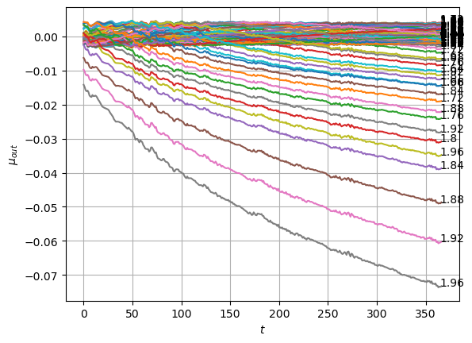

We can see the model is having good means for *α* \< 1.7 and has an
increasing bias for bigger *α*. On the other hand, the variance that
will be used to generate displacements may be connected with the aging
diffusion coefficient
*D*<sub>*α*</sub>(*t*) = *α**D*<sub>0</sub>*t*<sup>*α* − 1</sup>, and
coincides with the expected behavior up to very small displacements
*D* ∼ 10<sup>−7</sup>.

<details class="code-fold">
<summary>Code</summary>

``` python
# D_out from std_out
# scaling to compensate the time generated by the machine starting at RF+1
# t_full = np.arange(1,std_out.shape[-1]+1)
# t_shift = model.receptive_field+1
# t_gen  = t_full + t_shift
# def t_scaling(a): return ((1+t_full)/(t_gen))**(a-1.)
# TODO implement inside plotting function

plot_xf_D(std_out, lambda x: sig2D(x.mean(0)),ds_args, intersect_idx,
          f_a=f_a_text,
          f_D=lambda D: plt.axhline(D, c='k', lw=1, ls='--', alpha=0.7),
          f_aD=lambda a,D: plt.plot(a*D*np.arange(1,std_out.shape[-1])**(a-1.),'--', c='gray', alpha=0.6),
          each_D=True, x_label=r'$t$', y_label=r'$D_{out}$', y_scale='log',
         )
```

</details>

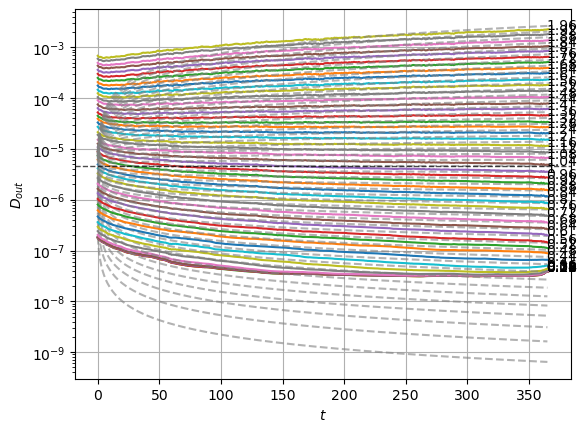

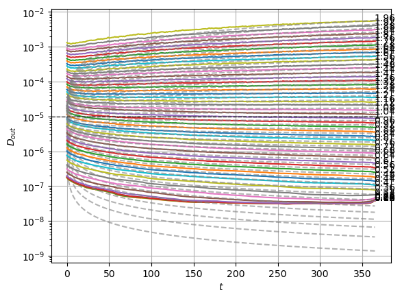

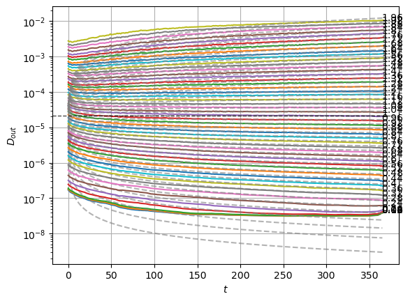

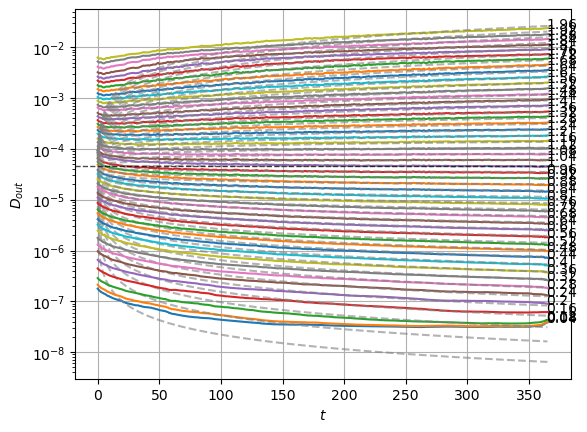

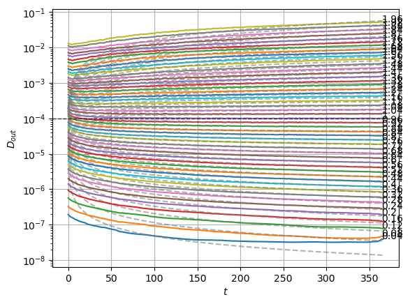

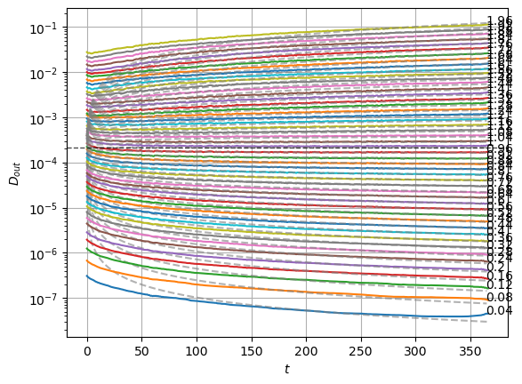

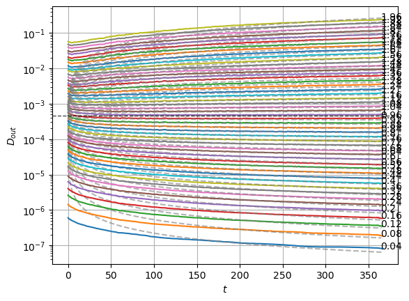

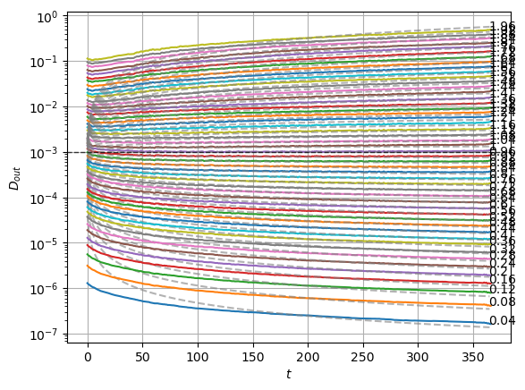

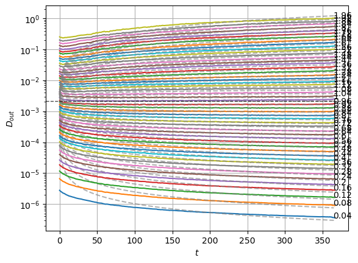

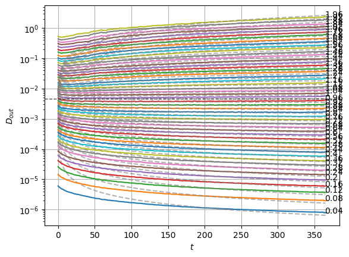

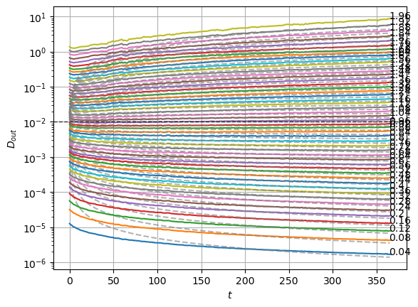

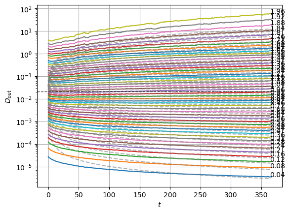

The model performs well inside the training range of *α* and big
*D*<sub>0</sub> whereas it fails in the smallest *D*<sub>0</sub> and the
*α* outside the training range. This might be due to a very fast
training.

# Interpret latent neurons

As we explain in the [model notebook](../source/models.html), the
architecture we trained is designed to have an interpretable bottleneck,
a few neurons that should encode relevant features of the input dataset
to have a good generation.

In the model, the latent neurons **z** have a Gaussian distribution
𝒩(*μ* = 0, *σ*<sup>2</sup> = 1) to create a continuous latent space.
Meaningful latent neurons have a mean *μ* related to some feature of the
data and a small variance *σ*<sup>2</sup>. On the contrary, the noised
neurons show a close to zero mean and near unit variance, as enforced by
the divergence term during training.

## Latent neuron activations distribution

The following plots show the distribution of the mean and variance
activations. Two neurons have a spread mean and very small variances,
while the rest of neurons’ activations lie around zero mean and unit
variance. Colors indicate each latent neuron index.

<details class="code-fold">
<summary>Code</summary>

``` python
fig, axs = plt.subplots(1,2,sharey=True,gridspec_kw=dict(wspace=0));
axs[0].hist(mu.T, 100, histtype='step', log=True);
axs[0].set_xlabel(r'$\mu$ neuron activation');
axs[0].set_ylabel('Counts');
axs[1].hist(np.exp(logvar).T, 100, histtype='step', log=True);
axs[1].set_xlabel(r'$\sigma^2$ neuron activation');
```

</details>

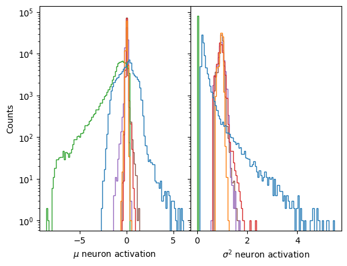

We can also detect which neurons are being informative with simple
metrics. For instance, the authors of [Lu et al. Phys. Rev. X **10**,
031056](https://doi.org/10.1103/PhysRevX.10.031056) make use of two
quantities, the variance of the mean, and the mean of the variance (we
use here the logarithm for visual convenience).

<details class="code-fold">
<summary>Code</summary>

``` python
plt.plot(mu.var(0), label=r'Var($\mu$)');
plt.plot(logvar.mean(0), label=r'Mean($\log\sigma^2$)');
plt.xlabel('Latent neuron'); plt.legend();
```

</details>

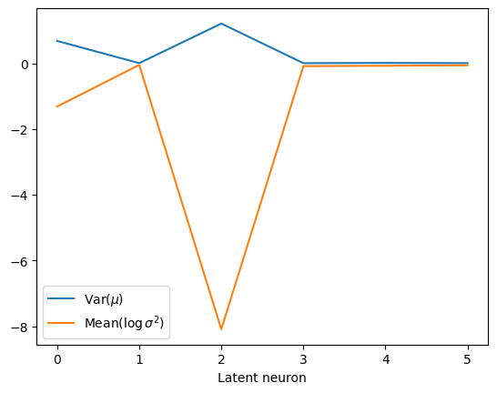

## *μ* relation with *α* and *D*<sub>0</sub>

To interpret these neurons, we look at their relation with the physical
parameters we expect in this dataset, the anomalous exponent *α* and the
constant *D*<sub>0</sub>.

We observe that both *surviving* neurons have a not so clear relation
with *α* while the uninformative neurons remain at zero mean.

<details class="code-fold">
<summary>Code</summary>

``` python
plt.plot(alphas_items, mu,'+', alpha=0.1);
plt.xlabel(r'$\alpha$'); plt.ylabel(r'$\mu$ neuron activation');
plt.grid();
```

</details>

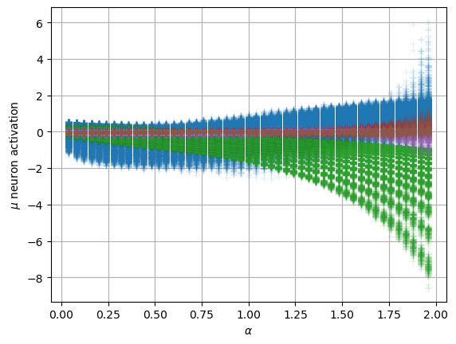

For the constant *D*<sub>0</sub>, we have a similar scenario, both
neurons present a relation with the parameter.

<details class="code-fold">
<summary>Code</summary>

``` python
plt.plot(Ds_items, mu,'+', alpha=0.1);
plt.xlabel(r'$D_0$'); plt.ylabel(r'$\mu$ neuron activation');
plt.xscale('log'); plt.grid();
```

</details>

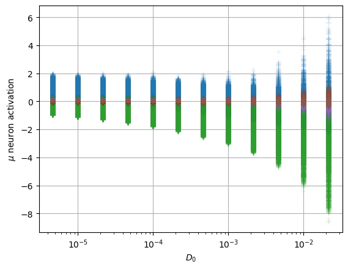

In this case, the interpretation is not satisfactory considering only
the independent parameters that control the whole expression of the
aging diffusion coefficient
*D*<sub>*α*</sub>(*t*) = *α**D*<sub>0</sub>*t*<sup>*α* − 1</sup>.
Instead, the latent neurons are encoding both parameters with two
combinations.

One of the neurons holds a strong relation with
log (*D*<sub>*α*</sub>(*t* = *T*)) = log (*α**D*<sub>0</sub>*T*<sup>*α* − 1</sup>).

<details class="code-fold">
<summary>Code</summary>

``` python
plt.plot(np.log(alphas_items*Ds_items*400**(alphas_items-1)), mu,'+', alpha=0.1);
plt.xlabel(r'$\log (D_\alpha(t=T)) = \log(\alpha D_0 T^{\alpha-1})$');
plt.ylabel(r'$\mu$ neuron activation');
```

</details>

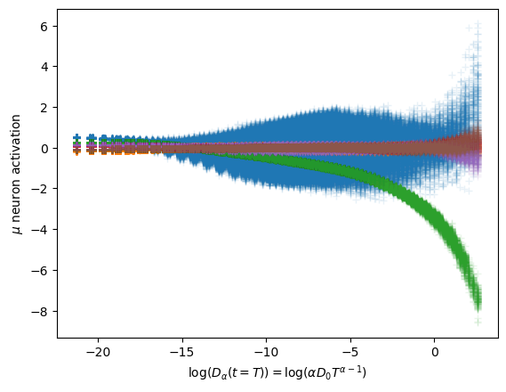

The other neuron is similar to
log (*α**D*<sub>0</sub>*T*<sup>−(*α* − 1)</sup>).

<details class="code-fold">
<summary>Code</summary>

``` python
plt.plot(np.log(alphas_items*Ds_items*400**(1-alphas_items)), mu,'+', alpha=0.1);
plt.xlabel(r'$\log (\alpha D_0 T^{-(\alpha-1)})$'); plt.ylabel(r'$\mu$ neuron activation');
```

</details>

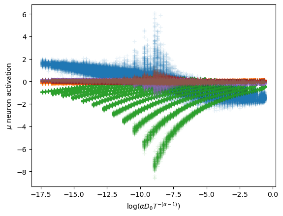

To properly observe the relation of the latent neurons with the
parameters, we show the distribution of the surviving neurons’
activations relative to the parameters alone and to their combinations.
This constitutes an example of the Fig. 2 in [our
paper](https://doi.org/10.48550/arXiv.2307.11608).

``` python
cmap_latent = 'Blues'
```

``` python
mu_idx = 2
plt.hist2d(Ds_items, mu[:,mu_idx].numpy(),
           bins=(u_D,125), cmin=2, cmap=cmap_latent,
           norm = matplotlib.colors.LogNorm());
plt.xscale('log');
plt.xlabel(r'$D$');plt.ylabel(r'$\mu_' f'{mu_idx}' '$');
plt.grid();
```

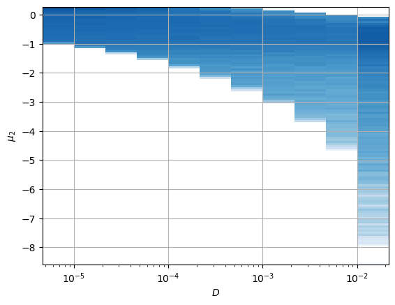

``` python
mu_idx = 0
plt.hist2d(alphas_items, mu[:,mu_idx].numpy(),
           bins=(u_a,125), cmin=2, cmap=cmap_latent,
           norm = matplotlib.colors.LogNorm());
plt.xlabel(r'$\alpha$');plt.ylabel(r'$\mu_' f'{mu_idx}' '$');
plt.grid();
```

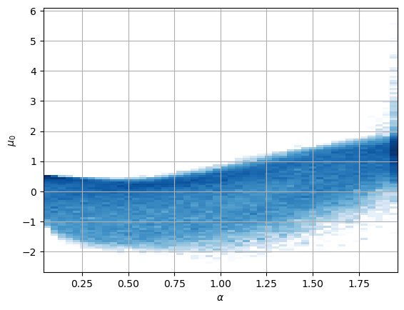

``` python
mu_idx = 2
plt.hist2d(np.log(alphas_items*Ds_items*400**(alphas_items-1)), mu[:,mu_idx].numpy(),
           125, cmin=2, cmap=cmap_latent, norm = matplotlib.colors.LogNorm());
plt.xlabel(r'$\log (D_\alpha(t=T)) = \log(\alpha D_0 T^{\alpha-1})$');
plt.ylabel(r'$\mu_' f'{mu_idx}' '$');
```

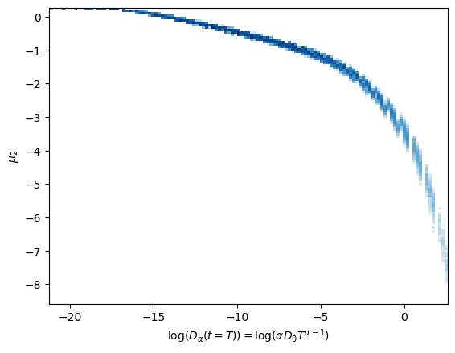

``` python
mu_idx = 0
plt.hist2d(np.log(alphas_items*Ds_items*400**(1-alphas_items)), mu[:,mu_idx].numpy(),
           125, cmin=2, cmap=cmap_latent, norm = matplotlib.colors.LogNorm());
plt.xlabel(r'$ \log(\alpha D_0 T^{-(\alpha-1)})$');
plt.ylabel(r'$\mu_' f'{mu_idx}' '$');
```

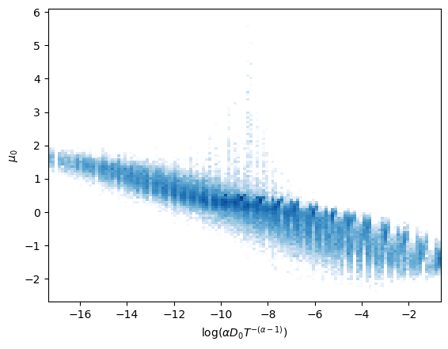

The *surviving* neurons respectively exhibit an almost linear
relationship with the combinations above.

To discern how combined this representation is, the next figure shows
*μ*<sub>*i*</sub> with respect to both parameters at the same time.

<details class="code-fold">
<summary>Code</summary>

``` python
fig, axs = plt.subplots(3,2, subplot_kw={'projection':'3d'},figsize=(6,8))
for mu_idx in range(mu.shape[-1]):
    Z = np.empty((len(u_a), len(u_D)))
    for j,D in enumerate(u_D):
        for i,a in enumerate(u_a):
            Z[i,j] = mu[intersect_idx[i,j],mu_idx].mean()
    Z = Z.T

    ax = axs.flat[mu_idx]
    X = u_a; Y = np.log10(u_D)
    X, Y = np.meshgrid(X, Y)
    cmap_latent_3d = matplotlib.cm.viridis
    norm_3d = matplotlib.colors.Normalize(vmin=-4,vmax=4)
    surf = ax.plot_surface(X, Y, Z, cmap=cmap_latent_3d,norm=norm_3d, alpha=0.6,
                           rstride=3, cstride=3,
                           linewidth=0, antialiased=False,)
    ax.xaxis.set_rotate_label(False)  # disable automatic rotation
    ax.set_xlabel(r'$\alpha$', labelpad=-8,rotation=0,ha='right',va='center');
    ax.set_xticks([0,1,2],[0,1,2],ha='right',va='center', )#rotation_mode='anchor')
    ax.set_xlim([0,2]);ax.set_ylim(np.log10([3.16e-6,3.163e-2]));
    ax.yaxis.set_rotate_label(False)  # disable automatic rotation
    ax.set_ylabel(r'$D$', labelpad=-4,rotation=0,ha='left',va='bottom');
    ax.set_yticks([-5,-4,-3,-2],[r'$10^{-5}$','',r'$10^{-3}$',''],ha='left',va='center');
    ax.tick_params(pad=-6)
    ax.yaxis.set_tick_params(pad=-4)
    ax.xaxis.set_tick_params(pad=-4)
    ax.zaxis.set_tick_params(pad=-6)
    ax.zaxis.set_rotate_label(False)  # disable automatic rotation
    ax.set_zlabel(r'$z_{_' f'{mu_idx}' r'}$',rotation=0,labelpad=-8, va='center', ha='right')
    ax.set_zlim(-3,3);
    ax.set_zticks([-2,0,2],[r'$-2$',r'$0$',r'$2$'], ha='right', va='center')
    ax.set_box_aspect(None, zoom=1)
    ax.zaxis._axinfo['juggled'] = (1,2,0)
    ax.tick_params(axis='x', which='major', direction='in')
    ax.tick_params(axis='y', which='major', direction='in')
    ax.tick_params(axis='z', which='major', direction='in')
```

</details>

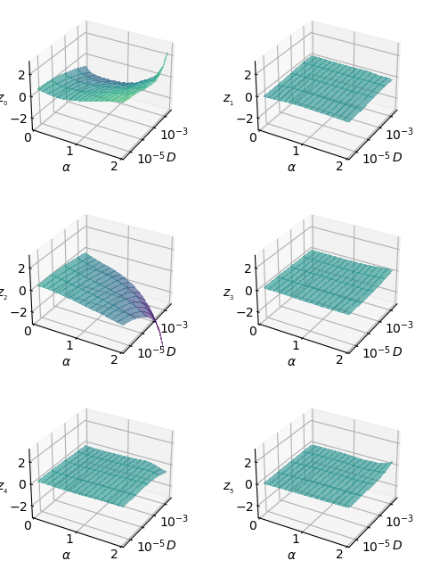

In the following [generation tutorial](./generation_sbm.html), we will
observe how we can generate trajectories that exhibit these
relationships with *α* and *D*.

# Loss distribution

The loss distribution illustrates how the model performs for different
inputs. As explained in the Appendix of [our
paper](https://doi.org/10.48550/arXiv.2307.11608), the loss distribution
is directly related with the dataset parameters. In particular, it has a
strong relationship with the diffusion coefficient, as it is related to
the scale of the displacements.

``` python
loss_fn_unreduced = Loss(learn.model.receptive_field, learn.model.c_channels>0, beta=model_args['beta'], reduction='none')
losses = []
with torch.no_grad():
    learn.dls[1].drop_last=False
    for b in tqdm(learn.dls[1]):
        x,y=b;  t = model(x)
        losses.append(loss_fn_unreduced(t,y))

print(len(losses), len(losses[0]), losses[0][0].shape)
loss_nll = np.vstack([a[0].squeeze().cpu().numpy() for a in losses])
print(loss_nll.shape)
loss_nll_mean_aD_val = np.array([[loss_nll[intersect_idx[i,j]].mean()  for j,D in enumerate(ds_args["D"])]for i,a in enumerate(ds_args["alpha"])])
```

      0%|          | 0/313 [00:00<?, ?it/s]

    313 3 torch.Size([256, 367, 1])
    (79968, 367)

The following plot shows the mean reconstruction loss per *α* and
*D*<sub>0</sub>.

<details class="code-fold">
<summary>Code</summary>

``` python
for j,D in enumerate(ds_args["D"]):
    plt.plot(u_a, loss_nll_mean_aD_val[:,j],label=f'{D:.3g}');
plt.xlabel(r'$\alpha$'); plt.ylabel('Reconstruction loss'); plt.grid();
plt.xlim(0,2)
plt.axvline(1, lw=1, ls='--', c='k', alpha=0.7);
h,l = plt.gca().get_legend_handles_labels()
plt.legend(h[::-1],l[::-1],title=r'$D_0$',bbox_to_anchor=(1,1),);
```

</details>

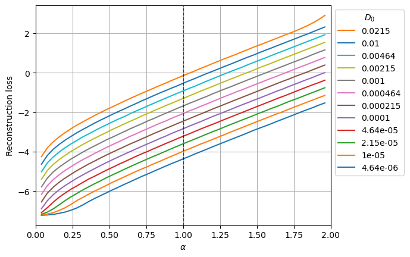

The aging effect of SBM makes the diffusion coefficient to scale as
*D*<sub>*α*</sub>(*t*) = *α**D*<sub>0</sub>*t*<sup>*α* − 1</sup>. Thus,
as we can observe in the [output
variance](#check-output-mean-and-variance) plot, the scale of the
displacements is directly related to *α* and *D*<sub>0</sub>. The loss
also manifests this behavior, it is lower for smaller *D*<sub>0</sub>
and larger for larger *α* (as it implies a larger D(t \> 1) for a given
*D*<sub>0</sub>).
