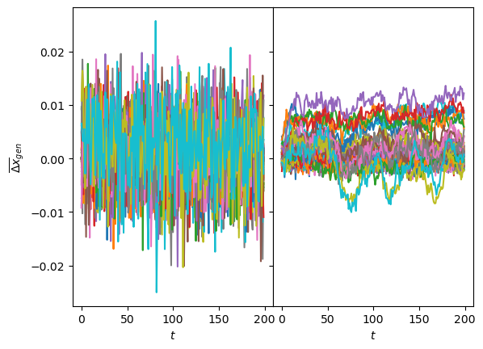
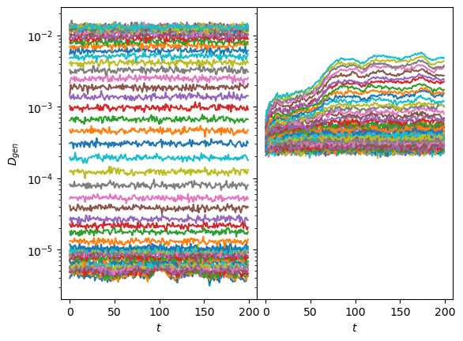
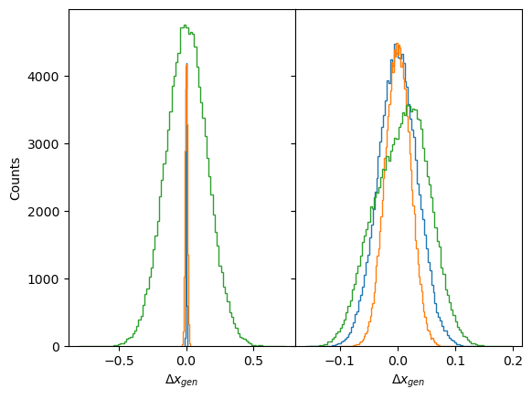
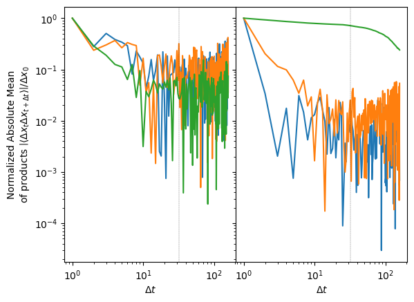
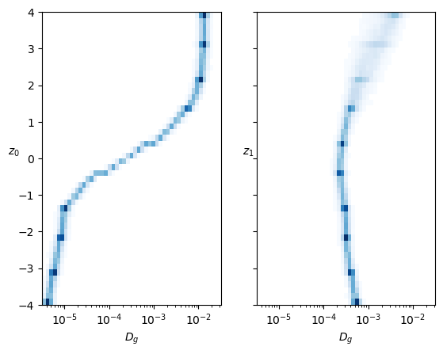
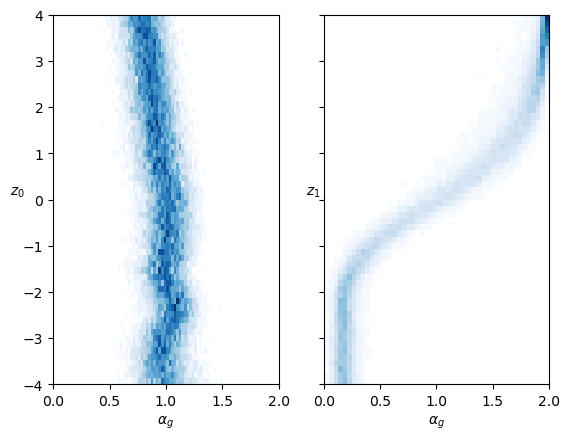
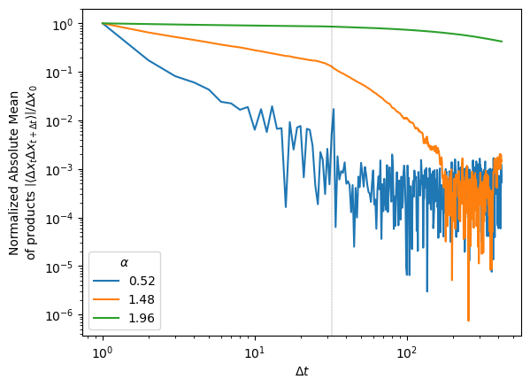
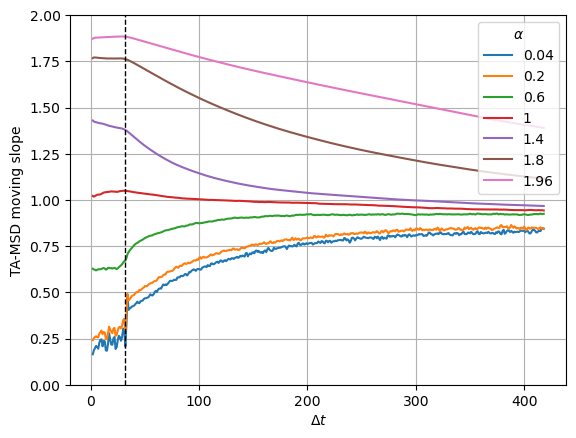
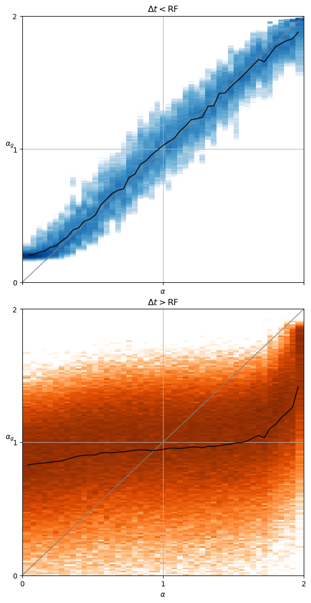

# Generation of FBM


<!-- WARNING: THIS FILE WAS AUTOGENERATED! DO NOT EDIT! -->

The goal of this tutorial is to generate new trajectories from the
trained SPIVAE and examine their attributes to evaluate the model’s
strengths and drawbacks.

# Load model

We load the model to characterize from its checkpoint.

``` python
DEVICE='cpu'
E=144
model_name = 'fbm' + f'_E{E}'
```

``` python
c_point, model = load_checkpoint("./models/"+model_name,device=DEVICE)
```

We can check the parameters of the data and the model.

``` python
ds_args, model_args = c_point['ds_args'],c_point['model_args']
print(ds_args, model_args)
```

    {'path': '../../data/raw/', 'model': 'fbm', 'N': 476, 'T': 400, 'D': array([1.00000000e-05, 2.15443469e-05, 4.64158883e-05, 1.00000000e-04,
           2.15443469e-04, 4.64158883e-04, 1.00000000e-03, 2.15443469e-03,
           4.64158883e-03, 1.00000000e-02]), 'alpha': array([0.2 , 0.28, 0.36, 0.44, 0.52, 0.6 , 0.68, 0.76, 0.84, 0.92, 1.  ,
           1.08, 1.16, 1.24, 1.32, 1.4 , 1.48, 1.56, 1.64, 1.72, 1.8 ]), 'seed': 0, 'valid_pct': 0.2, 'bs': 256, 'N_save': 6000, 'T_save': 400} {'o_dim': 399, 'nc_in': 1, 'nc_out': 6, 'nf': [16, 16, 16, 16], 'avg_size': 16, 'encoder': [200, 100], 'z_dim': 6, 'decoder': [100, 200], 'beta': 0.004, 'in_channels': 1, 'res_channels': 16, 'skip_channels': 16, 'c_channels': 6, 'g_channels': 0, 'res_kernel_size': 3, 'layer_size': 4, 'stack_size': 1, 'out_distribution': 'Normal', 'num_mixtures': 1, 'use_pad': False, 'model_name': 'SPIVAE'}

# Generate displacements

We generate new displacements from a range of values of the latent
neurons.

``` python
z_idx = 0 # 1
```

``` python
z_num = 60
```

``` python
z_range = torch.linspace(-4,4,z_num)
z_values = torch.zeros(z_num,6)
z_values[:,z_idx] = z_range
```

Then, we use the decoder to upsample the latent neurons we just created.

``` python
c = model.vae._decode(z_values); print(c.shape)
```

    torch.Size([60, 6, 399])

We choose the number of samples for each latent neuron value and the
batch size for generation.

``` python
samples_per_z = 6_00
```

``` python
total_samples = z_num*samples_per_z
bs = samples_per_z
assert not total_samples%bs, 'Using batched generation mode should be using a multiple of the batch size'
```

We sample from the model in a controlled manner with the conditions we
just created from the latent neurons.

``` python
disp_gen, logits = model.sample_batch(total_samples, bs=bs, c=c.repeat_interleave(samples_per_z,dim=0))
```

      0%|          | 0/60 [00:00<?, ?it/s]

And save it with proper dimensions for the analysis.

``` python
fname = "../../data/gen/"+model_name+f'_disp_gen{z_idx}.npz'
os.makedirs('../../data/gen/', exist_ok=True)
if not os.path.exists(fname):
    disp_gen = disp_gen.squeeze().detach().cpu().numpy()
    disp_gen = disp_gen.reshape(z_num, samples_per_z, disp_gen.shape[-1])
    np.savez_compressed(fname, disp_gen=disp_gen)
    print("Saved at:", fname)
    print("with dimensions", disp_gen.shape)
```

    Saved at: ../../data/gen/fbm_E144_disp_gen0.npz
    with dimensions (60, 600, 200)

We can now repeat the above steps with the other *surviving* neuron by
changing the `z_idx` value. Then, we have two sets of generated
displacements corresponding to a range of values of the selected latent
neurons.

``` python
z_idx = 1

z_range = torch.linspace(-4,4,z_num)
z_values = torch.zeros(z_num,6)
z_values[:,z_idx] = z_range

c = model.vae._decode(z_values); print(c.shape)

disp_gen, logits = model.sample_batch(total_samples, bs=bs, c=c.repeat_interleave(samples_per_z,dim=0))

fname = "../../data/gen/"+model_name+f'_disp_gen{z_idx}.npz'
os.makedirs('../../data/gen/', exist_ok=True)
if not os.path.exists(fname):
    disp_gen = disp_gen.squeeze().detach().cpu().numpy()
    disp_gen = disp_gen.reshape(z_num, samples_per_z, disp_gen.shape[-1])
    np.savez_compressed(fname, disp_gen=disp_gen)
    print("Saved at:", fname)
    print("with dimensions", disp_gen.shape)
```

# Analyze generated displacements

We analyze the diffusion properties of the displacements by means of
standard statistical techniques. The main approach consists in
characterizing ensembles of displacements with the same properties,
averaging in time, samples, or both.

## Load generated displacements

``` python
z_idx = 0
fname = "../../data/gen/"+model_name+f'_disp_gen{z_idx}.npz'
disp_gen0 = np.load(fname,)["disp_gen"]
z_idx = 1
fname = "../../data/gen/"+model_name+f'_disp_gen{z_idx}.npz'
disp_gen1 = np.load(fname,)["disp_gen"]
```

## Check generated displacements mean and variance

As a fast check of the generation, we can see if the displacements mean
and variance are the expected. For one neuron, we observe the mean
varies more than for the other neuron, coinciding with the
interpretation of these neurons with *D* and *α*. Both sets of generated
displacements have the mean inside the limits we saw with the input.

<details class="code-fold">
<summary>Code</summary>

``` python
fig, axs = plt.subplots(1,2, sharey=True, gridspec_kw=dict(wspace=0))
axs[0].plot(disp_gen0.mean(1).T); axs[1].plot(disp_gen1.mean(1).T);
for ax in axs: ax.set_xlabel(r'$t$');
axs[0].set_ylabel(r'$\overline{\Delta x}_{gen}$');
```

</details>



The same is supported by the variance of the generated displacements,
covering the training range of *D* for one neuron while the other has a
baseline with constant margin and some lines with increased *D*.

<details class="code-fold">
<summary>Code</summary>

``` python
fig, axs = plt.subplots(1,2, sharey=True, gridspec_kw=dict(wspace=0))
axs[0].semilogy(sig2D(disp_gen0.std(1)).T);
axs[1].semilogy(sig2D(disp_gen1.std(1)).T);
for ax in axs: ax.set_xlabel(r'$t$');
axs[0].set_ylabel(r'$D_{gen}$');
```

</details>



<details class="code-fold">
<summary>Code</summary>

``` python
fig, axs = plt.subplots(1,2, sharey=True, gridspec_kw=dict(wspace=0))
for z_i in [0,z_num//2,z_num-1]:
    axs[0].hist(disp_gen0[z_i].reshape(-1),100, histtype='step');
    axs[1].hist(disp_gen1[z_i].reshape(-1),100, histtype='step');
for ax in axs: ax.set_xlabel(r'$\Delta x_{gen}$');
axs[0].set_ylabel(r'Counts');
```

</details>



## Correlations

In fractional Brownian motion (FBM), the anomalous diffusion arises from
the displacements’ correlations. These correlations follow the power-law
*C* = |⟨*Δ**x*<sub>*t*</sub>*Δ**x*<sub>*t* + *Δ**t*</sub>⟩|/*Δ**x*<sub>0</sub><sup>2</sup> = *α*(*α* − 1)*D**Δ**t*<sup>*α* − 2</sup>.

When normalized, the correlations slope in logarithmic scale is a
manifestation of the anomalous exponent *α*.

``` python
windows = int(disp_gen0.shape[-1]*0.8)
delta_t = np.arange(1,windows)
```

``` python
disp_gen0.shape
```

    (60, 600, 200)

``` python
def correlations(disp, windows):
    return np.array([np.multiply(disp[...,:-win],disp[...,win:]).mean(-1).mean(-1)  # products mean, samples mean
                      for win in range(1,windows)]).T
```

``` python
corr_mean0 = correlations(disp_gen0, windows)
```

``` python
corr_mean1 = np.array([np.multiply(disp_gen1[:,:,:-win], disp_gen1[:,:,win:]
                                  ).mean(-1).mean(-1)  # products mean, samples mean
                      for win in range(1,windows)]).T
```

In the following plot, we observe that when varying the first neuron,
the slopes remain the same. When varying the other neuron value, we
observe different correlations. In the case of big *α*, it is clear the
correlations are maintained until the receptive field.

<details class="code-fold">
<summary>Code</summary>

``` python
fig, axs = plt.subplots(1,2, sharey=True, gridspec_kw=dict(wspace=0))
for z_i in [0,z_num//2,z_num-1]:
    axs[0].loglog(delta_t, np.abs(corr_mean0[z_i]/corr_mean0[z_i,:1]).T);
    axs[1].loglog(delta_t, np.abs(corr_mean1[z_i]/corr_mean1[z_i,:1]).T);
for ax in axs:
    ax.set_xlabel(r'$\Delta t$');
    ax.axvline(model.receptive_field, ls='--', lw=0.2,c='k');
axs[0].set_ylabel("Normalized Absolute Mean\nof products"
           r" $\left|\langle \Delta x_t\Delta x_{t+\Delta t} \rangle\right|/\Delta x_0^2$");
```

</details>



## TA-MSD

One prevalent approach employed in the study of single-particle
diffusion is to estimate the mean squared displacement (MSD) by
utilizing the time-averaged mean squared displacement (TA-MSD). We can
extract both parameters, *α* and *D*, by fitting the scaling of the
TA-MSD.

The time average mean squared displacement (TA-MSD) can be defined in
terms of a trajectory that is sampled at *T* discrete times
*t*<sub>*i*</sub> = *i**Δ**t* as,
$$ \mathrm{TA−MSD}(\Delta t) =
\frac{1}{T − \Delta t}
\sum\limits^{T −\Delta t}\_{i=1}
\[x(t_i) − x(t_i + \Delta t)\]^2,
$$
where *Δ**t* is the time lag.

``` python
from numba import njit, prange, set_num_threads
set_num_threads(2)

# non-jitted version
def TMSD_array_(trajs, t_lags):
    ttt = np.zeros((trajs.shape[0], len(t_lags))) # N trajs, windows
    for idx, t in enumerate(t_lags):
        for p in range(trajs.shape[1]-t):
            ttt[:, idx] += (trajs[:, p]-trajs[:, p+t])**2
        ttt[:, idx] /= trajs.shape[1]-t
    return ttt

@njit
def TAMSD_(traj, t_lags):
    tamsd = np.zeros_like(t_lags, dtype=np.float64)
    for idx, t in enumerate(t_lags):
        for p in range(len(traj) - t):
            tamsd[idx] += (traj[p] - traj[p + t])**2
        tamsd[idx] /= len(traj) - t
    return tamsd

@njit(parallel=True)
def TMSD_array(trajs, t_lags):
    ttt = np.zeros((trajs.shape[0], len(t_lags)), dtype=np.float64)
    for i in prange(trajs.shape[0]):
        ttt[i] = TAMSD_(trajs[i], t_lags)
    return ttt

def TAMSD(trajs, t_lags):
    return TMSD_array(trajs, t_lags)
```

``` python
tamsd0 = TAMSD(np.cumsum(disp_gen0.reshape(z_num*samples_per_z,-1),axis=-1),delta_t).reshape(z_num, samples_per_z,-1)
tamsd1 = TAMSD(np.cumsum(disp_gen1.reshape(z_num*samples_per_z,-1),axis=-1),delta_t).reshape(z_num, samples_per_z,-1)
```

A common criterion for this technique is to select the initial 10% of
the trajectory to perform the fitting.

``` python
# first 10%
skip = 0
perc = skip + max(4, int(tamsd0.shape[-1]*0.1))-1

log_delta_t = np.log(delta_t[skip:perc])
log_tamsd = np.log(tamsd0[...,skip:perc])
polyfits = np.array([np.polyfit(log_delta_t, log_tamsd[z_i].T, deg=1)
                       for z_i in range(z_num)])
coeffs0 = 0.5*np.exp(polyfits[:,1])
exponents0 = polyfits[:,0]

log_delta_t = np.log(delta_t[skip:perc])
log_tamsd = np.log(tamsd1[...,skip:perc])
polyfits = np.array([np.polyfit(log_delta_t, log_tamsd[z_i].T, deg=1)
                       for z_i in range(z_num)])
coeffs1 = 0.5*np.exp(polyfits[:,1])
exponents1 = polyfits[:,0]
```

``` python
exponents0.shape, exponents1.shape
```

    ((60, 600), (60, 600))

``` python
cmap_latent = 'Blues'
```

<details class="code-fold">
<summary>Code</summary>

``` python
fig, axs = plt.subplots(1,2, sharey=True,)
logbins = np.geomspace(3.16e-6, 3.16e-2,50)
axs[0].hist2d(coeffs0.reshape(-1),
           np.repeat(z_range.numpy(),coeffs0.shape[-1]),
           bins=(logbins,50), cmap=cmap_latent, cmin=2);
axs[0].set_ylabel(r'$z_0$', rotation=0);
axs[1].hist2d(coeffs1.reshape(-1),
           np.repeat(z_range.numpy(),coeffs1.shape[-1]),
           bins=(logbins,50), cmap=cmap_latent, cmin=2);
axs[1].set_ylabel(r'$z_1$', rotation=0);
for ax in axs:
    ax.set_xlabel(r'$D_g$');
    ax.set_xscale('log');
```

</details>



<details class="code-fold">
<summary>Code</summary>

``` python
fig, axs = plt.subplots(1,2, sharey=True,)
axs[0].hist2d(exponents0.reshape(-1),
           np.repeat(z_range.numpy(),exponents0.shape[-1]),
           bins=(50,z_num), cmap=cmap_latent, cmin=2);
axs[0].set_ylabel(r'$z_0$', rotation=0);
axs[1].hist2d(exponents1.reshape(-1),
           np.repeat(z_range.numpy(),exponents1.shape[-1]),
           bins=(50,z_num), cmap=cmap_latent, cmin=2);
axs[1].set_ylabel(r'$z_1$', rotation=0);
for ax in axs:
    ax.set_xlabel(r'$\alpha_g$');
    ax.set_xlim([0,2]);
```

</details>



In both cases, each neuron controls mainly one parameter inside the
training range. The neuron that represents the anomalous exponent *α*
also has a bit of effect on *D*.

# T=6k

The statistical methods to estimate *α* are based on the average of a
high quantity of data points. Here, instead of generating more
trajectories, we increase the statistics by generating longer
trajectories. This way, we can make a more confident analysis of the
estimated *α* for each time lag.

## Generate displacements

As in the previous generation, we load the model trained on trajectories
with T=400. Now, instead of generating directly from latent values, we
generate from the processed inputs, so we can compare directly with the
ground truth.

``` python
DEVICE = 'cpu'
E = 144
model_name = 'fbm' + f'_E{E}'
```

``` python
c_point, model = load_checkpoint("./models/"+model_name,device=DEVICE)
ds_args, model_args = c_point['ds_args'],c_point['model_args']
print(ds_args, model_args)
```

    Loading checkpoint: ./models/fbm_E144.tar
    on device: cpu
    {'path': '../../data/raw/', 'model': 'fbm', 'N': 476, 'T': 400, 'D': array([1.00000000e-05, 2.15443469e-05, 4.64158883e-05, 1.00000000e-04,
           2.15443469e-04, 4.64158883e-04, 1.00000000e-03, 2.15443469e-03,
           4.64158883e-03, 1.00000000e-02]), 'alpha': array([0.2 , 0.28, 0.36, 0.44, 0.52, 0.6 , 0.68, 0.76, 0.84, 0.92, 1.  ,
           1.08, 1.16, 1.24, 1.32, 1.4 , 1.48, 1.56, 1.64, 1.72, 1.8 ]), 'seed': 0, 'valid_pct': 0.2, 'bs': 256, 'N_save': 6000, 'T_save': 400} {'o_dim': 399, 'nc_in': 1, 'nc_out': 6, 'nf': [16, 16, 16, 16], 'avg_size': 16, 'encoder': [200, 100], 'z_dim': 6, 'decoder': [100, 200], 'beta': 0.004, 'in_channels': 1, 'res_channels': 16, 'skip_channels': 16, 'c_channels': 6, 'g_channels': 0, 'res_kernel_size': 3, 'layer_size': 4, 'stack_size': 1, 'out_distribution': 'Normal', 'num_mixtures': 1, 'use_pad': False, 'model_name': 'SPIVAE'}

We choose the number of samples for each parameter combination, the
number of samples for each processed input, and the batch size for
generation.

``` python
samples_per_c = 100
trajs_per_aD  = 60
T_gen = 6_000
bs = samples_per_c*10
```

``` python
total_samples = trajs_per_aD*samples_per_c

assert not total_samples%bs, 'Using batched generation mode should be using a multiple of the batch size'
```

We should activate the long generation by adding a parameter in the
model that sets the upsampling of the latent representation to the
desired length.

``` python
model.vae.Tgen = T_gen+model.receptive_field +1
print(model.vae.Tgen)
```

    6033

For the shake of space, we will exemplify the long generation for a
single diffusion coefficient.

``` python
Ds = [1e-3]
n_Ds = len(Ds)
```

``` python
n_alphas = 49
alphas = np.linspace(0.04,1.96,n_alphas)
```

Alert! We will generate around 6 GB of data.

``` python
print(f'{32*T_gen*trajs_per_aD*samples_per_c*n_alphas*n_Ds/(8*1024**3):.2} GB')
```

    6.6 GB

We load the dataset to get the upsampled representations.

``` python
ds_args = dict(path="../../data/test/", model='fbm',
               N=int(trajs_per_aD*n_Ds*1.4),
               T=400,
               D=Ds, alpha=alphas,
               N_save=1_000, T_save=400,
               seed=0, valid_pct=.9, bs=2**8,)
```

``` python
dls = load_data(ds_args).to(DEVICE)
dls[0].drop_last, dls[1].drop_last, dls[1].bs, dls.device
```

    (True, False, 256, 'cpu')

``` python
loss_fn = Loss(model.receptive_field, model.c_channels, 
                    beta=model_args['beta'], reduction='mean')

learn = Learner(dls, model, loss_func=loss_fn, opt_func=Adam,)
if torch.cuda.is_available() and DEVICE=='cuda': learn.model.cuda()
```

We get the upsampled latent representations `c` and keep track of the
parameters.

``` python
ds_in,preds,ds_targs = learn.get_preds(with_input=True,) # predicts in validation dataset

alphas_items = learn.dls.valid.items[:,0]
Ds_items     = learn.dls.valid.items[:,1]
ds_in_labels = learn.dls.valid.items[:,:2]
u_a=np.unique(alphas_items,)
u_D=np.unique(Ds_items,)

alphas_idx = [np.flatnonzero(alphas_items==a) for a in u_a]
Ds_idx     = [np.flatnonzero(Ds_items==D)     for D in u_D]

intersect_idx = np.array([[reduce(partial(np.intersect1d,assume_unique=True),
                                  (alphas_idx[i],Ds_idx[j]))
                           for j,D in enumerate(u_D)]
                          for i,a in enumerate(u_a)], dtype=object)

alphas_idx_flat = [item for sublist in alphas_idx for item in sublist]
Ds_idx_flat     = [item for sublist in Ds_idx     for item in sublist]

pred, mu, logvar, c, z = preds

print(ds_in.shape, learn.dls.valid.items.shape)
print(L(map(len, alphas_idx)), len(alphas_idx_flat), L(map(len, Ds_idx)), len(Ds_idx_flat))
```

``` python
assert not np.any( np.array(L(map(len, alphas_idx))) < trajs_per_aD ), 'There are not enough trajectories to sample from. Increase N when loading.'
```

``` python
assert c.shape[-1]>(T_gen+model.receptive_field), 'Has the long mode been activated?'
```

We sample from the model and save it for each parameter combination.

``` python
for a_idx,a in enumerate(ds_args["alpha"]):
    for D_idx,D in enumerate(ds_args["D"]):
        fname = "../../data/gen/"+model_name+f'_disp_gen_a{a:.3g}D{D:.3g}'.replace('.','')+'.npz'
        if not os.path.exists(fname):
            os.makedirs('../../data/gen/', exist_ok=True)
            indices = (a_idx,D_idx)
            disp_gen, logits = learn.model.sample_batch(total_samples, bs=bs,
                                                        c=c[intersect_idx[indices][:trajs_per_aD]].repeat(samples_per_c,1,1),
                                                        T=T_gen
                                                       )
            disp_gen = disp_gen.squeeze().detach().cpu().numpy()
            np.savez_compressed(fname, disp_gen=disp_gen)
            print("Saved at:", fname)
            print("with dimensions", disp_gen.shape)
```

      0%|          | 0/6 [00:00<?, ?it/s]

    Saved at: ../../data/gen/fbm_E144_disp_gen_a168D0001.npz
    with dimensions (6000, 6000)

      0%|          | 0/6 [00:00<?, ?it/s]

    Saved at: ../../data/gen/fbm_E144_disp_gen_a172D0001.npz
    with dimensions (6000, 6000)

      0%|          | 0/6 [00:00<?, ?it/s]

    Saved at: ../../data/gen/fbm_E144_disp_gen_a176D0001.npz
    with dimensions (6000, 6000)

      0%|          | 0/6 [00:00<?, ?it/s]

    Saved at: ../../data/gen/fbm_E144_disp_gen_a18D0001.npz
    with dimensions (6000, 6000)

      0%|          | 0/6 [00:00<?, ?it/s]

    Saved at: ../../data/gen/fbm_E144_disp_gen_a184D0001.npz
    with dimensions (6000, 6000)

      0%|          | 0/6 [00:00<?, ?it/s]

    Saved at: ../../data/gen/fbm_E144_disp_gen_a188D0001.npz
    with dimensions (6000, 6000)

      0%|          | 0/6 [00:00<?, ?it/s]

    Saved at: ../../data/gen/fbm_E144_disp_gen_a192D0001.npz
    with dimensions (6000, 6000)

      0%|          | 0/6 [00:00<?, ?it/s]

    Saved at: ../../data/gen/fbm_E144_disp_gen_a196D0001.npz
    with dimensions (6000, 6000)

## Load displacements

Once the displacements are generated and saved, we load them to analyze
the correlations and the TA-MSD.

``` python
print('D:', ds_args["D"])
print('a:', ds_args["alpha"])
```

    D: [0.001]
    a: [0.04 0.08 0.12 0.16 0.2  0.24 0.28 0.32 0.36 0.4  0.44 0.48 0.52 0.56
     0.6  0.64 0.68 0.72 0.76 0.8  0.84 0.88 0.92 0.96 1.   1.04 1.08 1.12
     1.16 1.2  1.24 1.28 1.32 1.36 1.4  1.44 1.48 1.52 1.56 1.6  1.64 1.68
     1.72 1.76 1.8  1.84 1.88 1.92 1.96]

``` python
disp_gen_6k = {f'{a:.3g}'+f',{D:.3g}':[] for D in ds_args["D"] for a in ds_args["alpha"]}
```

``` python
for a in ds_args["alpha"]:
    for D in ds_args["D"]:
        fname = "../../data/gen/"+model_name+f'_disp_gen_a{a:.3g}D{D:.3g}'.replace('.','')+'.npz'
        with np.load(fname, allow_pickle=True) as f:
            k = f'{a:.3g}'+f',{D:.3g}'
            disp_gen_6k[k] = f['disp_gen']
```

## Correlations

We compute the correlations of the generated displacements as we did
[before](#correlations).

``` python
disp_corr_6k = {f'{a:.3g}'+f',{D:.3g}':[] for D in ds_args["D"] for a in ds_args["alpha"]}
```

``` python
windows = 420
delta_t = np.arange(1,windows)
log_delta_t = np.log(delta_t)
for a in ds_args["alpha"][[n_alphas//4, n_alphas//7*5, n_alphas-1]]:
    for D in ds_args["D"]:
        k = f'{a:.3g}'+f',{D:.3g}'
        disp_corr_6k[k] = correlations(disp_gen_6k[k], windows)
```

<details class="code-fold">
<summary>Code</summary>

``` python
for a,D in zip(ds_args["alpha"][[n_alphas//4, n_alphas//7*5, n_alphas-1]],[1e-3]*3):
    k = f'{a:.3g}'+f',{D:.3g}'
    plt.loglog(delta_t, np.abs(disp_corr_6k[k]/disp_corr_6k[k][:1]).T, label=f'{a:.3g}');
plt.xlabel(r'$\Delta t$');
plt.axvline(learn.model.receptive_field, ls='--', lw=0.2,c='k');
plt.ylabel("Normalized Absolute Mean\nof products" 
           r" $\left|\langle \Delta x_t\Delta x_{t+\Delta t} \rangle\right|/\Delta x_0}^2$");
plt.legend(title=r'$\alpha$');
```

</details>



The correlation curves for different exponents *α* are straight until
the time lag *Δ**t* corresponding to the receptive field where they
start to vanish.

## TA-MSD

We analyze the slope of the TA-MSD from the lengthy generated
trajectories.

``` python
tamsd_6k = {f'{a:.3g}'+f',{D:.3g}':[] for D in ds_args["D"] for a in ds_args["alpha"]}
```

``` python
delta_t = np.arange(1,windows)
log_delta_t = np.log(delta_t)
for a in ds_args["alpha"]:
    for D in ds_args["D"]:
        k = f'{a:.3g}'+f',{D:.3g}'
        fname = "../../data/analysis/"+model_name+f'_tamsd_6k_{a:.3g}D{D:.3g}'.replace('.','')+'.npz'
        if not os.path.exists(fname): # create and save
            os.makedirs('../../data/analysis/', exist_ok=True)
            tamsd_6k[k] = TAMSD(np.cumsum(disp_gen_6k[k],axis=-1),delta_t)
            np.savez_compressed(fname, tamsd=tamsd_6k[k])
            print("Saved at:", fname)
            print("with dimensions", tamsd_6k[k].shape)
        else: # load
            with np.load(fname, allow_pickle=True) as f:
                tamsd_6k[k] = f['tamsd']
```

We observe the slope remains almost constant up to the time lag
corresponding to the receptive field. From there, the curve goes to 1
meaning that correlations are not well reproduced further than the
receptive field.

<details class="code-fold">
<summary>Code</summary>

``` python
log_delta_t = np.log(delta_t)
moving_win = 2
a_i = [0,n_alphas//10,n_alphas//3,n_alphas//2,n_alphas//3*2,n_alphas//7*6,n_alphas-1]
for i,a in enumerate(ds_args["alpha"][a_i]):
    for D in ds_args["D"]:
        k = f'{a:.3g}'+f',{D:.3g}'
    log_mean_a = np.log(tamsd_6k[k][:,:windows-1]).mean(0)
    moving_slope_a = (log_mean_a[:-moving_win]-log_mean_a[moving_win:])/(log_delta_t[:-moving_win]-log_delta_t[moving_win:])
    plt.plot(delta_t[moving_win//2:-moving_win//2], moving_slope_a, c=f'C{i}', label=f'{a:.3g}');
plt.xlabel(r'$\Delta t$');    plt.grid(); plt.ylim([0,2])
plt.axvline(learn.model.receptive_field, c='k', lw=1,ls='--');
plt.ylabel("TA-MSD moving slope");
plt.legend(title=r'$\alpha$');
```

</details>



## Get *α* exponent

We show the difference of taking the fitting before and after the
receptive field (RF).

``` python
k = f'{ds_args["alpha"][0]}'+f',{ds_args["D"][0]}'
windows = tamsd_6k[k].shape[-1]
delta_t = np.arange(1,windows)
log_delta_t = np.log(delta_t)

# delta_ts < RF:
skip = 0
perc = skip + max(4, 20)
```

``` python
# delta_ts > RF:
skip_ = 380
perc_ = 400
```

``` python
exponents = {f'{a:.3g}'+f',{D:.3g}':[] for D in ds_args["D"] for a in ds_args["alpha"]}
exponents_ = {f'{a:.3g}'+f',{D:.3g}':[] for D in ds_args["D"] for a in ds_args["alpha"]}
for j,D in enumerate(ds_args["D"]):
    for i,a in enumerate(ds_args["alpha"]):
        k = f'{a:.3g}'+f',{D:.3g}'
        exponents[k]  = np.polyfit(log_delta_t[skip :perc ], np.log(tamsd_6k[k][:,skip :perc ]).T, deg=1)[0]
        exponents_[k] = np.polyfit(log_delta_t[skip_:perc_], np.log(tamsd_6k[k][:,skip_:perc_]).T, deg=1)[0]
```

``` python
Z_a_r  = np.empty((len(ds_args["alpha"]), len(ds_args['D']),exponents[k].shape[0]))
Z_a_r_ = np.empty((len(ds_args["alpha"]), len(ds_args['D']),exponents_[k].shape[0]))
for j,D in enumerate(ds_args["D"]):
    for i,a in enumerate(ds_args["alpha"]):
        k = f'{a:.3g}'+f',{D:.3g}'
        Z_a_r[i,j]  = exponents[k]
        Z_a_r_[i,j] = exponents_[k]
```

``` python
traj_per_comb = exponents[k].shape[0]
```

For time lags smaller than the receptive field, the estimated exponent
*α*<sub>*g*</sub> is very close to the ground truth *α*. However, for
bigger time lags the estimated exponent remains close to *α* = 1
(Brownian motion) meaning the displacements are more uncorrelated.

<details class="code-fold">
<summary>Code</summary>

``` python
fig, axs = plt.subplots(2,1, figsize=(7,14), sharex=True, gridspec_kw=dict(hspace=0.1))
for j,D in enumerate(ds_args["D"]):
    x_flat = np.repeat(ds_args["alpha"],traj_per_comb).reshape(-1)
    bins = np.round(np.concatenate(([0],
                                    ds_args["alpha"][1:]-(ds_args["alpha"][1:]-ds_args["alpha"][:-1])*.5,
                                    [2.])),
                    2)
    cmaps = ['Blues', 'Oranges']
    for i, y in enumerate([Z_a_r[:,j],Z_a_r_[:,j]]):
        y_flat = y.reshape(-1)
        axs[i].hist2d(x_flat,y_flat,bins=(bins,250),cmin=2,
                  norm=matplotlib.colors.LogNorm(), cmap=cmaps[i],
                  );
        axs[i].plot([0,1,2], 'gray', alpha=0.7);
        axs[i].plot(ds_args["alpha"], y.mean(-1),'k', alpha=0.8,label='mean');

for ax in axs:
    ax.grid(); ax.set_ylim([0,2]); ax.set_xlim([0,2])
    ax.locator_params(nbins=3); ax.set_ylabel(r"$\alpha_g$", rotation=0);
    ax.set_xlabel(r'$\alpha$');
axs[0].set_title(r'$\Delta t<$RF');
axs[1].set_title(r'$\Delta t>$RF');
```

</details>


