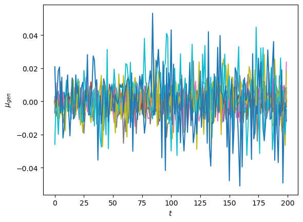
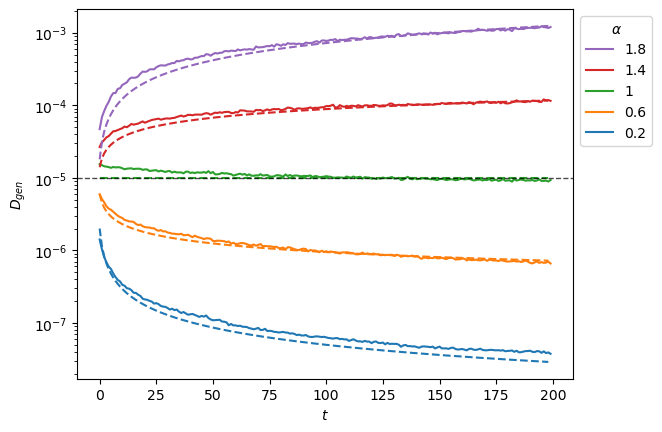
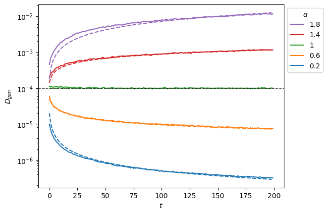
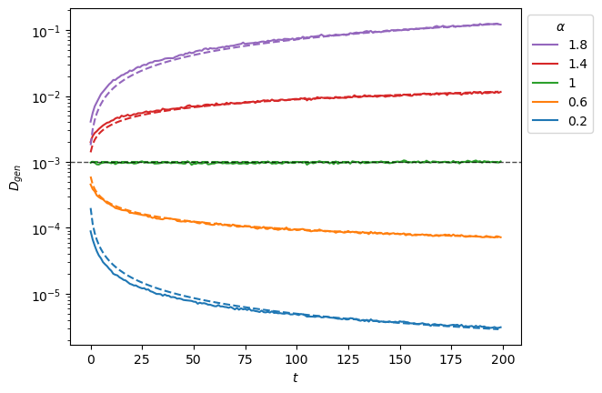
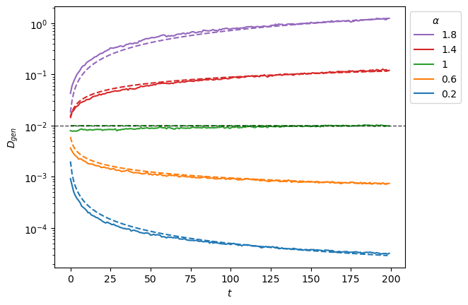
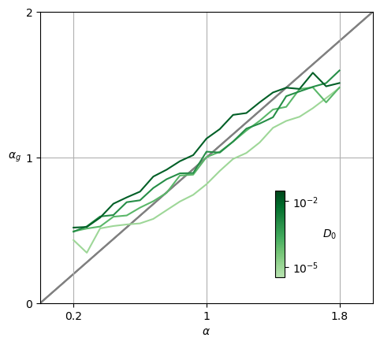

# Generation of SBM


<!-- WARNING: THIS FILE WAS AUTOGENERATED! DO NOT EDIT! -->

The goal of this tutorial is to generate new trajectories from the
trained SPIVAE and examine their attributes to evaluate the model’s
strengths and drawbacks.

# Load model

We load the model to characterize from its checkpoint.

``` python
DEVICE='cpu'
E=49
model_name = 'sbm' + f'_E{E}'
```

    Loading checkpoint: ./models/sbm_E49.tar
    on device: cpu

``` python
c_point, model = load_checkpoint("./models/"+model_name,device=DEVICE)
```

We can check the parameters of the data and the model.

``` python
ds_args, model_args = c_point['ds_args'],c_point['model_args']
print(ds_args, model_args)
```

    {'path': '../../data/raw/', 'model': 'sbm', 'N': 476, 'T': 400, 'D': array([1.00000000e-05, 2.15443469e-05, 4.64158883e-05, 1.00000000e-04,
           2.15443469e-04, 4.64158883e-04, 1.00000000e-03, 2.15443469e-03,
           4.64158883e-03, 1.00000000e-02]), 'alpha': array([0.2 , 0.28, 0.36, 0.44, 0.52, 0.6 , 0.68, 0.76, 0.84, 0.92, 1.  ,
           1.08, 1.16, 1.24, 1.32, 1.4 , 1.48, 1.56, 1.64, 1.72, 1.8 ]), 'N_save': 1000, 'T_save': 400, 'seed': 0, 'valid_pct': 0.2, 'bs': 256} {'o_dim': 399, 'nc_in': 1, 'nc_out': 6, 'nf': [16, 16, 16, 16], 'avg_size': 16, 'encoder': [200, 100], 'z_dim': 6, 'decoder': [100, 200], 'beta': 0.005, 'in_channels': 1, 'res_channels': 16, 'skip_channels': 16, 'c_channels': 6, 'g_channels': 0, 'res_kernel_size': 3, 'layer_size': 4, 'stack_size': 1, 'out_distribution': 'Normal', 'num_mixtures': 1, 'use_pad': False, 'model_name': 'SPIVAE'}

As the latent neurons’ interpretation is complex, we feed the model with
known trajectories and use their latent representation for the
generation. We load the test set generated in the [data
docs](../source/data.html#scaled-brownian-motion) or the [analysis
tutorial](analysis_sbm).

``` python
Ds = [1e-5,1e-4,1e-3,1e-2]
alphas = np.linspace(0.2,1.8,21)
```

``` python
n_alphas, n_Ds = len(alphas), len(Ds)
```

``` python
ds_args = dict(path="../../data/test/", model='sbm',
               N=1000,
               T=400,
               D=Ds, alpha=alphas,
               N_save=1_000, T_save=400,
               seed=0, valid_pct=.8, bs=2**8,)
```

``` python
dls = load_data(ds_args).to(DEVICE)
dls[0].drop_last, dls[1].drop_last, dls[1].bs, dls.device
```

    (True, False, 256, 'cpu')

We can see the mean loss on a batch.

``` python
print('RF:', model.receptive_field, 'bs:', dls.bs)
x,y=b = dls.valid.one_batch(); t = model(x)
loss_fn = Loss(model.receptive_field, model.c_channels, 
                    beta=model_args['beta'], reduction='mean')
l = loss_fn(t,y).item(); 
print('Current mean loss on a batch: ',l)
```

    RF: 32 bs: 256
    Current mean loss on a batch:  -2.2795233726501465

``` python
learn = Learner(dls, model, loss_func=loss_fn, opt_func=Adam,)
if torch.cuda.is_available() and DEVICE=='cuda': learn.model.cuda()
```

# Generate displacements

We generate new displacements from latent representation of the inputs.

``` python
ds_in,preds,ds_targs = learn.get_preds(with_input=True,) # predicts in validation dataset

alphas_items = learn.dls.valid.items[:,0]
Ds_items     = learn.dls.valid.items[:,1]
ds_in_labels = learn.dls.valid.items[:,:2] 
u_a=np.unique(alphas_items,)
u_D=np.unique(Ds_items,)

alphas_idx = [np.flatnonzero(alphas_items==a) for a in u_a]
Ds_idx     = [np.flatnonzero(Ds_items==D)     for D in u_D]

intersect_idx = np.array([[reduce(partial(np.intersect1d,assume_unique=True),
                                  (alphas_idx[i],Ds_idx[j]))
                           for j,D in enumerate(u_D)]
                          for i,a in enumerate(u_a)], dtype=object)

alphas_idx_flat = [item for sublist in alphas_idx for item in sublist]
Ds_idx_flat     = [item for sublist in Ds_idx     for item in sublist]

pred, mu, logvar, c, z = preds

print(ds_in.shape, learn.dls.valid.items.shape)
print(L(map(len, alphas_idx)), len(alphas_idx_flat), L(map(len, Ds_idx)), len(Ds_idx_flat))
```

<style>
    /* Turns off some styling */
    progress {
        /* gets rid of default border in Firefox and Opera. */
        border: none;
        /* Needs to be in here for Safari polyfill so background images work as expected. */
        background-size: auto;
    }
    progress:not([value]), progress:not([value])::-webkit-progress-bar {
        background: repeating-linear-gradient(45deg, #7e7e7e, #7e7e7e 10px, #5c5c5c 10px, #5c5c5c 20px);
    }
    .progress-bar-interrupted, .progress-bar-interrupted::-webkit-progress-bar {
        background: #F44336;
    }
</style>

    torch.Size([67200, 1, 399]) (67200, 401)
    [3181, 3202, 3224, 3174, 3202, 3183, 3203, 3203, 3196, 3215, 3184, 3196, 3213, 3190, 3207, 3210, 3171, 3242, 3188, 3212, 3204] 67200 [16844, 16738, 16802, 16816] 67200

We choose the number of samples for each parameter combination, the
number of samples for each processed input, and the batch size for
generation.

``` python
samples_per_c = 100
trajs_per_aD  = 60
bs = samples_per_c*10
```

``` python
total_samples = trajs_per_aD*samples_per_c
assert total_samples<=bs
assert not total_samples%bs, 'Using batched generation mode should be using a multiple of the batch size'
```

We sample from the model and save it for each parameter combination.

``` python
for a_idx,a in enumerate(ds_args["alpha"]):
    for D_idx,D in enumerate(ds_args["D"]):
        fname = "../../data/gen/"+model_name+f'_disp_gen_a{a:.3g}D{D:.3g}'.replace('.','')+'.npz'
        if not os.path.exists(fname):
            os.makedirs('../../data/gen/', exist_ok=True)
            indices = (a_idx,D_idx)
            disp_gen, logits = learn.model.sample_batch(total_samples, bs=bs,
                                                        c=c[intersect_idx[indices][:trajs_per_aD]].repeat(samples_per_c,1,1))
            disp_gen = disp_gen.squeeze().detach().cpu().numpy()
            np.savez_compressed(fname, disp_gen=disp_gen)
            print("Saved at:", fname)
            print("with dimensions", disp_gen.shape)
```

      0%|          | 0/6 [00:00<?, ?it/s]

    Saved at: ../../data/gen/sbm_E49_disp_gen_a02D1e-05.npz
    with dimensions (6000, 200)

      0%|          | 0/6 [00:00<?, ?it/s]

    Saved at: ../../data/gen/sbm_E49_disp_gen_a02D00001.npz
    with dimensions (6000, 200)

      0%|          | 0/6 [00:00<?, ?it/s]

    Saved at: ../../data/gen/sbm_E49_disp_gen_a02D0001.npz
    with dimensions (6000, 200)

      0%|          | 0/6 [00:00<?, ?it/s]

    Saved at: ../../data/gen/sbm_E49_disp_gen_a02D001.npz
    with dimensions (6000, 200)

      0%|          | 0/6 [00:00<?, ?it/s]

    Saved at: ../../data/gen/sbm_E49_disp_gen_a028D1e-05.npz
    with dimensions (6000, 200)

      0%|          | 0/6 [00:00<?, ?it/s]

    Saved at: ../../data/gen/sbm_E49_disp_gen_a028D00001.npz
    with dimensions (6000, 200)

      0%|          | 0/6 [00:00<?, ?it/s]

    Saved at: ../../data/gen/sbm_E49_disp_gen_a028D0001.npz
    with dimensions (6000, 200)

      0%|          | 0/6 [00:00<?, ?it/s]

    Saved at: ../../data/gen/sbm_E49_disp_gen_a028D001.npz
    with dimensions (6000, 200)

      0%|          | 0/6 [00:00<?, ?it/s]

    Saved at: ../../data/gen/sbm_E49_disp_gen_a036D1e-05.npz
    with dimensions (6000, 200)

      0%|          | 0/6 [00:00<?, ?it/s]

    Saved at: ../../data/gen/sbm_E49_disp_gen_a036D00001.npz
    with dimensions (6000, 200)

      0%|          | 0/6 [00:00<?, ?it/s]

    Saved at: ../../data/gen/sbm_E49_disp_gen_a036D0001.npz
    with dimensions (6000, 200)

      0%|          | 0/6 [00:00<?, ?it/s]

    Saved at: ../../data/gen/sbm_E49_disp_gen_a036D001.npz
    with dimensions (6000, 200)

      0%|          | 0/6 [00:00<?, ?it/s]

    Saved at: ../../data/gen/sbm_E49_disp_gen_a044D1e-05.npz
    with dimensions (6000, 200)

      0%|          | 0/6 [00:00<?, ?it/s]

    Saved at: ../../data/gen/sbm_E49_disp_gen_a044D00001.npz
    with dimensions (6000, 200)

      0%|          | 0/6 [00:00<?, ?it/s]

    Saved at: ../../data/gen/sbm_E49_disp_gen_a044D0001.npz
    with dimensions (6000, 200)

      0%|          | 0/6 [00:00<?, ?it/s]

    Saved at: ../../data/gen/sbm_E49_disp_gen_a044D001.npz
    with dimensions (6000, 200)

      0%|          | 0/6 [00:00<?, ?it/s]

    Saved at: ../../data/gen/sbm_E49_disp_gen_a052D1e-05.npz
    with dimensions (6000, 200)

      0%|          | 0/6 [00:00<?, ?it/s]

    Saved at: ../../data/gen/sbm_E49_disp_gen_a052D00001.npz
    with dimensions (6000, 200)

      0%|          | 0/6 [00:00<?, ?it/s]

    Saved at: ../../data/gen/sbm_E49_disp_gen_a052D0001.npz
    with dimensions (6000, 200)

      0%|          | 0/6 [00:00<?, ?it/s]

    Saved at: ../../data/gen/sbm_E49_disp_gen_a052D001.npz
    with dimensions (6000, 200)

      0%|          | 0/6 [00:00<?, ?it/s]

    Saved at: ../../data/gen/sbm_E49_disp_gen_a06D1e-05.npz
    with dimensions (6000, 200)

      0%|          | 0/6 [00:00<?, ?it/s]

    Saved at: ../../data/gen/sbm_E49_disp_gen_a06D00001.npz
    with dimensions (6000, 200)

      0%|          | 0/6 [00:00<?, ?it/s]

    Saved at: ../../data/gen/sbm_E49_disp_gen_a06D0001.npz
    with dimensions (6000, 200)

      0%|          | 0/6 [00:00<?, ?it/s]

    Saved at: ../../data/gen/sbm_E49_disp_gen_a06D001.npz
    with dimensions (6000, 200)

      0%|          | 0/6 [00:00<?, ?it/s]

    Saved at: ../../data/gen/sbm_E49_disp_gen_a068D1e-05.npz
    with dimensions (6000, 200)

      0%|          | 0/6 [00:00<?, ?it/s]

    Saved at: ../../data/gen/sbm_E49_disp_gen_a068D00001.npz
    with dimensions (6000, 200)

      0%|          | 0/6 [00:00<?, ?it/s]

    Saved at: ../../data/gen/sbm_E49_disp_gen_a068D0001.npz
    with dimensions (6000, 200)

      0%|          | 0/6 [00:00<?, ?it/s]

    Saved at: ../../data/gen/sbm_E49_disp_gen_a068D001.npz
    with dimensions (6000, 200)

      0%|          | 0/6 [00:00<?, ?it/s]

    Saved at: ../../data/gen/sbm_E49_disp_gen_a076D1e-05.npz
    with dimensions (6000, 200)

      0%|          | 0/6 [00:00<?, ?it/s]

    Saved at: ../../data/gen/sbm_E49_disp_gen_a076D00001.npz
    with dimensions (6000, 200)

      0%|          | 0/6 [00:00<?, ?it/s]

    Saved at: ../../data/gen/sbm_E49_disp_gen_a076D0001.npz
    with dimensions (6000, 200)

      0%|          | 0/6 [00:00<?, ?it/s]

    Saved at: ../../data/gen/sbm_E49_disp_gen_a076D001.npz
    with dimensions (6000, 200)

      0%|          | 0/6 [00:00<?, ?it/s]

    Saved at: ../../data/gen/sbm_E49_disp_gen_a084D1e-05.npz
    with dimensions (6000, 200)

      0%|          | 0/6 [00:00<?, ?it/s]

    Saved at: ../../data/gen/sbm_E49_disp_gen_a084D00001.npz
    with dimensions (6000, 200)

      0%|          | 0/6 [00:00<?, ?it/s]

    Saved at: ../../data/gen/sbm_E49_disp_gen_a084D0001.npz
    with dimensions (6000, 200)

      0%|          | 0/6 [00:00<?, ?it/s]

    Saved at: ../../data/gen/sbm_E49_disp_gen_a084D001.npz
    with dimensions (6000, 200)

      0%|          | 0/6 [00:00<?, ?it/s]

    Saved at: ../../data/gen/sbm_E49_disp_gen_a092D1e-05.npz
    with dimensions (6000, 200)

      0%|          | 0/6 [00:00<?, ?it/s]

    Saved at: ../../data/gen/sbm_E49_disp_gen_a092D00001.npz
    with dimensions (6000, 200)

      0%|          | 0/6 [00:00<?, ?it/s]

    Saved at: ../../data/gen/sbm_E49_disp_gen_a092D0001.npz
    with dimensions (6000, 200)

      0%|          | 0/6 [00:00<?, ?it/s]

    Saved at: ../../data/gen/sbm_E49_disp_gen_a092D001.npz
    with dimensions (6000, 200)

      0%|          | 0/6 [00:00<?, ?it/s]

    Saved at: ../../data/gen/sbm_E49_disp_gen_a1D1e-05.npz
    with dimensions (6000, 200)

      0%|          | 0/6 [00:00<?, ?it/s]

    Saved at: ../../data/gen/sbm_E49_disp_gen_a1D00001.npz
    with dimensions (6000, 200)

      0%|          | 0/6 [00:00<?, ?it/s]

    Saved at: ../../data/gen/sbm_E49_disp_gen_a1D0001.npz
    with dimensions (6000, 200)

      0%|          | 0/6 [00:00<?, ?it/s]

    Saved at: ../../data/gen/sbm_E49_disp_gen_a1D001.npz
    with dimensions (6000, 200)

      0%|          | 0/6 [00:00<?, ?it/s]

    Saved at: ../../data/gen/sbm_E49_disp_gen_a108D1e-05.npz
    with dimensions (6000, 200)

      0%|          | 0/6 [00:00<?, ?it/s]

    Saved at: ../../data/gen/sbm_E49_disp_gen_a108D00001.npz
    with dimensions (6000, 200)

      0%|          | 0/6 [00:00<?, ?it/s]

    Saved at: ../../data/gen/sbm_E49_disp_gen_a108D0001.npz
    with dimensions (6000, 200)

      0%|          | 0/6 [00:00<?, ?it/s]

    Saved at: ../../data/gen/sbm_E49_disp_gen_a108D001.npz
    with dimensions (6000, 200)

      0%|          | 0/6 [00:00<?, ?it/s]

    Saved at: ../../data/gen/sbm_E49_disp_gen_a116D1e-05.npz
    with dimensions (6000, 200)

      0%|          | 0/6 [00:00<?, ?it/s]

    Saved at: ../../data/gen/sbm_E49_disp_gen_a116D00001.npz
    with dimensions (6000, 200)

      0%|          | 0/6 [00:00<?, ?it/s]

    Saved at: ../../data/gen/sbm_E49_disp_gen_a116D0001.npz
    with dimensions (6000, 200)

      0%|          | 0/6 [00:00<?, ?it/s]

    Saved at: ../../data/gen/sbm_E49_disp_gen_a116D001.npz
    with dimensions (6000, 200)

      0%|          | 0/6 [00:00<?, ?it/s]

    Saved at: ../../data/gen/sbm_E49_disp_gen_a124D1e-05.npz
    with dimensions (6000, 200)

      0%|          | 0/6 [00:00<?, ?it/s]

    Saved at: ../../data/gen/sbm_E49_disp_gen_a124D00001.npz
    with dimensions (6000, 200)

      0%|          | 0/6 [00:00<?, ?it/s]

    Saved at: ../../data/gen/sbm_E49_disp_gen_a124D0001.npz
    with dimensions (6000, 200)

      0%|          | 0/6 [00:00<?, ?it/s]

    Saved at: ../../data/gen/sbm_E49_disp_gen_a124D001.npz
    with dimensions (6000, 200)

      0%|          | 0/6 [00:00<?, ?it/s]

    Saved at: ../../data/gen/sbm_E49_disp_gen_a132D1e-05.npz
    with dimensions (6000, 200)

      0%|          | 0/6 [00:00<?, ?it/s]

    Saved at: ../../data/gen/sbm_E49_disp_gen_a132D00001.npz
    with dimensions (6000, 200)

      0%|          | 0/6 [00:00<?, ?it/s]

    Saved at: ../../data/gen/sbm_E49_disp_gen_a132D0001.npz
    with dimensions (6000, 200)

      0%|          | 0/6 [00:00<?, ?it/s]

    Saved at: ../../data/gen/sbm_E49_disp_gen_a132D001.npz
    with dimensions (6000, 200)

      0%|          | 0/6 [00:00<?, ?it/s]

    Saved at: ../../data/gen/sbm_E49_disp_gen_a14D1e-05.npz
    with dimensions (6000, 200)

      0%|          | 0/6 [00:00<?, ?it/s]

    Saved at: ../../data/gen/sbm_E49_disp_gen_a14D00001.npz
    with dimensions (6000, 200)

      0%|          | 0/6 [00:00<?, ?it/s]

    Saved at: ../../data/gen/sbm_E49_disp_gen_a14D0001.npz
    with dimensions (6000, 200)

      0%|          | 0/6 [00:00<?, ?it/s]

    Saved at: ../../data/gen/sbm_E49_disp_gen_a14D001.npz
    with dimensions (6000, 200)

      0%|          | 0/6 [00:00<?, ?it/s]

    Saved at: ../../data/gen/sbm_E49_disp_gen_a148D1e-05.npz
    with dimensions (6000, 200)

      0%|          | 0/6 [00:00<?, ?it/s]

    Saved at: ../../data/gen/sbm_E49_disp_gen_a148D00001.npz
    with dimensions (6000, 200)

      0%|          | 0/6 [00:00<?, ?it/s]

    Saved at: ../../data/gen/sbm_E49_disp_gen_a148D0001.npz
    with dimensions (6000, 200)

      0%|          | 0/6 [00:00<?, ?it/s]

    Saved at: ../../data/gen/sbm_E49_disp_gen_a148D001.npz
    with dimensions (6000, 200)

      0%|          | 0/6 [00:00<?, ?it/s]

    Saved at: ../../data/gen/sbm_E49_disp_gen_a156D1e-05.npz
    with dimensions (6000, 200)

      0%|          | 0/6 [00:00<?, ?it/s]

    Saved at: ../../data/gen/sbm_E49_disp_gen_a156D00001.npz
    with dimensions (6000, 200)

      0%|          | 0/6 [00:00<?, ?it/s]

    Saved at: ../../data/gen/sbm_E49_disp_gen_a156D0001.npz
    with dimensions (6000, 200)

      0%|          | 0/6 [00:00<?, ?it/s]

    Saved at: ../../data/gen/sbm_E49_disp_gen_a156D001.npz
    with dimensions (6000, 200)

      0%|          | 0/6 [00:00<?, ?it/s]

    Saved at: ../../data/gen/sbm_E49_disp_gen_a164D1e-05.npz
    with dimensions (6000, 200)

      0%|          | 0/6 [00:00<?, ?it/s]

    Saved at: ../../data/gen/sbm_E49_disp_gen_a164D00001.npz
    with dimensions (6000, 200)

      0%|          | 0/6 [00:00<?, ?it/s]

    Saved at: ../../data/gen/sbm_E49_disp_gen_a164D0001.npz
    with dimensions (6000, 200)

      0%|          | 0/6 [00:00<?, ?it/s]

    Saved at: ../../data/gen/sbm_E49_disp_gen_a164D001.npz
    with dimensions (6000, 200)

      0%|          | 0/6 [00:00<?, ?it/s]

    Saved at: ../../data/gen/sbm_E49_disp_gen_a172D1e-05.npz
    with dimensions (6000, 200)

      0%|          | 0/6 [00:00<?, ?it/s]

    Saved at: ../../data/gen/sbm_E49_disp_gen_a172D00001.npz
    with dimensions (6000, 200)

      0%|          | 0/6 [00:00<?, ?it/s]

    Saved at: ../../data/gen/sbm_E49_disp_gen_a172D0001.npz
    with dimensions (6000, 200)

      0%|          | 0/6 [00:00<?, ?it/s]

    Saved at: ../../data/gen/sbm_E49_disp_gen_a172D001.npz
    with dimensions (6000, 200)

      0%|          | 0/6 [00:00<?, ?it/s]

    Saved at: ../../data/gen/sbm_E49_disp_gen_a18D1e-05.npz
    with dimensions (6000, 200)

      0%|          | 0/6 [00:00<?, ?it/s]

    Saved at: ../../data/gen/sbm_E49_disp_gen_a18D00001.npz
    with dimensions (6000, 200)

      0%|          | 0/6 [00:00<?, ?it/s]

    Saved at: ../../data/gen/sbm_E49_disp_gen_a18D0001.npz
    with dimensions (6000, 200)

      0%|          | 0/6 [00:00<?, ?it/s]

    Saved at: ../../data/gen/sbm_E49_disp_gen_a18D001.npz
    with dimensions (6000, 200)

# Analyze generated displacements

We analyze the diffusion properties of the displacements by means of
standard statistical techniques. The main approach consists in
characterizing ensembles of displacements with the same properties,
averaging in time, samples, or both.

## Load generated displacements

We first load the generated displacements for the combination of
parameters we want.

``` python
disp_gen = {f'{a:.3g}'+f',{D:.3g}':[] for D in ds_args["D"] for a in ds_args["alpha"]}
```

``` python
for a in ds_args["alpha"]:
    for D in ds_args["D"]:
        with np.load(f'../../data/gen/'+model_name+f'_disp_gen_a{a:.3g}D{D:.3g}'.replace('.','')+'.npz', allow_pickle=True)\
        as f:
            k = f'{a:.3g}'+f',{D:.3g}'
            disp_gen[k] = f['disp_gen']
```

## Check generated displacements mean and variance

As a fast check of the generation, we can see if the displacements mean
and variance are the expected. For each parameter combination, we
observe the mean of generated displacements is inside the limits we saw
with the [input](../source/data.html#sbm-1).

<details class="code-fold">
<summary>Code</summary>

``` python
for j,D in enumerate(ds_args["D"]):
    for i,a in enumerate(ds_args["alpha"]):
        k = f'{a:.3g}'+f',{D:.3g}'
        plt.plot(disp_gen[k].squeeze().mean(0), '-', c=f'C{i}',label=f'{a:.3g}, {D:.3g}'); 
    plt.xlabel(r'$t$');plt.ylabel(r'$\mu_{gen}$');
```

</details>



For the variance, we observe a correct reproduction of the scaling with
a small deviation, as noted in the
[analysis](./analysis_sbm.html#check-output-mean-and-variance).

<details class="code-fold">
<summary>Code</summary>

``` python
for j,D in enumerate(ds_args["D"]):
    plt.figure()
    for i,a in enumerate(ds_args["alpha"][::5]):
        k = f'{a:.3g}'+f',{D:.3g}'
        # original time
        t_full = np.arange(1,disp_gen[k].shape[-1]+1)
        # shifted
        t_shift = model.receptive_field+1
        t_gen  = t_full + t_shift
        # scaling to compensate the time generated by the machine starting at RF+1
        # time scale factors: ((1+t_full)/(t_shift+t_full))**(a-1.)
        t_scaling = ((1+t_full)/(t_gen))**(a-1.)
        x = sig2D(disp_gen[k].squeeze().std(0))
        x = x*t_scaling
        plt.semilogy(x, '-', c=f'C{i}', label=f'{a:.3g}');
        plt.plot(a*D*np.arange(1,x.shape[-1])**(a-1.), '--')
    plt.axhline(D, c='k', lw=1, ls='--', alpha=0.7);
    plt.xlabel(r'$t$');plt.ylabel(r'$D_{gen}$');
    h,l = plt.gca().get_legend_handles_labels()
    plt.legend(h[::-1],l[::-1],title=r'$\alpha$', bbox_to_anchor=(1,1));
```

</details>









## TEA-MSD for SBM

To extract the anomalous exponent *α* from SBM trajectories, one needs
the time ensemble average mean squared displacement (TEA-MSD). As SBM is
weakly non-ergodic, the TA-MSD along different time lags will not work
as it did for FBM. We instead make the TA-MSD for one time lag and take
the ensemble average.

``` python
def TAMSD_t_lag(traj, t_lag):
    t_t_lag = len(traj) - t_lag
    tamsd = np.zeros(t_t_lag, dtype=np.float64)
    for t_ in range(t_t_lag): tamsd[t_] = (traj[t_] - traj[t_ + t_lag])**2
    tamsd /= (t_t_lag)
    return tamsd

def TEAMSD_t_lag(trajs, t_lag):
    ttt = np.zeros((trajs.shape[0], trajs.shape[-1]-t_lag), dtype=np.float64)
    for i in range(trajs.shape[0]): # prange
        ttt[i] = TAMSD_t_lag(trajs[i], t_lag)
    return ttt
```

``` python
def get_alpha_from_sbm_trajs(trajs, # (N,T)
                             t_lag=2, perc=.55):
    teamsd = TEAMSD_t_lag(trajs,t_lag).mean(0)
    log_teamsd = np.log(teamsd)
    # if two timesteps have the same value, tamsd_=0 and log is -inf and polyfit is nan
    log_teamsd[~np.isfinite(log_teamsd)]=-27
    log_t = np.log(np.arange(1,teamsd.shape[-1]+1))
    last_perc = int(log_teamsd.shape[-1]*perc)
    return 1+np.polyfit(log_t[-last_perc:], log_teamsd[-last_perc:], 1)[0]
```

``` python
exponents = np.zeros((len(ds_args["alpha"]),len(ds_args["D"])))
for j,D in enumerate(ds_args["D"]):
    for i,a in enumerate(ds_args["alpha"]):
        k = f'{a:.3g}' + f',{D:.3g}'
        trajs  = np.cumsum(disp_gen[k],-1)
        exponents[i,j] = get_alpha_from_sbm_trajs(trajs, t_lag=2, perc=.55)
```

``` python
fname = '../../data/analysis/'+model_name+'_exponents.npz'
if not os.path.exists(fname):
    os.makedirs('../../data/analysis/', exist_ok=True) 
    np.savez_compressed(fname,exponents=exponents)
```

``` python
exponents = np.load(fname)["exponents"]
```

<details class="code-fold">
<summary>Code</summary>

``` python
cmap_D = matplotlib.colors.ListedColormap(matplotlib.colormaps['Greens'](np.linspace(0.3,1,150)))
norm_D = matplotlib.colors.LogNorm(vmin=3.16e-6, vmax=3.16e-2)
sm_D_4 = plt.cm.ScalarMappable(cmap=cmap_D, norm=norm_D)

for j,D in enumerate(ds_args["D"]):
    x = ds_args["alpha"]
    y = exponents[:,j]
    plt.plot([0,1,2], 'gray', alpha=0.7, zorder=-1);
    plt.plot(x,y, c=cmap_D(norm_D(D)),label=f'{D:.3g}');
ax = plt.gca(); ax.grid();
ax.set_xlabel(r'$\alpha$', ha='center', va='top',);
ax.set_ylabel(r'$\alpha_{g}$', rotation=0, ha='right', va='center');
ax.set_xlim(0,2); ax.set_ylim(0,2);

ax.locator_params(nbins=3);
ax.set_xticks([0.2,1,1.8],[0.2,'1',1.8])

cb = plt.colorbar(sm_D_4, ax=ax,pad=0, aspect=9,shrink=0.3, anchor=(-2,0.125));
cb.ax.set_ylabel(r'$D_0$',ha='left', va='center', rotation=0, )
cb.ax.set_yscale('log')
cb.ax.set_yticks([1e-5,1e-2], [r'$10^{-5}$',r'$10^{-2}$']);
```

</details>



The estimated exponent *α*<sub>*g*</sub> is very close to the ground
truth of the input for different values of *D*<sub>0</sub>.
