# Model training on SBM


<!-- WARNING: THIS FILE WAS AUTOGENERATED! DO NOT EDIT! -->

In this tutorial, we aim at training SPIVAE with the dataset of scaled
Brownian motion (SBM) to extract the aging diffusion coefficient
*D*(*t*), and the anomalous exponent *α*.

# Parameters

To train the models, we use the [fastai](https://docs.fast.ai/) library
that provides easy to use methods. First, we gather everything needed to
train (the data, the model, the loss, the optimizer, etc.) into a
`Learner` object. We will use the `Learner` to hold all the parameters
and handle the training procedure.

We start selecting the parameters of the device to train on, the
dataset, and the model.

``` python
DEVICE= 'cpu'  # 'cuda'
print(DEVICE)
```

    cpu

To construct the dataset of SBM, we vary *D*<sub>0</sub> logarithmically
inside the range 10<sup>−5</sup> and 10<sup>−2</sup> such that the
displacements are not much bigger than one. At the same time, we choose
*α* ∈ \[0.2, 1.8\]. We take the same amount of trajectories for each
combination of parameters, about 100 thousand trajectories in total. We
split them in training and validation sets, and select a batch size
(bs).

``` python
Ds = np.geomspace(1e-5,1e-2, 10)
alphas = np.linspace(0.2,1.8,21)
```

``` python
n_alphas, n_Ds = len(alphas), len(Ds)
```

``` python
ds_args = dict(path="../../data/raw/", model='sbm',
               N=int(100_000/n_alphas/n_Ds), T=400,
               D=Ds, alpha=alphas,
               N_save=1_000, T_save=400,
               seed=0, valid_pct=0.2, bs=2**8,)
```

We generate training data as explained in the [data
docs](../source/data.html#scaled-brownian-motion). You can skip this
step if you already generated data using the data generation notebook.

``` python
fname = ds_args["path"] + 'sbm.npz'
disp_gen = {f'{a:.3g}'+f',{D:.3g}':[] for D in ds_args["D"] for a in ds_args["alpha"]}
if not os.path.exists(fname):  # create
    for i,a in enumerate(ds_args["alpha"]):
        for j,D in enumerate(ds_args["D"]):
            k = f'{a:.3g}'+f',{D:.3g}'
            disp_gen[k]=np.array([np.concatenate(([a,D],sbm(ds_args["T_save"], a, sigma = D2sig(D)))) 
                                  for n in range(ds_args["N_save"])]) # N, T+2
    np.savez_compressed(fname,**disp_gen)
    print('Saved at:', fname)
else:    print(f"{fname} already exists. Load it with load_data().")
```

We create the data loaders `dls` for training and validation with the
parameters we selected above.

``` python
dls = load_data(ds_args).to(DEVICE)
dls[1].drop_last = True # for validation to throw the last incomplete batch or not
dls[0].drop_last, dls[1].drop_last, dls[1].bs, dls.device
```

    (True, True, 256, 'cpu')

We set a small model to train rapidly, but large enough to provide
adequate expressiveness. We fix 6 latent neurons, as a priori, we do not
know how many neurons will encode the trajectory parameters.

``` python
model_args = dict(# VAE #################
                  o_dim=ds_args['T']-1,
                  nc_in=1,  # 1D
                  nc_out=6, # = z_dim
                  nf=[16]*4,
                  avg_size=16,
                  encoder=[200,100],
                  z_dim=6,  # latent dimension
                  decoder=[100,200],
                  beta=0,
                  # WaveNet ############
                  in_channels=1,
                  res_channels=16,skip_channels=16,
                  c_channels=6, # = nc_out
                  g_channels=0,
                  res_kernel_size=3,
                  layer_size=4,  # 6  # Largest dilation is 2**layer_size
                  stack_size=1,
                  out_distribution= "Normal",
                  num_mixtures=1,
                  use_pad=False,    
                  model_name = 'SPIVAE',
                 )
```

We initialize a model and define its loss function as defined in
[Utils](../source/utils.html). The initial loss for this dataset is
around 1.5, bigger than that the initialization provides an unstable
model that may not train properly.

``` python
model = VAEWaveNet(**model_args).to(DEVICE)
print('RF:', model.receptive_field, 'bs:', dls.bs)
x,y=b = dls.valid.one_batch(); t = model(x)
loss_fn = Loss(model.receptive_field, model.c_channels, 
                    beta=model_args['beta'], reduction='mean')
l = loss_fn(t,y).item(); 
print('Initial loss: ',l)
assert l<1.5, 'Initial loss should be around 1.5 or less'
```

    RF: 32 bs: 256
    Initial loss:  1.0185976028442383

We now set a few callback functions to show relevant information during
training. The first two update a plot of the total loss for training and
validation, and the Kullback-Leibler divergence (*D*<sub>*K**L*</sub>)
of the latent neurons, respectively. The other two record the
reconstruction loss and the *D*<sub>*K**L*</sub> of each latent neuron.

``` python
callbacks = [ShowLossCallback(), ShowKLDsCallback(),
             GMsCallback(model.receptive_field,model.c_channels),
             KLDsCallback(model.c_channels)]
```

We add two metrics to follow the reconstruction loss and the divergence
term during training.

``` python
metrics = [GaussianMixtureMetric(model.receptive_field, model.c_channels,reduction='mean'),
           KLDMetric(model.c_channels,),
          ]
```

With all the ingredients, we create the `Learner` with the default
optimizer, Adam.

``` python
learn = Learner(dls, model, loss_func=loss_fn, opt_func=Adam, cbs=callbacks, metrics=metrics,)
if torch.cuda.is_available() and DEVICE=='cuda': learn.model.cuda()
```

The learner can show us a summary including the model sizes and number
of parameters.

``` python
learn.summary()
```

<style>
    /* Turns off some styling */
    progress {
        /* gets rid of default border in Firefox and Opera. */
        border: none;
        /* Needs to be in here for Safari polyfill so background images work as expected. */
        background-size: auto;
    }
    progress:not([value]), progress:not([value])::-webkit-progress-bar {
        background: repeating-linear-gradient(45deg, #7e7e7e, #7e7e7e 10px, #5c5c5c 10px, #5c5c5c 20px);
    }
    .progress-bar-interrupted, .progress-bar-interrupted::-webkit-progress-bar {
        background: #F44336;
    }
</style>

    VAEWaveNet (Input shape: 256 x 1 x 399)
    ============================================================================
    Layer (type)         Output Shape         Param #    Trainable 
    ============================================================================
                         256 x 16 x 397      
    Conv1d                                    64         True      
    ReLU                                                           
    ____________________________________________________________________________
                         256 x 16 x 395      
    Conv1d                                    784        True      
    ReLU                                                           
    ____________________________________________________________________________
                         256 x 16 x 393      
    Conv1d                                    784        True      
    ReLU                                                           
    ____________________________________________________________________________
                         256 x 16 x 391      
    Conv1d                                    784        True      
    ReLU                                                           
    ____________________________________________________________________________
                         256 x 16 x 16       
    AdaptiveAvgPool1d                                              
    AdaptiveMaxPool1d                                              
    ____________________________________________________________________________
                         256 x 512           
    View                                                           
    ____________________________________________________________________________
                         256 x 200           
    Linear                                    102600     True      
    ReLU                                                           
    ____________________________________________________________________________
                         256 x 100           
    Linear                                    20100      True      
    ReLU                                                           
    ____________________________________________________________________________
                         256 x 12            
    Linear                                    1212       True      
    ____________________________________________________________________________
                         256 x 100           
    Linear                                    700        True      
    ReLU                                                           
    ____________________________________________________________________________
                         256 x 200           
    Linear                                    20200      True      
    ReLU                                                           
    ____________________________________________________________________________
                         256 x 512           
    Linear                                    102912     True      
    ReLU                                                           
    ____________________________________________________________________________
                         256 x 16 x 32       
    View                                                           
    ____________________________________________________________________________
                         256 x 16 x 393      
    ConvTranspose1d                           784        True      
    ReLU                                                           
    ____________________________________________________________________________
                         256 x 16 x 395      
    ConvTranspose1d                           784        True      
    ReLU                                                           
    ____________________________________________________________________________
                         256 x 16 x 397      
    ConvTranspose1d                           784        True      
    ReLU                                                           
    ____________________________________________________________________________
                         256 x 6 x 399       
    ConvTranspose1d                           294        True      
    ReLU                                                           
    ____________________________________________________________________________
                         256 x 16 x 399      
    Conv1d                                    32         True      
    ____________________________________________________________________________
                         256 x 16 x 397      
    Conv1d                                    528        True      
    ____________________________________________________________________________
                         256 x 32 x 395      
    Conv1d                                    1568       True      
    ____________________________________________________________________________
                         256 x 32 x 399      
    Conv1d                                    192        True      
    Conv1d                                    272        True      
    Conv1d                                    272        True      
    ____________________________________________________________________________
                         256 x 32 x 391      
    Conv1d                                    1568       True      
    ____________________________________________________________________________
                         256 x 32 x 399      
    Conv1d                                    192        True      
    Conv1d                                    272        True      
    Conv1d                                    272        True      
    ____________________________________________________________________________
                         256 x 32 x 383      
    Conv1d                                    1568       True      
    ____________________________________________________________________________
                         256 x 32 x 399      
    Conv1d                                    192        True      
    Conv1d                                    272        True      
    Conv1d                                    272        True      
    ____________________________________________________________________________
                         256 x 32 x 367      
    Conv1d                                    1568       True      
    ____________________________________________________________________________
                         256 x 32 x 399      
    Conv1d                                    192        True      
    Conv1d                                    272        True      
    Conv1d                                    272        True      
    ReLU                                                           
    Conv1d                                    272        True      
    ReLU                                                           
    ____________________________________________________________________________
                         256 x 3 x 367       
    Conv1d                                    51         True      
    ____________________________________________________________________________

    Total params: 262,885
    Total trainable params: 262,885
    Total non-trainable params: 0

    Optimizer used: <function Adam>
    Loss function: <SPIVAE.utils.Loss object>

    Callbacks:
      - TrainEvalCallback
      - CastToTensor
      - Recorder
      - ProgressCallback
      - ShowLossCallback
      - ShowKLDsCallback
      - GMsCallback
      - KLDsCallback

Finally, we need a learning rate. Conveniently,
[fastai](https://docs.fast.ai/) includes a [learning rate
finder](https://docs.fast.ai/callback.schedule.html#learner.lr_find).
This finder can suggest some points, each based on a criterion that
guides us. Hence, we try with one order above and below the default
criterion, the
[valley](https://docs.fast.ai/callback.schedule.html#valley).

``` python
learn.lr_find()
```

<style>
    /* Turns off some styling */
    progress {
        /* gets rid of default border in Firefox and Opera. */
        border: none;
        /* Needs to be in here for Safari polyfill so background images work as expected. */
        background-size: auto;
    }
    progress:not([value]), progress:not([value])::-webkit-progress-bar {
        background: repeating-linear-gradient(45deg, #7e7e7e, #7e7e7e 10px, #5c5c5c 10px, #5c5c5c 20px);
    }
    .progress-bar-interrupted, .progress-bar-interrupted::-webkit-progress-bar {
        background: #F44336;
    }
</style>

    SuggestedLRs(valley=0.0005754399462603033)

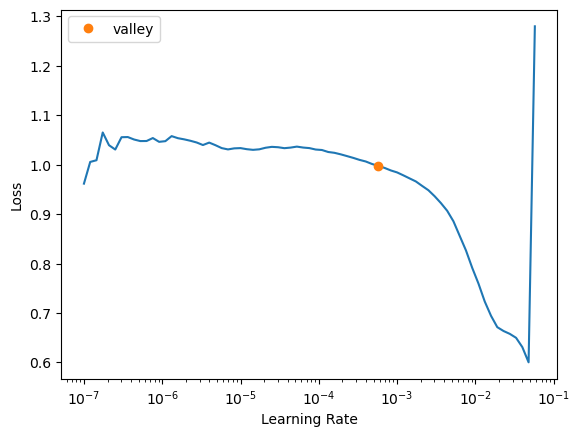

The valley is around 5 ⋅ 10<sup>−4</sup>, thus we will start trying a
learning rate of 10<sup>−3</sup> to see if we can learn fast.

During the search, not only the loss was logged but also the
*D*<sub>*K**L*</sub> which we can see here:

``` python
plt.semilogy(np.stack(learn.kl_ds.preds)); learn.kl_ds.preds=[]
```

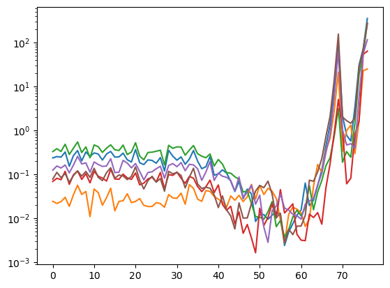

During the training, we will keep an eye on both the total loss and the
*D*<sub>*K**L*</sub>.

# Training with *β*=0

We start training with *β* = 0 to have no additional constraint in the
latent neurons and allow the VAE to use the full capacity of its
bottleneck.

``` python
learn.loss_func.beta=0
```

To ease the training, we update the model’s parameters following the
learning rate schedule developed by [Leslie N. Smith et
al. (2017)](https://arxiv.org/abs/1708.07120), the 1cycle policy, and
already implemented in
[fastai](https://docs.fast.ai/callback.schedule.html#learner.fit_one_cycle).
We choose as the maximum learning rate the one derived from the finder
above.

``` python
learn.fit_one_cycle(1, lr_max=1e-3,)
```

<style>
    /* Turns off some styling */
    progress {
        /* gets rid of default border in Firefox and Opera. */
        border: none;
        /* Needs to be in here for Safari polyfill so background images work as expected. */
        background-size: auto;
    }
    progress:not([value]), progress:not([value])::-webkit-progress-bar {
        background: repeating-linear-gradient(45deg, #7e7e7e, #7e7e7e 10px, #5c5c5c 10px, #5c5c5c 20px);
    }
    .progress-bar-interrupted, .progress-bar-interrupted::-webkit-progress-bar {
        background: #F44336;
    }
</style>

<table class="dataframe" data-quarto-postprocess="true" data-border="1">
<thead>
<tr style="text-align: left;">
<th data-quarto-table-cell-role="th">epoch</th>
<th data-quarto-table-cell-role="th">train_loss</th>
<th data-quarto-table-cell-role="th">valid_loss</th>
<th data-quarto-table-cell-role="th">mix_gaussian_loss</th>
<th data-quarto-table-cell-role="th">kld</th>
<th data-quarto-table-cell-role="th">time</th>
</tr>
</thead>
<tbody>
<tr>
<td>0</td>
<td>-2.157843</td>
<td>-2.199759</td>
<td>-2.199759</td>
<td>966.304993</td>
<td>01:12</td>
</tr>
</tbody>
</table>

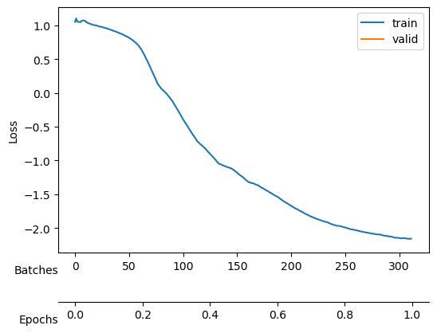

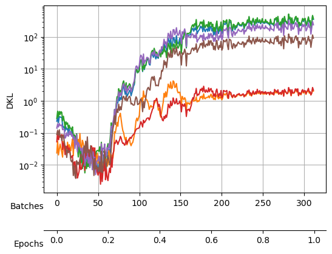

With the 1cycle policy we got a good first model, thus we save it and
train for a few epochs more.

``` python
E=1; model_name = 'sbm' + f'_E{E}'
if not os.path.exists("./models/"+model_name+'.tar'):
    save_model("./models/"+model_name, model, model_args, ds_args)
```

    Saved at ./models/sbm_E1.tar

``` python
learn.fit_one_cycle(16, lr_max=1e-3,)
```

<style>
    /* Turns off some styling */
    progress {
        /* gets rid of default border in Firefox and Opera. */
        border: none;
        /* Needs to be in here for Safari polyfill so background images work as expected. */
        background-size: auto;
    }
    progress:not([value]), progress:not([value])::-webkit-progress-bar {
        background: repeating-linear-gradient(45deg, #7e7e7e, #7e7e7e 10px, #5c5c5c 10px, #5c5c5c 20px);
    }
    .progress-bar-interrupted, .progress-bar-interrupted::-webkit-progress-bar {
        background: #F44336;
    }
</style>

<table class="dataframe" data-quarto-postprocess="true" data-border="1">
<thead>
<tr style="text-align: left;">
<th data-quarto-table-cell-role="th">epoch</th>
<th data-quarto-table-cell-role="th">train_loss</th>
<th data-quarto-table-cell-role="th">valid_loss</th>
<th data-quarto-table-cell-role="th">mix_gaussian_loss</th>
<th data-quarto-table-cell-role="th">kld</th>
<th data-quarto-table-cell-role="th">time</th>
</tr>
</thead>
<tbody>
<tr>
<td>0</td>
<td>-2.263310</td>
<td>-2.267519</td>
<td>-2.267519</td>
<td>1442.309204</td>
<td>01:09</td>
</tr>
<tr>
<td>1</td>
<td>-2.092829</td>
<td>-2.072918</td>
<td>-2.072918</td>
<td>2818.877197</td>
<td>01:15</td>
</tr>
<tr>
<td>2</td>
<td>-1.981965</td>
<td>-2.144248</td>
<td>-2.144248</td>
<td>5740.245605</td>
<td>01:09</td>
</tr>
<tr>
<td>3</td>
<td>-1.960727</td>
<td>-2.105671</td>
<td>-2.105671</td>
<td>8740.739258</td>
<td>01:10</td>
</tr>
<tr>
<td>4</td>
<td>-1.668681</td>
<td>-1.482724</td>
<td>-1.482724</td>
<td>27266.724609</td>
<td>01:10</td>
</tr>
<tr>
<td>5</td>
<td>-2.079590</td>
<td>-2.127594</td>
<td>-2.127594</td>
<td>14647.367188</td>
<td>01:10</td>
</tr>
<tr>
<td>6</td>
<td>-2.141758</td>
<td>-2.256035</td>
<td>-2.256035</td>
<td>14994.700195</td>
<td>01:11</td>
</tr>
<tr>
<td>7</td>
<td>-2.188065</td>
<td>-2.214240</td>
<td>-2.214240</td>
<td>17237.187500</td>
<td>01:10</td>
</tr>
<tr>
<td>8</td>
<td>-2.242931</td>
<td>-2.223907</td>
<td>-2.223907</td>
<td>17943.906250</td>
<td>01:10</td>
</tr>
<tr>
<td>9</td>
<td>-2.258962</td>
<td>-2.299075</td>
<td>-2.299075</td>
<td>19063.156250</td>
<td>01:14</td>
</tr>
<tr>
<td>10</td>
<td>-2.303101</td>
<td>-2.313661</td>
<td>-2.313661</td>
<td>18943.972656</td>
<td>01:11</td>
</tr>
<tr>
<td>11</td>
<td>-2.321828</td>
<td>-2.326061</td>
<td>-2.326061</td>
<td>17432.900391</td>
<td>01:10</td>
</tr>
<tr>
<td>12</td>
<td>-2.323314</td>
<td>-2.324073</td>
<td>-2.324073</td>
<td>16692.931641</td>
<td>01:12</td>
</tr>
<tr>
<td>13</td>
<td>-2.325410</td>
<td>-2.326961</td>
<td>-2.326961</td>
<td>15656.347656</td>
<td>01:12</td>
</tr>
<tr>
<td>14</td>
<td>-2.336070</td>
<td>-2.330342</td>
<td>-2.330342</td>
<td>15198.240234</td>
<td>01:11</td>
</tr>
<tr>
<td>15</td>
<td>-2.342307</td>
<td>-2.330926</td>
<td>-2.330926</td>
<td>15115.720703</td>
<td>01:10</td>
</tr>
</tbody>
</table>

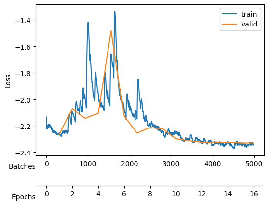

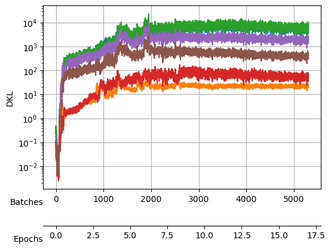

After training, we see a validation loss around -2.33 and two neurons
that contribute the most to the *D*<sub>*K**L*</sub>. We take a
checkpoint of the model at this moment.

``` python
E=1+16; model_name = 'sbm' + f'_E{E}'
if not os.path.exists("./models/"+model_name+'.tar'):
    save_model("./models/"+model_name, model, model_args, ds_args)
```

    Saved at ./models/sbm_E17.tar

# Annealing *β*

Now, we increase *β* to impose a Gaussian prior into the latent neurons
distribution which effectively forces the encoding of the already
present information to use the minimal number of neurons while noising
out the rest of neurons.

``` python
E=17
model_name = 'fbm' + f'_E{E}'
c_point, model = load_checkpoint("./models/"+model_name,device=DEVICE)
```

    Loading checkpoint: ./models/fbm_E64.tar
    on device: cpu

``` python
learn.loss_func.beta=1e-4; model_args.update(dict(beta=1e-4))
```

``` python
learn.fit_one_cycle(8, lr_max=1e-3,)
```

<style>
    /* Turns off some styling */
    progress {
        /* gets rid of default border in Firefox and Opera. */
        border: none;
        /* Needs to be in here for Safari polyfill so background images work as expected. */
        background-size: auto;
    }
    progress:not([value]), progress:not([value])::-webkit-progress-bar {
        background: repeating-linear-gradient(45deg, #7e7e7e, #7e7e7e 10px, #5c5c5c 10px, #5c5c5c 20px);
    }
    .progress-bar-interrupted, .progress-bar-interrupted::-webkit-progress-bar {
        background: #F44336;
    }
</style>

<table class="dataframe" data-quarto-postprocess="true" data-border="1">
<thead>
<tr style="text-align: left;">
<th data-quarto-table-cell-role="th">epoch</th>
<th data-quarto-table-cell-role="th">train_loss</th>
<th data-quarto-table-cell-role="th">valid_loss</th>
<th data-quarto-table-cell-role="th">mix_gaussian_loss</th>
<th data-quarto-table-cell-role="th">kld</th>
<th data-quarto-table-cell-role="th">time</th>
</tr>
</thead>
<tbody>
<tr>
<td>0</td>
<td>-2.265089</td>
<td>-2.256390</td>
<td>-2.269281</td>
<td>128.906479</td>
<td>01:10</td>
</tr>
<tr>
<td>1</td>
<td>-2.072519</td>
<td>-2.171102</td>
<td>-2.193184</td>
<td>220.815460</td>
<td>01:11</td>
</tr>
<tr>
<td>2</td>
<td>-2.078890</td>
<td>-2.010547</td>
<td>-2.027710</td>
<td>171.636841</td>
<td>01:11</td>
</tr>
<tr>
<td>3</td>
<td>-2.150817</td>
<td>-2.082684</td>
<td>-2.094985</td>
<td>123.012283</td>
<td>01:11</td>
</tr>
<tr>
<td>4</td>
<td>-2.276386</td>
<td>-2.275580</td>
<td>-2.283196</td>
<td>76.156914</td>
<td>01:13</td>
</tr>
<tr>
<td>5</td>
<td>-2.333585</td>
<td>-2.269568</td>
<td>-2.275890</td>
<td>63.225800</td>
<td>01:11</td>
</tr>
<tr>
<td>6</td>
<td>-2.331838</td>
<td>-2.324122</td>
<td>-2.329123</td>
<td>50.004139</td>
<td>01:10</td>
</tr>
<tr>
<td>7</td>
<td>-2.350273</td>
<td>-2.325296</td>
<td>-2.330021</td>
<td>47.249344</td>
<td>01:10</td>
</tr>
</tbody>
</table>

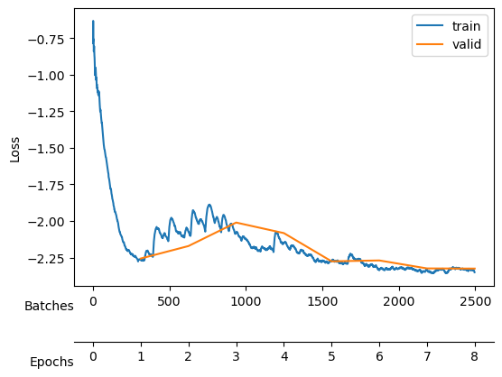

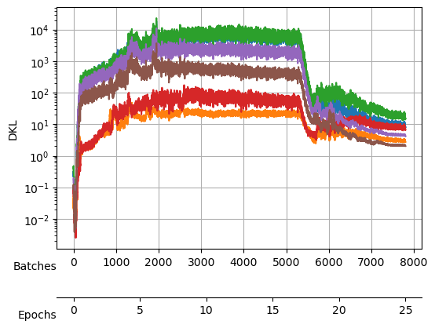

We save the model after each cycle, just in case all the neurons
collapse due to a big *β*.

``` python
E=1+16+8; model_name = 'sbm' + f'_E{E}'
if not os.path.exists("./models/"+model_name+'.tar'):
    save_model("./models/"+model_name, model, model_args, ds_args)
```

    Saved at ./models/sbm_E25.tar

Then, we increase the *β* and train again.

``` python
learn.loss_func.beta=1e-3; model_args.update(dict(beta=1e-3))
```

``` python
learn.fit_one_cycle(8, lr_max=1e-3,)
```

<style>
    /* Turns off some styling */
    progress {
        /* gets rid of default border in Firefox and Opera. */
        border: none;
        /* Needs to be in here for Safari polyfill so background images work as expected. */
        background-size: auto;
    }
    progress:not([value]), progress:not([value])::-webkit-progress-bar {
        background: repeating-linear-gradient(45deg, #7e7e7e, #7e7e7e 10px, #5c5c5c 10px, #5c5c5c 20px);
    }
    .progress-bar-interrupted, .progress-bar-interrupted::-webkit-progress-bar {
        background: #F44336;
    }
</style>

<table class="dataframe" data-quarto-postprocess="true" data-border="1">
<thead>
<tr style="text-align: left;">
<th data-quarto-table-cell-role="th">epoch</th>
<th data-quarto-table-cell-role="th">train_loss</th>
<th data-quarto-table-cell-role="th">valid_loss</th>
<th data-quarto-table-cell-role="th">mix_gaussian_loss</th>
<th data-quarto-table-cell-role="th">kld</th>
<th data-quarto-table-cell-role="th">time</th>
</tr>
</thead>
<tbody>
<tr>
<td>0</td>
<td>-2.281132</td>
<td>-2.259779</td>
<td>-2.279295</td>
<td>19.515345</td>
<td>01:10</td>
</tr>
<tr>
<td>1</td>
<td>-1.824657</td>
<td>-2.179360</td>
<td>-2.205580</td>
<td>26.219692</td>
<td>01:11</td>
</tr>
<tr>
<td>2</td>
<td>-2.211249</td>
<td>-2.233248</td>
<td>-2.253192</td>
<td>19.943052</td>
<td>01:11</td>
</tr>
<tr>
<td>3</td>
<td>-2.257035</td>
<td>-2.247903</td>
<td>-2.264651</td>
<td>16.747833</td>
<td>01:11</td>
</tr>
<tr>
<td>4</td>
<td>-2.289768</td>
<td>-2.278646</td>
<td>-2.294806</td>
<td>16.160137</td>
<td>01:11</td>
</tr>
<tr>
<td>5</td>
<td>-2.303732</td>
<td>-2.287849</td>
<td>-2.302872</td>
<td>15.023915</td>
<td>01:11</td>
</tr>
<tr>
<td>6</td>
<td>-2.342452</td>
<td>-2.313574</td>
<td>-2.328554</td>
<td>14.978462</td>
<td>01:11</td>
</tr>
<tr>
<td>7</td>
<td>-2.326436</td>
<td>-2.314047</td>
<td>-2.329060</td>
<td>15.013249</td>
<td>01:11</td>
</tr>
</tbody>
</table>

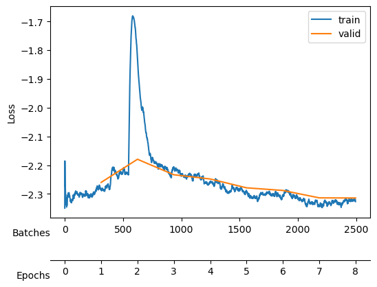

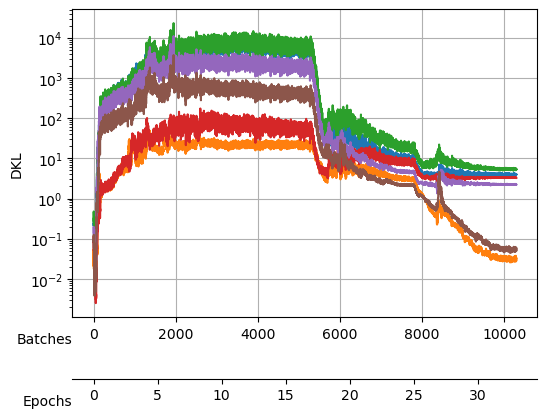

We see the *D*<sub>*K**L*</sub> of two neurons already dropped two
orders of magnitude. We increase *β* and train more.

``` python
E=1+16+8*2; model_name = 'sbm' + f'_E{E}'
if not os.path.exists("./models/"+model_name+'.tar'):
    save_model("./models/"+model_name, model, model_args, ds_args)
```

    Saved at ./models/sbm_E33.tar

``` python
learn.loss_func.beta=5e-3; model_args.update(dict(beta=5e-3))
```

``` python
learn.fit_one_cycle(16, lr_max=1e-3,)
```

<style>
    /* Turns off some styling */
    progress {
        /* gets rid of default border in Firefox and Opera. */
        border: none;
        /* Needs to be in here for Safari polyfill so background images work as expected. */
        background-size: auto;
    }
    progress:not([value]), progress:not([value])::-webkit-progress-bar {
        background: repeating-linear-gradient(45deg, #7e7e7e, #7e7e7e 10px, #5c5c5c 10px, #5c5c5c 20px);
    }
    .progress-bar-interrupted, .progress-bar-interrupted::-webkit-progress-bar {
        background: #F44336;
    }
</style>

<table class="dataframe" data-quarto-postprocess="true" data-border="1">
<thead>
<tr style="text-align: left;">
<th data-quarto-table-cell-role="th">epoch</th>
<th data-quarto-table-cell-role="th">train_loss</th>
<th data-quarto-table-cell-role="th">valid_loss</th>
<th data-quarto-table-cell-role="th">mix_gaussian_loss</th>
<th data-quarto-table-cell-role="th">kld</th>
<th data-quarto-table-cell-role="th">time</th>
</tr>
</thead>
<tbody>
<tr>
<td>0</td>
<td>-2.251511</td>
<td>-2.252467</td>
<td>-2.306516</td>
<td>10.809682</td>
<td>01:10</td>
</tr>
<tr>
<td>1</td>
<td>-2.252817</td>
<td>-2.245228</td>
<td>-2.293772</td>
<td>9.708881</td>
<td>01:11</td>
</tr>
<tr>
<td>2</td>
<td>-2.239562</td>
<td>-2.216622</td>
<td>-2.256845</td>
<td>8.044684</td>
<td>01:12</td>
</tr>
<tr>
<td>3</td>
<td>-2.191882</td>
<td>-1.953922</td>
<td>-1.985323</td>
<td>6.280288</td>
<td>01:11</td>
</tr>
<tr>
<td>4</td>
<td>-2.178543</td>
<td>-2.131708</td>
<td>-2.163971</td>
<td>6.452771</td>
<td>01:11</td>
</tr>
<tr>
<td>5</td>
<td>-2.213535</td>
<td>-2.258947</td>
<td>-2.288923</td>
<td>5.995219</td>
<td>01:11</td>
</tr>
<tr>
<td>6</td>
<td>-2.250787</td>
<td>-2.235217</td>
<td>-2.263428</td>
<td>5.642315</td>
<td>01:12</td>
</tr>
<tr>
<td>7</td>
<td>-2.231592</td>
<td>-2.203765</td>
<td>-2.230007</td>
<td>5.248451</td>
<td>01:11</td>
</tr>
<tr>
<td>8</td>
<td>-2.299702</td>
<td>-2.284002</td>
<td>-2.309700</td>
<td>5.139698</td>
<td>01:11</td>
</tr>
<tr>
<td>9</td>
<td>-2.285194</td>
<td>-2.205304</td>
<td>-2.230760</td>
<td>5.091110</td>
<td>01:13</td>
</tr>
<tr>
<td>10</td>
<td>-2.293305</td>
<td>-2.262668</td>
<td>-2.287017</td>
<td>4.869694</td>
<td>01:12</td>
</tr>
<tr>
<td>11</td>
<td>-2.304803</td>
<td>-2.297028</td>
<td>-2.321219</td>
<td>4.838166</td>
<td>01:11</td>
</tr>
<tr>
<td>12</td>
<td>-2.306652</td>
<td>-2.300437</td>
<td>-2.324596</td>
<td>4.831745</td>
<td>01:11</td>
</tr>
<tr>
<td>13</td>
<td>-2.299996</td>
<td>-2.302048</td>
<td>-2.326326</td>
<td>4.855473</td>
<td>01:11</td>
</tr>
<tr>
<td>14</td>
<td>-2.308707</td>
<td>-2.302276</td>
<td>-2.326377</td>
<td>4.820252</td>
<td>01:12</td>
</tr>
<tr>
<td>15</td>
<td>-2.311806</td>
<td>-2.302298</td>
<td>-2.326384</td>
<td>4.817187</td>
<td>01:12</td>
</tr>
</tbody>
</table>

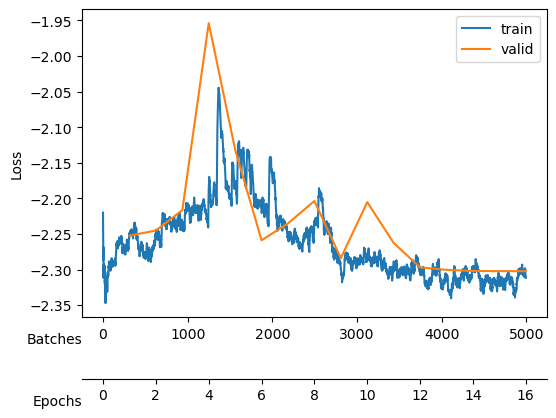

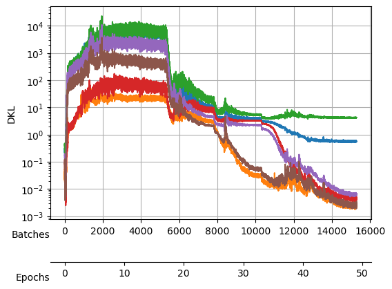

``` python
E=1+16+8*2+16; model_name = 'sbm' + f'_E{E}'
if not os.path.exists("./models/"+model_name+'.tar'):
    save_model("./models/"+model_name, model, model_args, ds_args)
```

    Saved at ./models/fbm_E49.tar

After training, we see a good reconstruction loss around -2.32, while
the *D*<sub>*K**L*</sub> is on the order of one for two neurons and the
rest are two orders of magnitude below. We say that two neurons
*survive* while the rest are noised out. We will see in the [analysis
tutorial](analysis_sbm.html) how these two neurons encode the minimal
relevant information to generate the trajectories.

# Bigger *β*

If we train with a bigger *β*, eventually one neuron drops, affecting
the reconstruction loss that is then worse.

``` python
learn.loss_func.beta=1e-2; model_args.update(dict(beta=1e-2))
```

``` python
learn.fit_one_cycle(16, lr_max=1e-3,)
```

<style>
    /* Turns off some styling */
    progress {
        /* gets rid of default border in Firefox and Opera. */
        border: none;
        /* Needs to be in here for Safari polyfill so background images work as expected. */
        background-size: auto;
    }
    progress:not([value]), progress:not([value])::-webkit-progress-bar {
        background: repeating-linear-gradient(45deg, #7e7e7e, #7e7e7e 10px, #5c5c5c 10px, #5c5c5c 20px);
    }
    .progress-bar-interrupted, .progress-bar-interrupted::-webkit-progress-bar {
        background: #F44336;
    }
</style>

<table class="dataframe" data-quarto-postprocess="true" data-border="1">
<thead>
<tr style="text-align: left;">
<th data-quarto-table-cell-role="th">epoch</th>
<th data-quarto-table-cell-role="th">train_loss</th>
<th data-quarto-table-cell-role="th">valid_loss</th>
<th data-quarto-table-cell-role="th">mix_gaussian_loss</th>
<th data-quarto-table-cell-role="th">kld</th>
<th data-quarto-table-cell-role="th">time</th>
</tr>
</thead>
<tbody>
<tr>
<td>0</td>
<td>-2.292675</td>
<td>-2.278427</td>
<td>-2.320651</td>
<td>4.222384</td>
<td>01:09</td>
</tr>
<tr>
<td>1</td>
<td>-2.265743</td>
<td>-2.279128</td>
<td>-2.320320</td>
<td>4.119149</td>
<td>01:10</td>
</tr>
<tr>
<td>2</td>
<td>-2.218647</td>
<td>-2.246289</td>
<td>-2.288341</td>
<td>4.205155</td>
<td>01:13</td>
</tr>
<tr>
<td>3</td>
<td>-2.209015</td>
<td>-2.225596</td>
<td>-2.265452</td>
<td>3.985472</td>
<td>01:12</td>
</tr>
<tr>
<td>4</td>
<td>-2.248430</td>
<td>-2.196464</td>
<td>-2.238191</td>
<td>4.172781</td>
<td>01:12</td>
</tr>
<tr>
<td>5</td>
<td>-2.223559</td>
<td>-2.201737</td>
<td>-2.243423</td>
<td>4.168562</td>
<td>01:12</td>
</tr>
<tr>
<td>6</td>
<td>-2.249357</td>
<td>-2.239655</td>
<td>-2.279761</td>
<td>4.010539</td>
<td>01:14</td>
</tr>
<tr>
<td>7</td>
<td>-2.224961</td>
<td>-2.210147</td>
<td>-2.251729</td>
<td>4.158061</td>
<td>01:13</td>
</tr>
<tr>
<td>8</td>
<td>-2.267192</td>
<td>-2.271090</td>
<td>-2.312112</td>
<td>4.102235</td>
<td>01:14</td>
</tr>
<tr>
<td>9</td>
<td>-2.283242</td>
<td>-2.274777</td>
<td>-2.314433</td>
<td>3.965613</td>
<td>01:13</td>
</tr>
<tr>
<td>10</td>
<td>-2.279653</td>
<td>-2.275052</td>
<td>-2.314808</td>
<td>3.975609</td>
<td>01:13</td>
</tr>
<tr>
<td>11</td>
<td>-2.274931</td>
<td>-2.281827</td>
<td>-2.321421</td>
<td>3.959441</td>
<td>01:12</td>
</tr>
<tr>
<td>12</td>
<td>-2.280176</td>
<td>-2.282479</td>
<td>-2.321944</td>
<td>3.946445</td>
<td>01:12</td>
</tr>
<tr>
<td>13</td>
<td>-2.283632</td>
<td>-2.282778</td>
<td>-2.322360</td>
<td>3.958159</td>
<td>01:12</td>
</tr>
<tr>
<td>14</td>
<td>-2.301415</td>
<td>-2.283230</td>
<td>-2.322545</td>
<td>3.931563</td>
<td>01:11</td>
</tr>
<tr>
<td>15</td>
<td>-2.300677</td>
<td>-2.283238</td>
<td>-2.322650</td>
<td>3.941171</td>
<td>01:12</td>
</tr>
</tbody>
</table>

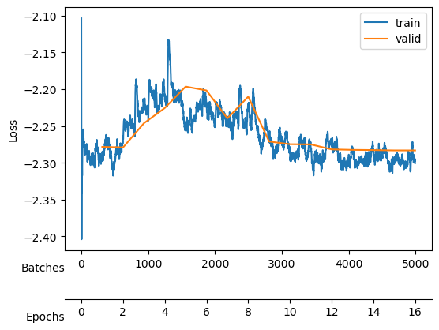

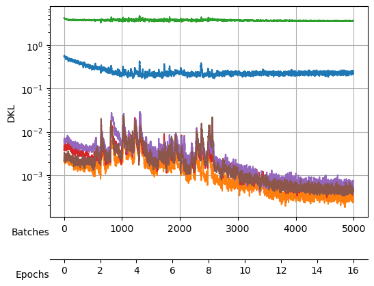

``` python
learn.loss_func.beta=4e-2; model_args.update(dict(beta=4e-2))
```

``` python
learn.fit_one_cycle(16, lr_max=1e-3,)
```

<style>
    /* Turns off some styling */
    progress {
        /* gets rid of default border in Firefox and Opera. */
        border: none;
        /* Needs to be in here for Safari polyfill so background images work as expected. */
        background-size: auto;
    }
    progress:not([value]), progress:not([value])::-webkit-progress-bar {
        background: repeating-linear-gradient(45deg, #7e7e7e, #7e7e7e 10px, #5c5c5c 10px, #5c5c5c 20px);
    }
    .progress-bar-interrupted, .progress-bar-interrupted::-webkit-progress-bar {
        background: #F44336;
    }
</style>

<table class="dataframe" data-quarto-postprocess="true" data-border="1">
<thead>
<tr style="text-align: left;">
<th data-quarto-table-cell-role="th">epoch</th>
<th data-quarto-table-cell-role="th">train_loss</th>
<th data-quarto-table-cell-role="th">valid_loss</th>
<th data-quarto-table-cell-role="th">mix_gaussian_loss</th>
<th data-quarto-table-cell-role="th">kld</th>
<th data-quarto-table-cell-role="th">time</th>
</tr>
</thead>
<tbody>
<tr>
<td>0</td>
<td>-2.204268</td>
<td>-2.183239</td>
<td>-2.304005</td>
<td>3.019161</td>
<td>01:11</td>
</tr>
<tr>
<td>1</td>
<td>-2.194592</td>
<td>-2.175812</td>
<td>-2.292791</td>
<td>2.924464</td>
<td>01:12</td>
</tr>
<tr>
<td>2</td>
<td>-2.145626</td>
<td>-2.180877</td>
<td>-2.293877</td>
<td>2.824981</td>
<td>01:12</td>
</tr>
<tr>
<td>3</td>
<td>-2.079138</td>
<td>-2.172214</td>
<td>-2.287631</td>
<td>2.885419</td>
<td>01:11</td>
</tr>
<tr>
<td>4</td>
<td>-2.127781</td>
<td>-2.103078</td>
<td>-2.214047</td>
<td>2.774220</td>
<td>01:12</td>
</tr>
<tr>
<td>5</td>
<td>-2.113369</td>
<td>-2.036130</td>
<td>-2.148762</td>
<td>2.815787</td>
<td>01:11</td>
</tr>
<tr>
<td>6</td>
<td>-2.166729</td>
<td>-2.182533</td>
<td>-2.285766</td>
<td>2.580839</td>
<td>01:12</td>
</tr>
<tr>
<td>7</td>
<td>-2.168032</td>
<td>-2.187016</td>
<td>-2.293549</td>
<td>2.663330</td>
<td>01:12</td>
</tr>
<tr>
<td>8</td>
<td>-2.175102</td>
<td>-2.190198</td>
<td>-2.295090</td>
<td>2.622296</td>
<td>01:14</td>
</tr>
<tr>
<td>9</td>
<td>-2.210599</td>
<td>-2.195347</td>
<td>-2.298699</td>
<td>2.583786</td>
<td>01:11</td>
</tr>
<tr>
<td>10</td>
<td>-2.217565</td>
<td>-2.165514</td>
<td>-2.270107</td>
<td>2.614821</td>
<td>01:11</td>
</tr>
<tr>
<td>11</td>
<td>-2.200825</td>
<td>-2.198460</td>
<td>-2.301876</td>
<td>2.585433</td>
<td>01:11</td>
</tr>
<tr>
<td>12</td>
<td>-2.199532</td>
<td>-2.199680</td>
<td>-2.303985</td>
<td>2.607617</td>
<td>01:12</td>
</tr>
<tr>
<td>13</td>
<td>-2.214851</td>
<td>-2.200226</td>
<td>-2.303653</td>
<td>2.585687</td>
<td>01:11</td>
</tr>
<tr>
<td>14</td>
<td>-2.215913</td>
<td>-2.200113</td>
<td>-2.304406</td>
<td>2.607338</td>
<td>01:11</td>
</tr>
<tr>
<td>15</td>
<td>-2.224487</td>
<td>-2.200450</td>
<td>-2.304470</td>
<td>2.600497</td>
<td>01:11</td>
</tr>
</tbody>
</table>

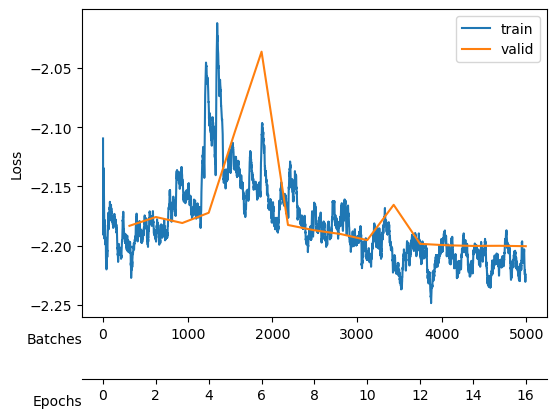

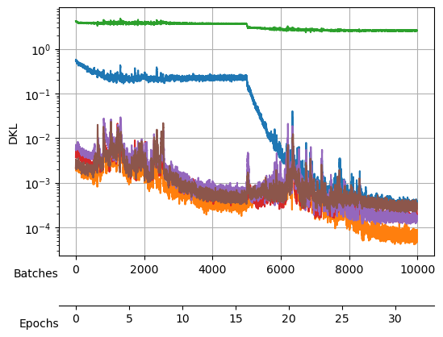
